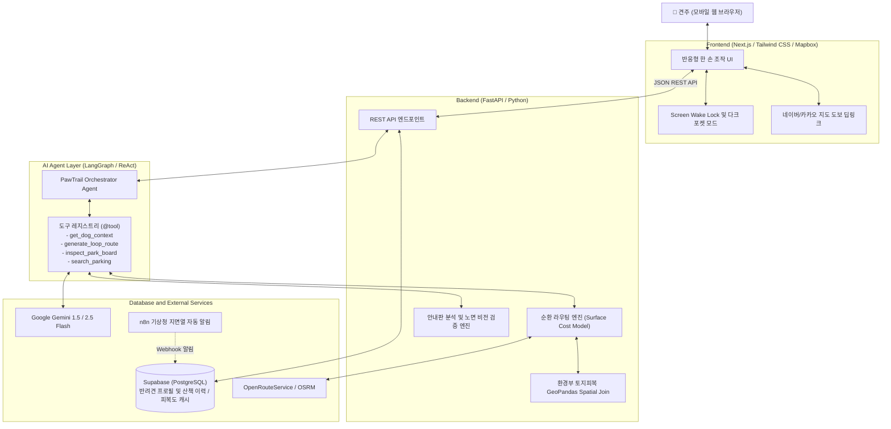

# 🐾 PawTrail (포트레일)

> **"우리 아이 발바닥과 관절을 위한 가장 안전하고 푹신한 길"**  
> **AI Native 반려견 맞춤형 안심 노면 산책 에이전트 및 기록·공유 플랫폼**

PawTrail은 딱딱한 아스팔트와 보도블록 대신 **흙길, 잔디길, 탄성포장로** 등 반려견 신체 조건에 최적화된 맞춤형 산책로를 AI가 자율적으로 찾아주고 안내해 주는 서비스입니다.

---

## 📖 목차 (Table of Contents)

1. [💡 왜 PawTrail인가? (기획 배경)](#1--왜-pawtrail인가-기획-배경)
2. [✨ 핵심 기능 (Key Features)](#2--핵심-기능-key-features)
3. [🏗️ 시스템 아키텍처 (Architecture)](#3-️-시스템-아키텍처-architecture)
4. [👥 팀 구성 및 역할 분담 (Team Roles)](#4--팀-구성-및-역할-분담-team-roles)
5. [📚 필수 문서 읽기 로드맵 (Docs Roadmap)](#5--필수-문서-읽기-로드맵-docs-roadmap)
6. [🚀 개발 및 테스트 시작하기 (Getting Started)](#6--개발-및-테스트-시작하기-getting-started)
7. [📐 엔지니어링 표준 및 코딩 규칙 (Engineering Standards)](#7--엔지니어링-표준-및-코딩-규칙-engineering-standards)
8. [🎯 5인 CBT 및 완료 정의 (DoD)](#8--5인-cbt-및-완료-정의-dod)

---

## 1. 💡 왜 PawTrail인가? (기획 배경)

### 견주들의 진짜 고민 (Problem)
* **슬개골 탈구 및 관절 질환**: 국내 반려견의 약 70% 이상이 슬개골 탈구 위험에 노출되어 있습니다. 딱딱한 아스팔트와 보도블록은 반려견 관절에 지속적인 충격을 줍니다.
* **여름철 지면열 화상**: 한여름 낮 아스팔트 지면 온도는 50℃를 웃돌아 발바닥 패드 화상을 유발합니다.
* **기존 상용 지도의 한계**: 네이버 지도, 카카오맵, T맵 등은 자동차나 사람 기준의 **'최단거리'**만 안내할 뿐, 바닥이 **흙길인지 아스팔트인지 자갈밭인지** 알려주지 않습니다.

### PawTrail의 해결책 (Solution)
* **노면 인지형 라우팅 (Surface-Aware Routing)**: 환경부 세분류 토지피복지도(SHP) Spatial Join과 OSM 도로망을 결합해 흙길/잔디길 통과 비율을 극대화한 순환 코스를 생성합니다.
* **AI 비전 사전/사후 진단**: 공원 입구 종합안내판 사진을 찍으면 흙길 코스와 반려견 출입 금지구역을 사전 판독하고, 완주 후기 사진 비전 검증으로 지도의 결측 노면을 영구 보강합니다.
* **주머니 속 안심 트래킹**: 산책 중 스마트폰을 주머니에 넣어도 화면 꺼짐 없이 안전하게 위치를 연속 기록합니다.

---

## 2. ✨ 핵심 기능 (Key Features)

| 기능 | 아이콘 | 설명 | 담당 기술 |
|---|:---:|---|---|
| **자연어 산책 플래너** | 🤖 | "슬개골 안 좋은 포메인데 30분 정도 가볍게 걷고 싶어"라고 말하면 AI가 의도와 반려견 상태를 파악해 코스 제안 | LangGraph, Gemini 2.5 Flash |
| **선호 노면 맞춤 라우팅** | 🗺️ | 흙/잔디길 가중치 할인(0.4~0.5), 아스팔트/자갈길 회피(2.5~3.5), 환경부 토지피복 공간 결합 기반 순환 코스 생성 | Routing API Provider, GeoPandas Spatial Join |
| **공원 안내판 & 노면 비전 검증** | 📸 | 공원 안내판 판독으로 출입금지구역 사전 회피 및 완주 후기 사진 검증을 통한 지도 속성 영구 보강 | Gemini 1.5 Flash Vision, Structured Output |
| **주머니 보관 연속 트래킹** | 📱 | Screen Wake Lock + 초절전 다크 포켓 모드로 화면 꺼짐과 오터치를 방지하며 완주 기록 수집 | HTML5 Geolocation, WakeLock API |
| **공영주차장 P&R 연계** | 🚗 | 차를 타고 이동해 산책하는 대형견/원정 견주를 위한 공영주차장 거점 추천 | 공공데이터포털 주차장 API |
| **안심 코스 피드 & 체크인** | 🐾 | 완주 후 노면 만족도 평가, 집 주소 노출 방지(좌표 마스킹) 후 커뮤니티 공유 | Supabase (PostgreSQL) |

---

## 3. 🏗️ 시스템 아키텍처 (Architecture)

PawTrail은 **Next.js 모바일 웹(Frontend) + FastAPI(Backend) + LangGraph / Gemini(AI) + Supabase(DB & Memory) + n8n(Automation)**으로 구성된 모던 클라우드 네이티브 아키텍처를 채택하고 있습니다.



---

## 4. 👥 팀 구성 및 역할 분담 (Team Roles)

팀원 5명이 각자의 전문 영역을 맡아 5주 애자일 스프린트(2개 스프린트 및 Hardening)로 개발을 진행합니다.

| 역할 | 담당자 | 주 업무 영역 | 담당 사용자 스토리 |
|---|:---:|---|---|
| **Member A** | **PM & AI Agent Lead** | • 프로젝트 일정 관리 및 PM 총괄<br/>• LangGraph 기반 ReAct 에이전트 오케스트레이션 | US-01, US-02, US-16 |
| **Member B** | **AI / Vision Lead** | • Gemini Flash 비전 프롬프트 엔지니어링<br/>• 공원 종합안내판 판독 및 산책 후기 노면 사진 검증 | US-04, US-05 |
| **Member C** | **Backend & Routing Lead** | • FastAPI 백엔드 구축 및 REST API 엔드포인트<br/>• 환경부 토지피복 Spatial Join, 1.5km Seed 데이터셋, 노면 가중치 순환 라우터 & 거리 환산 | US-02, US-03, US-13, US-16 |
| **Member D** | **Frontend & UI/UX Lead** | • Next.js 기반 모바일 웹 반응형 UI/UX<br/>• Mapbox 노면 Polyline, Screen Wake Lock & 포켓 모드, 즐겨찾기 및 PWA 캐시 | US-07, US-08, US-09, US-14, US-15 |
| **Member E** | **Infra, QA & DevOps Lead** | • Supabase DB 모델링(Memory/즐겨찾기) 및 Vercel/Render CI/CD<br/>• n8n 날씨 자동화 및 **5인 실사용자 CBT 총괄** | US-06, US-10, US-11, US-12, US-14 |

---

## 5. 📚 필수 문서 읽기 로드맵 (Docs Roadmap)

프로젝트를 처음 접하는 팀원은 `docs/` 폴더에 번호 순서대로 정리된 문서를 읽으면 프로젝트의 모든 맥락을 완벽히 이해할 수 있습니다:

```
docs/
├── 01_PawTrail_Project_Proposal.md           [1단계: 프로젝트 제안서 및 문제 정의]
├── 02_PawTrail_Team_building.md              [2단계: 팀 빌딩, 팀원별 역할 및 R&R]
├── 03_PawTrail_Agile_User_Stories.md         [3단계: 16개 애자일 사용자 스토리 & 인수 조건]
├── 04_PawTrail_Architecture_Design.md        [4단계: C4 아키텍처 및 시스템 세부 설계]
├── 05_PawTrail_Detailed_Implementation_Plan.md [5단계: 5주간 개발 마일스톤 및 5인 협업 계획]
├── 06_PawTrail_Task_Breakdown_and_Estimations.md [6단계: 54개 구현 세부 Task (총 330h / 약 324h)]
├── 07_PawTrail_Presentation_Pain_Points.md   [7단계: 발표 평가 페인 포인트 & 4대 기술 돌파구]
└── screens/                                  [8단계: 5대 핵심 시나리오 UI 스크린 & 인터랙티브 뷰어]
```

> 💡 **AI 협업 및 개발 지침 (`.gemini/`)**:
> - [`.gemini/GEMINI.md`](file:///.gemini/GEMINI.md): AI Code Assist가 준수해야 할 마스터 엔지니어링 지침 (REST API 규격, 4대 Tool, DoD).
> - [`.gemini/coding_rule.md`](file:///.gemini/coding_rule.md): 클린코드, SonarLint 정적분석 규칙, 파일/함수 라인수 및 복잡도 임계치, 리팩토링 가이드.
> - [`.gemini/UX_COMPACT_RULES.md`](file:///.gemini/UX_COMPACT_RULES.md): 한 손 조작 환경, 야외 시인성, 다크 포켓 모드 UI 규칙.

---

## 6. 🚀 개발 및 테스트 시작하기 (Getting Started)

PawTrail은 코드 작성 전 테스트를 먼저 정의하고 검증하는 **TDD(Test-Driven Development)**를 철저히 지킵니다.

### 6.1 환경 요구사항
* **Python**: 3.10 이상
* **Node.js**: 18.0 이상 (LTS 권장)
* **가상환경**: venv 또는 conda 권장

### 6.2 테스트 실행 (Verification)
프로젝트 루트에서 단위 및 도메인 통합 테스트를 한 번에 실행할 수 있습니다:

```bash
# 1. 의존성 설치 (필요시)
pip install -r requirements.txt  # 또는 pytest, pydantic, httpx 설치

# 2. 전체 단위/통합 테스트 실행 (60개 테스트 전수 검증)
python -m pytest test_case/ -q
```

실행 결과 예시:
```
............................................................                  [100%]
60 passed in 0.35s
```

### 6.3 테스트 스위트 구조 (`test_case/`)
* `test_surface_cost_model.py`: 노면 비용 공식($\text{Cost} = \text{Length} \times W_{\text{base}} \times W_{\text{pref}}$), 환경부 토지피복 Spatial Join 및 5단계 `surface_source` 투명성 태깅 검증
* `test_walk_plan_agent_schema.py`: 반려견 컨텍스트 주입, Clarification 되물음 루프 및 보행 속도 매핑 기반 목표 거리 자동 환산 검증
* `test_vision_safety_inspector.py`: Gemini Flash 공원 종합안내판 판독(`ParkBoardInspector`) 및 완주 후기 노면 사진 검증(`CommunityMapEnricher`) 검증
* `test_walk_tracking_and_feedback.py`: 선호 노면 달성률(%), 체크인 피드백 및 오프라인 IndexedDB 동기화 검증
* `test_thermal_and_parking.py`: 기상청 일사량/기온 연동 지면열 수지식 및 반경 1.5km 공영주차장(P&R) 필터링 검증
* `test_api_contracts.py`: FastAPI 핵심 REST API 엔드포인트(`inspect-board`, `verify-surface`, `favorites` 등) 요청/응답 스키마 계약 검증

---

## 7. 📐 엔지니어링 표준 및 코딩 규칙 (Engineering Standards)

모든 팀원은 [`.gemini/coding_rule.md`](file:///.gemini/coding_rule.md)에 명시된 규칙을 준수해야 합니다.

### 7.1 코드 규모 및 복잡도 임계치 (Thresholds & Refactoring)
코드 비대화와 기술 부채를 방지하기 위해 엄격한 임계치를 적용합니다:
* **단일 파일 라인 수**: **250 라인 초과 시 분할 권고** (최대 400 라인 초과 금지)
* **단일 함수/컴포넌트 라인 수**: **40 라인 초과 시 추출 권고** (최대 80 라인 제한)
* **인지 복잡도 (Cognitive Complexity)**: **10 초과 시 리팩토링 권고** (15 초과 시 즉시 분할)
* **제어문 중첩 깊이**: 2단계 초과 금지 ➔ **조기 반환 (Early Return / Guard Clause)** 필수 적용

### 7.2 리팩토링 핵심 전략
1. **Frontend**: 상태/이펙트가 30라인을 넘기면 즉시 Custom Hook(`hooks/useWalkTracker.ts` 등)으로 분리.
2. **Backend**: 라우터 엔드포인트는 호출 라우팅만 담당하며 비즈니스 로직은 `services/` 레이어로 이관.
3. **Lookup Table**: 복잡한 다중 분기문은 딕셔너리(`Record<Key, Value>`) 매핑 테이블로 대체.
4. **리팩토링 후 검증**: 리팩토링 즉시 `pytest test_case/`를 실행해 회귀 결함이 없음을 증명.

---

## 8. 🎯 5인 CBT 및 완료 정의 (DoD)

### 8.1 5인 실사용자 CBT 검증 목표 (US-11)
캡스톤 4주차에는 단순 시연이 아닌 **실제 견주 5인**과 함께 현장 필드 테스트를 진행합니다:
1. **소형견 (포메라니안)**: 슬개골 탈구 예방을 위한 흙/잔디길 가중치 반영 검증
2. **대형견 (골든 리트리버)**: 원정 산책을 위한 공영주차장(P&R) 출발 코스 검증
3. **노령견 (시츄 13세)**: 무리 없는 완만한 평지 및 그늘 노면 위주 경로 검증
4. **일반견 (믹스견)**: 공원 입구 종합안내판 촬영 업로드 및 산책 후기 노면 사진 검증
5. **활동견 (보더콜리)**: n8n 기상청 지면열 골든타임 알림 수신 후 완주 및 피드백 검증

### 8.2 기능 완료 정의 (Definition of Done)
코드를 작성했다고 완료된 것이 아니며, 아래 조건을 모두 만족해야 PR 머지 및 기능 완료로 인정합니다:
- [x] 실제 서비스 E2E 시나리오에서 정상 동작 확인 (껍데기 Mock 배제)
- [x] Mock이 아닌 실제 API / DB / AI 연동 완료
- [x] 유효하지 않은 입력 및 외부 API 타임아웃/오류 방어 로직 완비
- [x] 모바일 웹 브라우저에서 한 손 조작 및 야외 시인성 충족
- [x] 개인정보 보호(출발지/거주지 좌표 블러링 마스킹) 및 보안 요건 준수
- [x] `test_case/` 내 단위/통합 테스트 100% 통과
- [x] 코드 규모 기준 충족 (단일 파일 250줄, 함수 40줄, 인지 복잡도 10 이하)

---

> 🐾 **PawTrail Team**: "반려견에게 산책은 하루의 전부입니다. 가장 편안하고 안전한 발걸음을 선물합니다."
