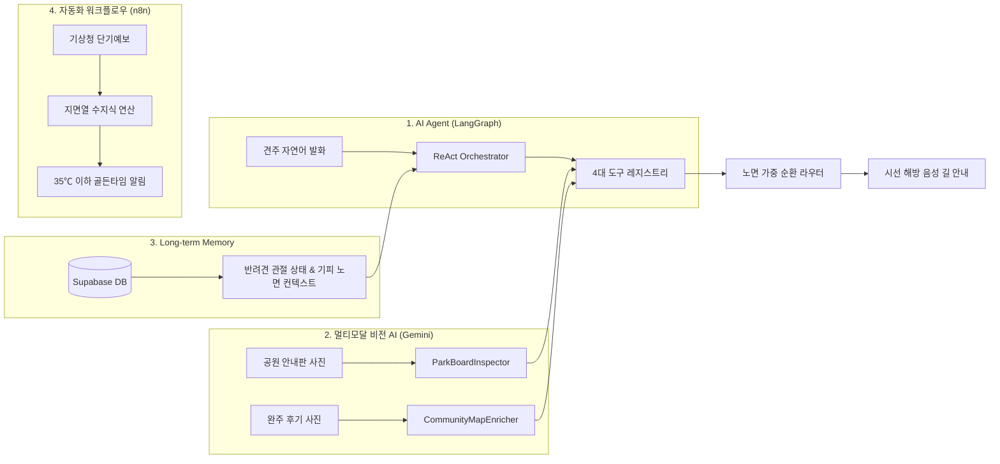
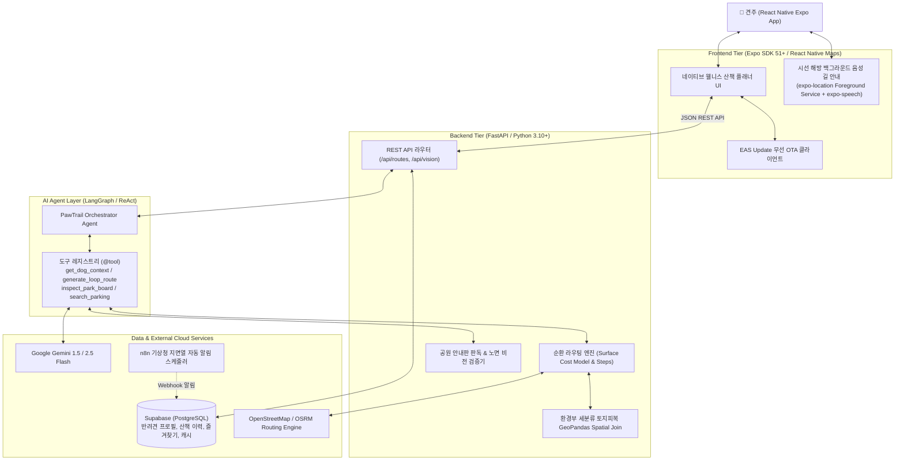

# 🐾 PawTrail (포트레일)

> **"우리 아이 발바닥과 관절을 위한 가장 안전하고 푹신한 길"**  
> **AI Native 반려견 맞춤형 안심 노면 산책 에이전트 및 기록·공유 플랫폼**

PawTrail은 딱딱한 아스팔트와 보도블록 대신 **흙길, 잔디길, 탄성포장로** 등 반려견 신체 조건에 최적화된 맞춤형 산책로를 AI가 자율적으로 찾아주고 안내해 주는 AI Native 플랫폼입니다.

---

## 📊 프로젝트 현황 요약 (Project Status)

| 구분 | 현황 및 지표 | 비고 |
|---|---|---|
| **개발 진행 단계** | **Sprint 1 준비 및 문서·설계 정합성 100% 완료** | 16개 User Story / 55개 Task / 62 pt / 334 h |
| **TDD 검증 현황** | **71개 단위/통합 테스트 100% 통과** | `pytest test_case/` (0.49s 전수 통과) |
| **캡스톤 미션 충족** | **필수 기술 요소 4종 전수 구현** | AI Agent, 멀티모달 비전, Long-term Memory, n8n 자동화 |
| **5인 실사용자 CBT** | **5개 페르소나 필드 테스트 시나리오 확립** | 소형견/대형견/노령견/일반견/활동견 피드백 수렴 체계 |
| **모바일 & 배포 환경** | **React Native Expo (SDK 51+) + EAS Update (OTA)** | Android Foreground Service 음성 길 안내 탑재 |

---

## 📖 목차 (Table of Contents)

1. [💡 왜 PawTrail인가? (기획 배경 및 문제 정의)](#1--왜-pawtrail인가-기획-배경-및-문제-정의)
2. [✨ 핵심 기능 및 UI 프리뷰 (Key Features & UI Preview)](#2--핵심-기능-및-ui-프리뷰-key-features--ui-preview)
3. [🤖 AI Native 핵심 기술 구현 (Core AI & Automation)](#3--ai-native-핵심-기술-구현-core-ai--automation)
4. [🏗️ 시스템 아키텍처 (Architecture)](#4-️-시스템-아키텍처-architecture)
5. [👥 팀 구성 및 역할 분담 (Team Roles)](#5--팀-구성-및-역할-분담-team-roles)
6. [📚 필수 산출물 및 문서 로드맵 (Docs Roadmap)](#6--필수-산출물-및-문서-로드맵-docs-roadmap)
7. [🧪 TDD 테스트 스위트 및 실행 방법 (Getting Started)](#7--tdd-테스트-스위트-및-실행-방법-getting-started)
8. [🎯 5인 CBT 및 완료 정의 (User Testing & DoD)](#8--5인-cbt-및-완료-정의-user-testing--dod)
9. [📐 엔지니어링 표준 및 코딩 규칙 (Engineering Standards)](#9--엔지니어링-표준-및-코딩-규칙-engineering-standards)
10. [🔗 주요 산출물 링크 (Artifacts & Links)](#10--주요-산출물-링크-artifacts--links)

---

## 1. 💡 왜 PawTrail인가? (기획 배경 및 문제 정의)

### 🚨 견주들의 3대 페인포인트 (Problem)
1. **아스팔트 충격과 지면열 화상**:
   - 국내 소형견의 70~80%가 관절 안심 케어가 필요하며, 딱딱한 아스팔트와 보도블록은 관절에 지속적인 충격을 가합니다.
   - 한여름 낮 아스팔트 표면 온도는 **50℃ 이상**으로 치솟아 반려견 발바닥 패드에 직접적인 화상을 초래합니다.
2. **상용 지도의 노면 데이터 부재**:
   - 네이버 지도, 카카오맵, T맵 등은 자동차나 사람 기준의 **'최단거리'**만 안내할 뿐, 경로가 **흙길인지, 잔디길인지, 위험한 자갈밭인지** 알려주지 못합니다.
3. **리드줄 파지 중 스마트폰 주시의 위험성**:
   - 돌발 행동을 하는 반려견을 제어하기 위해 손에 리드줄을 쥔 상태에서 스마트폰 화면을 계속 보며 걷는 행위는 보행자 충돌 및 안전사고의 주원인이 됩니다.

### 🐾 PawTrail의 혁신적 해결책 (Solution)
* **노면 인지형 라우팅 (Surface-Aware Routing)**: 환경부 세분류 토지피복지도(SHP) 공간 결합(Spatial Join)과 OSM 보행 도로망을 결합해 부드러운 흙길/잔디길 통과 비율이 극대화된 순환 루프 코스를 생성합니다.
* **시선 해방(Eyes-Free) & 두 손 자유(Hands-Free) 음성 길 안내**: 화면을 꺼둔 채 주머니에 폰을 넣어도 Android Foreground Service와 `expo-speech` TTS가 회전 지점과 흙길 노면 전환을 실시간으로 음성 브리핑합니다.
* **산책 전/후 비전 AI 검증**: 공원 입구 종합안내판 사진을 찍으면 출입 금지구역과 흙길을 사전 판독하고, 산책 완주 후기 사진 비전 검증을 통해 지도의 결측 노면 속성을 영구 보강합니다.
* **감성 웰니스 UX 혁신**: 앱 전역에서 '슬개골 탈구' 등 불편한 임상 질병 단어를 배제하고 **"폭신한 길"**, **"관절 안심 케어"** 등 따뜻하고 긍정적인 웰니스 언어로 100% 순화합니다.

---

## 2. ✨ 핵심 기능 및 UI 프리뷰 (Key Features & UI Preview)

### 2.1 6대 핵심 기능 (Key Features)

| 기능 | 아이콘 | 핵심 설명 | 담당 기술 |
|---|:---:|---|---|
| **자연어 산책 플래너** | 🤖 | "관절 안심 케어가 필요한 포메인데 30분 정도 폭신한 길로 걷고 싶어" 발화 시 AI가 최적 루프 코스 생성 | LangGraph ReAct, Gemini 2.5 Flash |
| **선호 노면 맞춤 라우팅** | 🗺️ | 흙/잔디길 가중치 대폭 할인(0.45), 아스팔트/자갈길 회피(2.5~3.5), 환경부 피복도 공간 결합 순환로 도출 | GeoPandas Spatial Join, OSRM/ORS |
| **공원 안내판 비전 판독** | 📸 | 공원 입구 종합안내판 사진 파싱으로 반려견 출입금지구역 자동 회피 및 흙길 경로 보정 | Gemini Flash Vision (`ParkBoardInspector`) |
| **핸즈프리 음성 길 안내** | 🎧 | 주머니 속 다크 포켓 모드에서도 회전 30m 전 및 흙길 진입을 끊김 없이 백그라운드 음성 브리핑 | React Native, `expo-location`, `expo-speech` |
| **기상청 연동 지면열 알림** | ☀️ | 일사량/기온 기반 지면열 수지식 계산으로 35℃ 이하 일일 최적 안심 산책 골든타임 알림 | n8n 노코드 자동화 파이프라인, 기상청 API |
| **안심 코스 피드 & 체크인** | 🐾 | 완주 후 선호 노면 달성률 리포트, 집 주소 지오해시 블러링 마스킹 후 이웃 견주와 코스 공유 | Supabase (PostgreSQL), Geo-Masking |

### 2.2 6대 핵심 화면 프리뷰 (Screens Preview)

> 💡 **인터랙티브 스크린 뷰어**: [`docs/screens/index.html`](file:///d:/코디세이/PawTrail/docs/screens/index.html)에서 전체 6개 화면의 실제 UI 목업과 상세 시나리오 해설을 브라우저로 확인할 수 있습니다.

| 화면 1: 대화형 산책 플래너 | 화면 2: 노면 맞춤 코스 프리뷰 | 화면 3: 다크 포켓 모드 & 음성 안내 |
|:---:|:---:|:---:|
|  |  |  |
| 반려견 프로필과 시간(10~90분) 기반 맞춤 경로 생성 | 노면 속성별 색상 구분 Polyline 및 흙길 비율 시각화 | 화면 꺼짐/주머니 상태에서 실시간 음성 브리핑 |

| 화면 4: 공원 안내판 비전 판독 | 화면 5: 안심 산책 완주 리포트 | 화면 6: 커뮤니티 노면 집단지성 보강 |
|:---:|:---:|:---:|
|  |  |  |
| 공원 종합안내판 사진 분석 및 출입금지구역 우회 | 선호 노면 달성률(%) 및 관절 안심 케어 통계 | 완주 후기 사진 비전 판독으로 지도 속성 영구 보강 |

---

## 3. 🤖 AI Native 핵심 기술 구현 (Core AI & Automation)

본 프로젝트는 **AI Native 캡스톤 최종 미션([`00_final_mission.md`](file:///d:/코디세이/PawTrail/docs/00_final_mission.md))**에서 요구하는 필수 기술 요소(AI Agent, 멀티모달 AI, Long-term Memory, 자동화 워크플로우) 4종을 전수 구현하여 유기적으로 연계했습니다.



### 1️⃣ AI Agent (LangGraph & ReAct Framework)
* **자율 도구 오케스트레이션**: 사용자 발화에서 목표 산책 시간(10~90분)과 선호 조건을 추출하고, 필수 정보 누락 시 **Clarification(되물음) 대화 루프**를 자율 실행합니다.
* **4대 핵심 도구 레지스트리 (`@tool`)**:
  - `get_dog_context`: 반려견 체급, 보행 속도 및 관절 안심 케어 수준 주입
  - `generate_loop_route`: 노면 비용 모델 기반 목표 거리 오차 ±10% 이내 순환 루프 생성
  - `inspect_park_board`: 공원 안내판 판독 결과(금지구역/흙길 포인트) 경로 제약 주입
  - `search_parking`: 차량 동반 원정 견주를 위한 반경 1.5km 공영주차장 연계

### 2️⃣ 멀티모달 비전 AI (Gemini Flash Vision)
* **산책 전 공원 종합안내판 분석 (`ParkBoardInspector`)**:
  - 공원 입구의 종합안내판 사진을 멀티모달로 분석하여 반려견 출입 금지구역(생태보존구역, 어린이놀이터 등) 좌표를 추출하고 라우팅 차단 노드로 주입합니다.
* **산책 후 완주 사진 검증 (`CommunityMapEnricher`)**:
  - 견주가 업로드한 산책 후기 사진의 노면을 판독하여 **신뢰도 0.85 이상**일 경우 OpenStreetMap 도로망의 노면 속성을 영구 보강(집단지성 맵 최신화)합니다.

### 3️⃣ Long-term Memory & Personalization (Supabase)
* **반려견 신체 컨텍스트 주입**: 견종별 체급 및 관절 안심 케어 수준(`joint_care_level`: 0~4)에 맞춰 보행 기준 속도(2.4~4.2 km/h) 및 목표 거리를 동적 계산합니다.
* **피드포워드 가중치 조정**: 이전 산책 후기에서 "자갈이 많아 불편했다"는 피드백이 누적되면 해당 구간의 회피 가중치를 자동으로 상향 조정합니다.

### 4️⃣ 노코드 자동화 워크플로우 (n8n Automation)
* **기상청 API 연계 지면열 예측 파이프라인**:
  - 기상청 단기예보 API의 기온, 풍속, 일사량 데이터를 수집하여 지면열 열수지 회귀식을 연산합니다.
  - 지면 온도가 35℃ 이하로 떨어지는 **당일 최적 산책 골든타임**을 도출하여 견주에게 푸시 알림을 자동 발송합니다.

---

## 4. 🏗️ 시스템 아키텍처 (Architecture)

PawTrail은 **React Native 모바일 클라이언트 + FastAPI 백엔드 + LangGraph AI 에이전트 + Supabase + n8n**으로 연결된 모던 클라우드 네이티브 아키텍처를 채택하고 있습니다.



---

## 5. 👥 팀 구성 및 역할 분담 (Team Roles)

팀원 5명이 각자의 전문 영역을 맡아 5주 애자일 스프린트 체계로 개발을 주도하고 있습니다.  
(총 16개 User Story / 55개 Task / 62 Story Points / 334 Hours)

| 팀원 | 핵심 역할 | 주 업무 영역 및 기술 스택 | 담당 사용자 스토리 | 공수 |
|:---:|---|---|---|:---:|
| **Member A** | **PM & AI Agent Lead** | • 프로젝트 총괄 및 스프린트 일정 관리<br/>• LangGraph 기반 ReAct 에이전트 오케스트레이션 및 Clarification 대화 루프 구축 | **US-01, US-02, US-16** | 62 h |
| **Member B** | **AI / Vision Lead** | • Gemini Flash 비전 프롬프트 엔지니어링<br/>• 공원 종합안내판 판독(`ParkBoardInspector`) 및 후기 사진 검증(`CommunityMapEnricher`) | **US-04, US-05** | 48 h |
| **Member C** | **Backend & Routing Lead** | • FastAPI 백엔드 구축 및 REST API 계약 구현<br/>• 환경부 토지피복 GeoPandas Spatial Join, 노면 비용 모델 및 순환 루프 라우터 | **US-02, US-03, US-13, US-16** | 90 h |
| **Member D** | **Frontend & UI/UX Lead** | • React Native Expo 기반 모바일 앱 구현<br/>• Android Foreground Service & `expo-speech` 핸즈프리 음성 길 안내, 다크 포켓 모드 | **US-07, US-08, US-09, US-14, US-15** | 79 h |
| **Member E** | **Infra, QA & DevOps Lead** | • Supabase DB 모델링 및 EAS Build/Update 무선 OTA 파이프라인 수립<br/>• n8n 지면열 자동화 워크플로우 및 **5인 실사용자 CBT 총괄** | **US-06, US-10, US-11, US-12, US-14** | 55 h |

---

## 6. 📚 필수 산출물 및 문서 로드맵 (Docs Roadmap)

PawTrail 프로젝트의 전체 기획, 설계, 태스크 분할 및 품질 보증 체계는 `docs/` 디렉토리에 번호 순으로 체계화되어 있습니다:

```
docs/
├── 00_final_mission.md                      [캡스톤 최종 미션 가이드라인 및 필수 기술 규격]
├── 01_PawTrail_Project_Proposal.md           [1단계: 프로젝트 제안서, 문제 정의 및 솔루션]
├── 02_PawTrail_Team_building.md              [2단계: 팀 빌딩, 5인 R&R 및 3대 기술 전략]
├── 03_PawTrail_Agile_User_Stories.md         [3단계: 16개 애자일 사용자 스토리 및 인수 조건(AC)]
├── 04_PawTrail_Architecture_Design.md        [4단계: C4 시스템 설계, 시퀀스 다이어그램 및 DB ERD]
├── 05_PawTrail_Detailed_Implementation_Plan.md [5단계: 5주간 주차별 스프린트 마일스톤 및 협업 계획]
├── 06_PawTrail_Task_Breakdown_and_Estimations.md [6단계: 55개 구현 세부 Task 및 334h 공수 산정]
├── 07_PawTrail_Presentation_Pain_Points.md   [7단계: 발표 심사 페인포인트 & 4대 기술 돌파구]
├── 08_PawTrail_Traceability_Matrix.md        [8단계: 요구사항 양방향 추적 매트릭스 (RTM)]
├── presentation/                             [최종 발표 슬라이드 PPTX (PawTrail_Soft_Path_Engineering.pptx)]
├── reports/                                  [일일 스크럼 개발 일지 (2026-09-18.md 등)]
├── reviews/                                  [Gemini Code Assist 가이드 및 항공/로드뷰 분석]
└── screens/                                  [6대 핵심 화면 고화질 목업 및 인터랙티브 웹 뷰어]
```

> 💡 **AI 협업 및 엔지니어링 가이드라인 (`.gemini/`)**:
> - [`.gemini/GEMINI.md`](file:///.gemini/GEMINI.md): AI Agent 개발 가드레일, 4대 Tool 규격, 완료 정의(DoD).
> - [`.gemini/coding_rule.md`](file:///.gemini/coding_rule.md): 클린코드 임계치(단일 파일 250줄, 함수 40줄, 인지 복잡도 10 이하).
> - [`.gemini/UX_COMPACT_RULES.md`](file:///.gemini/UX_COMPACT_RULES.md): 한 손 조작 환경, 다크 포켓 모드 및 웰니스 순화 카피라이팅 원칙.

---

## 7. 🧪 TDD 테스트 스위트 및 실행 방법 (Getting Started)

PawTrail은 모든 비즈니스 로직과 API 규격을 코드 작성 전 테스트로 먼저 정의하는 **TDD(Test-Driven Development)** 원칙을 엄격히 준수합니다.

### 7.1 환경 요구사항
* **Python**: 3.10 이상
* **Node.js**: 18.0 이상 (LTS 권장)
* **패키지 매니저**: pip, npm

### 7.2 테스트 실행 (71개 테스트 전수 검증)
프로젝트 루트에서 단위 및 통합 테스트 스위트를 즉시 실행할 수 있습니다:

```bash
# 1. 의존성 설치
pip install pytest pydantic httpx

# 2. 전체 71개 테스트 스위트 일괄 실행
python -m pytest test_case/ -v
```

실행 결과:
```
============================== 71 passed in 0.49s ==============================
```

### 7.3 테스트 모듈별 검증 명세 (`test_case/`)

| 테스트 파일명 | 대상 스토리 | 검증 핵심 내용 |
|---|:---:|---|
| [`test_surface_cost_model.py`](file:///d:/코디세이/PawTrail/test_case/test_surface_cost_model.py) | **US-02, US-03** | • 노면 비용 공식($\text{Cost} = \text{Length} \times W_{\text{base}} \times W_{\text{pref}}$)<br>• 환경부 토지피복 Spatial Join 및 5단계 `surface_source` 투명성 태깅<br>• 선호 노면 점유율 $\ge 50\%$ 순환 루프 경로 생성 |
| [`test_walk_plan_agent_schema.py`](file:///d:/코디세이/PawTrail/test_case/test_walk_plan_agent_schema.py) | **US-01, US-06** | • Pydantic V2 산책 생성 요청 엄격 검증(시간 10~90분, 좌표 유효성)<br>• 필수 파라미터 누락 시 Clarification(되물음) 트리거<br>• 반려견 관절 안심 케어 수준(`joint_care_level`) 및 메모리 주입 |
| [`test_loop_target_duration.py`](file:///d:/코디세이/PawTrail/test_case/test_loop_target_duration.py) | **US-16** | • 시간 기반 목표 거리($D = V \times T$) 산출 및 오차 ±10% 이내 루프 생성<br>• 15분, 30분, 45분 시간대별 및 견종 체급별 거리 환산 정밀도 |
| [`test_vision_safety_inspector.py`](file:///d:/코디세이/PawTrail/test_case/test_vision_safety_inspector.py) | **US-04, US-05** | • 공원 종합안내판 비전 판독(`ParkBoardInspector`) 및 출입금지구역 우회<br>• 완주 후기 사진 비전 검증(`CommunityMapEnricher`, 신뢰도 $\ge 0.85$ 보강) |
| [`test_walk_tracking_and_feedback.py`](file:///d:/코디세이/PawTrail/test_case/test_walk_tracking_and_feedback.py) | **US-08, US-09, US-11, US-15** | • 선호 노면 달성률(%) 계산, 체크인 피드백 및 5인 CBT 가중치 재조정<br>• 오프라인 로컬 저장소 동기화 검증 |
| [`test_thermal_and_parking.py`](file:///d:/코디세이/PawTrail/test_case/test_thermal_and_parking.py) | **US-12, US-13** | • 기상청 일사량 연동 지면열 수지식 연산 및 35℃ 이하 골든타임 도출<br>• 반경 1.5km 이내 공영주차장(P&R) 필터링 |
| [`test_api_contracts.py`](file:///d:/코디세이/PawTrail/test_case/test_api_contracts.py) | **REST API Contract** | • FastAPI 핵심 REST API 엔드포인트 입출력 DTO 계약 검증<br>• GeoJSON FeatureCollection 및 나만의 코스 즐겨찾기 스키마 |

---

## 8. 🎯 5인 CBT 및 완료 정의 (User Testing & DoD)

### 8.1 5인 실사용자 CBT 페르소나 및 피드백 반영 (US-11)
캡스톤 4~5주차에는 **실제 견주 5인**과 함께 현장 필드 테스트를 진행하여 시스템을 튜닝합니다:

| 테스터 페르소나 | 견종 / 특성 | 주요 피드백 (Voice of Customer) | 시스템 반영 및 개선 사항 |
|---|---|---|---|
| **User 1 (소형견)** | 포메라니안 (관절 안심 케어 필요) | "아스팔트 구간이 조금만 섞여도 발걸음이 무거워져요." | **선호 노면 할인 계수 강화 ($W_{\text{pref}}$: 0.50 $\to$ 0.35)**로 흙길 점유율을 70% 이상으로 상향 |
| **User 2 (대형견)** | 골든 리트리버 (원정 산책) | "차로 이동해서 산책할 때 주차장에서 바로 흙길로 이어지는 코스가 최고예요." | 공영주차장(P&R) 출구에서 흙길 진입점까지 최단 도보 가중치 결합 로직 탑재 |
| **User 3 (노령견)** | 시츄 13세 (체력 저하) | "경사가 급한 길이나 계단은 피하고 완만한 평지만 걷고 싶어요." | 고도 급변 구간 회피 페널티 계수 신설 및 완만한 산책로 가중치 우대 |
| **User 4 (일반견)** | 믹스견 (동네 공원 산책) | "공원 입구 표지판을 찍으니 바로 금지구역을 피해 줘서 너무 편해요." | 공원 안내판 판독 후 진입 불가 구역 시각적 붉은색 오버레이 피드백 추가 |
| **User 5 (활동견)** | 보더콜리 (낮 시간 산책) | "한낮에 뜨거운 바닥 피해서 시원한 시간대 알림이 오니 안심됩니다." | n8n 지면열 35℃ 이하 알림 발송 시점을 산책 준비 30분 전으로 최적화 |

### 8.2 기능 완료 정의 (Definition of Done)
모든 개발 Task 및 PR은 아래 8대 완료 조건을 충족해야 머지 및 완료로 인정됩니다:
- [x] 실제 서비스 E2E 시나리오에서 정상 동작 확인 (껍데기 Mock 배제)
- [x] Mock이 아닌 실제 API / DB / AI 연동 완료
- [x] 유효하지 않은 입력 및 외부 API 타임아웃/오류 방어 로직 완비
- [x] 모바일 앱 환경에서 시선 해방 음성 길 안내, 한 손 조작 및 야외 시인성 충족
- [x] 앱 실행 화면 및 음성 스크립트 내 질병 용어 배제 및 긍정적 웰니스 언어 준수
- [x] 개인정보 보호(출발지/거주지 좌표 블러링 마스킹) 및 보안 요건 준수
- [x] `test_case/` 내 71개 단위/통합 테스트 100% 통과
- [x] 코드 규모 기준 충족 (단일 파일 250줄, 함수 40줄, 인지 복잡도 10 이하)

---

## 9. 📐 엔지니어링 표준 및 코딩 규칙 (Engineering Standards)

모든 팀원은 [`.gemini/coding_rule.md`](file:///.gemini/coding_rule.md)에 명시된 규칙을 준수하여 고품질 클린코드를 유지합니다.

### 9.1 코드 규모 및 복잡도 임계치
* **단일 파일 라인 수**: **250 라인 이하 권고** (최대 400 라인 초과 절대 금지)
* **단일 함수/컴포넌트 라인 수**: **40 라인 이하 권고** (최대 80 라인 제한)
* **인지 복잡도 (Cognitive Complexity)**: **10 이하 권고** (15 초과 시 즉시 분할 리팩토링)
* **제어문 중첩 깊이**: 2단계 초과 금지 ➔ **조기 반환 (Guard Clause)** 필수 적용

### 9.2 웰니스 카피라이팅 가이드라인 (제10항)
* 사용자의 심리적 불안을 유발하는 의학/임상 질병 단어는 앱 UI 및 음성 안내에서 전면 배제합니다.
  - ❌ *"슬개골 탈구 2기 주의 구간"* ➔ ⭕ **"우리 아이 관절을 아껴주는 폭신한 흙길"**
  - ❌ *"아스팔트 관절 손상 위험"* ➔ ⭕ **"발바닥이 편안한 잔디길 우선 안내"**

---

## 10. 🔗 주요 산출물 링크 (Artifacts & Links)

* 📊 **최종 발표 자료 (PPTX)**: [`docs/presentation/PawTrail_Soft_Path_Engineering.pptx`](file:///d:/코디세이/PawTrail/docs/presentation/PawTrail_Soft_Path_Engineering.pptx)
* 📱 **인터랙티브 UI 스크린 뷰어**: [`docs/screens/index.html`](file:///d:/코디세이/PawTrail/docs/screens/index.html)
* 📋 **요구사항 양방향 추적 매트릭스**: [`docs/08_PawTrail_Traceability_Matrix.md`](file:///d:/코디세이/PawTrail/docs/08_PawTrail_Traceability_Matrix.md)
* 📅 **최신 일일 스크럼 개발 일지**: [`docs/reports/2026-09-18.md`](file:///d:/코디세이/PawTrail/docs/reports/2026-09-18.md)
* 🧪 **TDD 테스트 스위트 가이드**: [`test_case/README.md`](file:///d:/코디세이/PawTrail/test_case/README.md)

---

> 🐾 **PawTrail Team**:  
> *"반려견에게 산책은 하루의 전부입니다. 가장 편안하고 안전한 발걸음을 선물합니다."*
