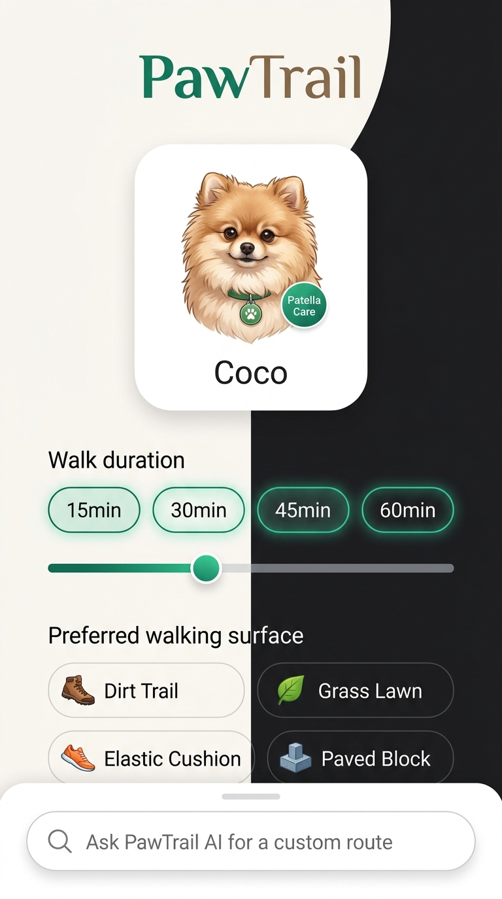
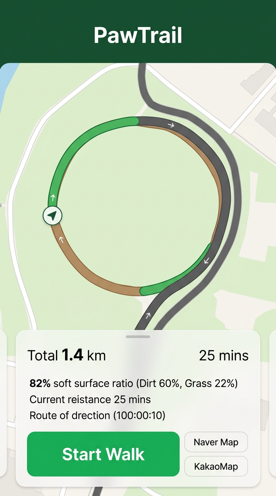
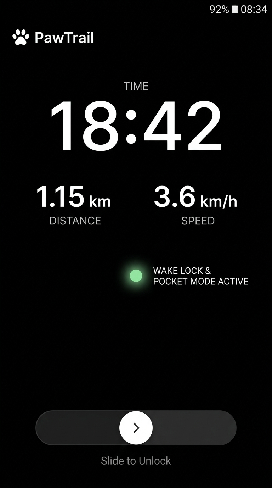
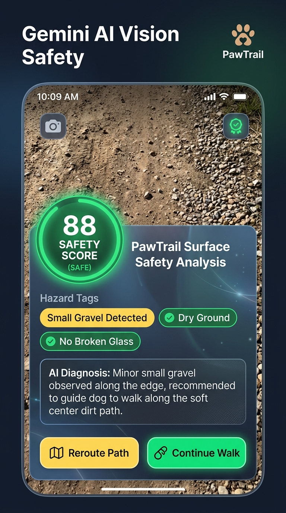
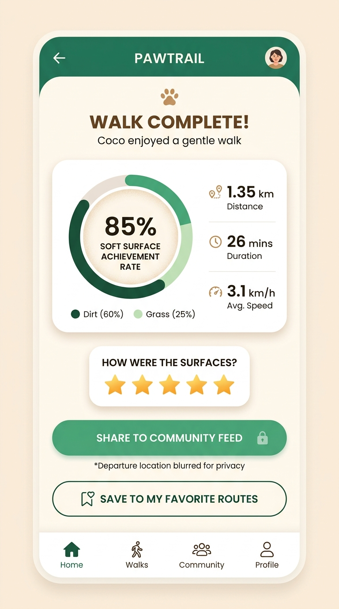
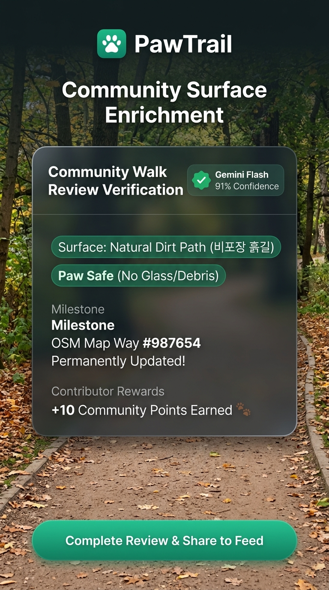
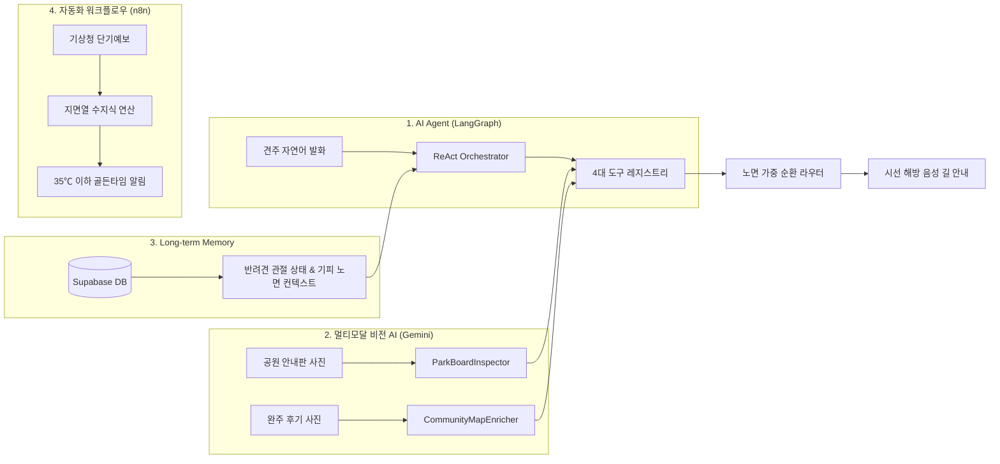
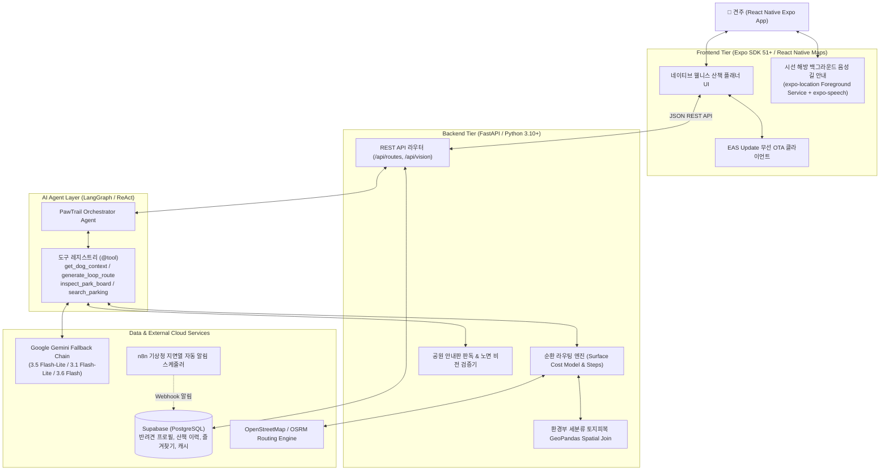

# 🐾 PawTrail (포트레일)

> **"우리 아이 발바닥과 관절을 위한 가장 안전하고 푹신한 길"**  
> **AI Native 반려견 맞춤형 안심 노면 산책 에이전트 및 기록·공유 플랫폼**

PawTrail은 딱딱한 아스팔트와 보도블록 대신 **흙길, 잔디길, 탄성포장로** 등 반려견 신체 조건에 최적화된 맞춤형 산책로를 AI가 자율적으로 찾아주고 안내해 주는 AI Native 서비스입니다.

---

## 📊 프로젝트 현황 (Project Status)

> 💡 **현재 진행 단계: Sprint 1 구현 착수 단계 (기획·설계 및 TDD 도메인 스펙 수립 완료)**  
> 본 저장소는 전체 기획(01~08), 아키텍처 설계, 화면 UI 목업, 그리고 구현의 기준이 되는 **71개 TDD 도메인 명세 테스트**가 완성된 상태이며, 이를 토대로 실제 FastAPI 백엔드 및 React Native Expo 모바일 앱 코드를 단계별로 구현해 나가는 시점입니다.

| 구분 | 현황 및 진행 내용 | 비고 |
|---|---|---|
| **현재 마일스톤** | **Sprint 1 착수 (도메인 설계 및 TDD 스펙 100% 수립 완료)** | 16개 User Story / 55개 Task / 62 pt / 334 h |
| **TDD 명세 검증** | **71개 도메인 알고리즘·스키마 테스트 통과** | `pytest test_case/` (0.49s, 자체 내장 스펙 검증) |
| **핵심 알고리즘** | **노면 비용 수지식, 지면열 공식, 거리 환산 수식 정립** | 수학적 모델 및 Pydantic V2 DTO 규격 확정 |
| **UI/UX 디자인** | **6대 핵심 시나리오 UI 화면 목업 및 뷰어 제작 완료** | `docs/screens/` 고화질 디자인 및 웹 뷰어 완비 |
| **다음 진행 작업** | **FastAPI 백엔드 서비스 구축 & React Native 앱 초기화** | TDD 로직의 `services/` 모듈화 및 실제 API 연동 |

---

## 📖 목차 (Table of Contents)

1. [💡 왜 PawTrail인가? (기획 배경 및 문제 정의)](#1--왜-pawtrail인가-기획-배경-및-문제-정의)
2. [✨ 핵심 기능 및 UI 프리뷰 (Key Features & UI Preview)](#2--핵심-기능-및-ui-프리뷰-key-features--ui-preview)
3. [🤖 AI Native 핵심 기술 설계 (Core AI & Automation)](#3--ai-native-핵심-기술-설계-core-ai--automation)
4. [🏗️ 시스템 아키텍처 (Architecture)](#4-️-시스템-아키텍처-architecture)
5. [👥 팀 구성 및 역할 분담 (Team Roles)](#5--팀-구성-및-역할-분담-team-roles)
6. [📚 산출물 및 문서 로드맵 (Docs Roadmap)](#6--산출물-및-문서-로드맵-docs-roadmap)
7. [🧪 TDD 테스트 스위트 구조 및 실행 (Getting Started)](#7--tdd-테스트-스위트-구조-및-실행-getting-started)
8. [🎯 5인 CBT 계획 및 완료 정의 (User Testing & DoD)](#8--5인-cbt-계획-및-완료-정의-user-testing--dod)
9. [📐 엔지니어링 표준 및 코딩 규칙 (Engineering Standards)](#9--엔지니어링-표준-및-코딩-규칙-engineering-standards)
10. [🔗 주요 산출물 링크 (Artifacts & Links)](#10--주요-산출물-링크-artifacts--links)

---

## 1. 💡 왜 PawTrail인가? (기획 배경 및 문제 정의)

### 🚨 견주들의 3대 페인포인트 (Problem)
1. **아스팔트 충격과 지면열 화상**:
   - 국내 소형견의 다수가 관절 안심 케어가 필요하며, 딱딱한 아스팔트와 보도블록은 관절에 지속적인 충격을 가합니다.
   - 한여름 낮 아스팔트 표면 온도는 **50℃ 이상**으로 치솟아 반려견 발바닥 패드 화상을 초래합니다.
2. **상용 지도의 노면 데이터 부재**:
   - 네이버 지도, 카카오맵, T맵 등은 자동차나 사람 기준의 **'최단거리'**만 안내할 뿐, 경로가 **흙길인지, 잔디길인지, 위험한 자갈밭인지** 알려주지 못합니다.
3. **리드줄 파지 중 스마트폰 주시의 위험성**:
   - 돌발 행동을 하는 반려견을 제어하기 위해 손에 리드줄을 쥔 상태에서 스마트폰 화면을 계속 보며 걷는 행위는 보행자 충돌 및 안전사고의 주원인이 됩니다.

### 🐾 PawTrail의 해결책 (Solution)
* **노면 인지형 라우팅 (Surface-Aware Routing)**: 환경부 세분류 토지피복지도(SHP) 공간 결합(Spatial Join)과 OSM 보행 도로망을 결합해 부드러운 흙길/잔디길 통과 비율이 극대화된 순환 루프 코스를 생성합니다.
* **시선 해방(Eyes-Free) & 두 손 자유(Hands-Free) 음성 길 안내**: 화면을 꺼둔 채 주머니에 폰을 넣어도 Android Foreground Service와 `expo-speech` TTS가 회전 지점과 흙길 노면 전환을 실시간으로 음성 브리핑합니다.
* **산책 전/후 비전 AI 검증**: 공원 입구 종합안내판 사진을 찍으면 출입 금지구역과 흙길을 사전 판독하고, 산책 완주 후기 사진 비전 검증을 통해 지도의 결측 노면 속성을 영구 보강합니다.
* **감성 웰니스 UX 혁신**: 앱 전역에서 '슬개골 탈구' 등 불편한 임상 질병 단어를 배제하고 **"폭신한 길"**, **"관절 안심 케어"** 등 따뜻하고 긍정적인 웰니스 언어로 100% 순화합니다.

---

## 2. ✨ 핵심 기능 및 UI 프리뷰 (Key Features & UI Preview)

### 2.1 6대 핵심 기능 (Key Features)

| 기능 | 아이콘 | 핵심 설명 | 담당 기술 |
|---|:---:|---|---|
| **자연어 산책 플래너** | 🤖 | "관절 안심 케어가 필요한 포메인데 30분 정도 폭신한 길로 걷고 싶어" 발화 시 AI가 최적 루프 코스 생성 | LangGraph ReAct, Gemini Fallback Chain |
| **선호 노면 맞춤 라우팅** | 🗺️ | 흙/잔디길 가중치 대폭 할인(0.45), 아스팔트/자갈길 회피(2.5~3.5), 환경부 피복도 공간 결합 순환로 도출 | GeoPandas Spatial Join, OSRM/ORS |
| **공원 안내판 비전 판독** | 📸 | 공원 입구 종합안내판 사진 파싱으로 반려견 출입금지구역 자동 회피 및 흙길 경로 보정 | Gemini Fallback Chain (3.5 Flash-Lite / 3.1 Flash-Lite / 3.6 Flash) |
| **핸즈프리 음성 길 안내** | 🎧 | 주머니 속 다크 포켓 모드에서도 회전 30m 전 및 흙길 진입을 끊김 없이 백그라운드 음성 브리핑 | React Native, `expo-location`, `expo-speech` |
| **기상청 연동 지면열 알림** | ☀️ | 일사량/기온 기반 지면열 수지식 계산으로 35℃ 이하 일일 최적 안심 산책 골든타임 알림 | n8n 노코드 자동화 파이프라인, 기상청 API |
| **안심 코스 피드 & 체크인** | 🐾 | 완주 후 선호 노면 달성률 리포트, 집 주소 지오해시 블러링 마스킹 후 이웃 견주와 코스 공유 | Supabase (PostgreSQL), Geo-Masking |

### 2.2 6대 핵심 화면 디자인 목업 (UI Prototype)

> 💡 **인터랙티브 스크린 뷰어**: [`docs/screens/index.html`](file:///d:/코디세이/PawTrail/docs/screens/index.html)을 웹 브라우저로 열면 전체 6개 화면의 실제 UI 목업과 상세 시나리오 인터랙션을 직접 확인할 수 있습니다.

| 화면 1: 대화형 산책 플래너 | 화면 2: 노면 맞춤 코스 프리뷰 | 화면 3: 다크 포켓 모드 & 음성 안내 |
|:---:|:---:|:---:|
|  |  |  |
| 반려견 프로필과 시간(10~90분) 기반 맞춤 경로 생성 | 노면 속성별 색상 구분 Polyline 및 흙길 비율 시각화 | 화면 꺼짐/주머니 상태에서 실시간 음성 브리핑 |

| 화면 4: 공원 안내판 비전 판독 | 화면 5: 안심 산책 완주 리포트 | 화면 6: 커뮤니티 노면 집단지성 보강 |
|:---:|:---:|:---:|
|  |  |  |
| 공원 종합안내판 사진 분석 및 출입금지구역 우회 | 선호 노면 달성률(%) 및 관절 안심 케어 통계 | 완주 후기 사진 비전 판독으로 지도 속성 영구 보강 |

---

## 3. 🤖 AI Native 핵심 기술 설계 (Core AI & Automation)

본 프로젝트는 **AI Native 캡스톤 최종 미션([`00_final_mission.md`](file:///d:/코디세이/PawTrail/docs/00_final_mission.md))**에서 요구하는 4대 필수 기술 요소를 전수 설계 및 테스트 스펙으로 구체화했습니다:



### 1️⃣ AI Agent (LangGraph & ReAct Framework)
* **자율 도구 오케스트레이션**: 사용자 발화에서 목표 산책 시간(10~90분)과 선호 조건을 추출하고, 필수 정보 누락 시 **Clarification(되물음) 대화 루프**를 자율 실행합니다.
* **4대 핵심 도구 레지스트리 (`@tool`)**:
  - `get_dog_context`: 반려견 체급, 보행 속도 및 관절 안심 케어 수준 주입
  - `generate_loop_route`: 노면 비용 모델 기반 목표 거리 오차 ±10% 이내 순환 루프 생성
  - `inspect_park_board`: 공원 안내판 판독 결과(금지구역/흙길 포인트) 경로 제약 주입
  - `search_parking`: 차량 동반 원정 견주를 위한 반경 1.5km 공영주차장 연계

### 2️⃣ 멀티모달 비전 AI (Gemini Flash Vision)
* **산책 전 공원 종합안내판 분석 (`ParkBoardInspector`)**:
  - 공원 입구의 종합안내판 사진을 멀티모달로 분석하여 반려견 출입 금지구역(생태보존구역, 어린이놀이터 등) 좌표를 추출하고 라우팅 차단 노드로 주입합니다.
* **산책 후 완주 사진 검증 (`CommunityMapEnricher`)**:
  - 견주가 업로드한 산책 후기 사진의 노면을 판독하여 **신뢰도 0.85 이상**일 경우 OpenStreetMap 도로망의 노면 속성을 영구 보강(집단지성 맵 최신화)합니다.

### 3️⃣ Long-term Memory & Personalization (Supabase)
* **반려견 신체 컨텍스트 주입**: 견종별 체급 및 관절 안심 케어 수준(`joint_care_level`: 0~4)에 맞춰 보행 기준 속도(2.4~4.2 km/h) 및 목표 거리를 동적 계산합니다.
* **피드포워드 가중치 조정**: 이전 산책 후기에서 "자갈이 많아 불편했다"는 피드백이 누적되면 해당 구간의 회피 가중치를 자동으로 상향 조정합니다.

### 4️⃣ 노코드 자동화 워크플로우 (n8n Automation)
* **기상청 API 연계 지면열 예측 파이프라인**:
  - 기상청 단기예보 API의 기온, 풍속, 일사량 데이터를 수집하여 지면열 열수지 회귀식을 연산합니다.
  - 지면 온도가 35℃ 이하로 떨어지는 **당일 최적 산책 골든타임**을 도출하여 견주에게 푸시 알림을 자동 발송합니다.

---

## 4. 🏗️ 시스템 아키텍처 (Architecture)

PawTrail은 **React Native 모바일 클라이언트 + FastAPI 백엔드 + LangGraph AI 에이전트 + Supabase + n8n**으로 연결되는 아키텍처로 설계되었습니다.



---

## 5. 👥 팀 구성 및 역할 분담 (Team Roles)

팀원 5명이 각자의 전문 영역을 맡아 5주 애자일 스프린트 체계로 개발을 진행합니다.  
(총 18개 User Story / 68개 Task / 77 Story Points / 372 Hours)

| 팀원 | 핵심 역할 | 주 업무 영역 및 기술 스택 | 담당 사용자 스토리 | 공수 |
|:---:|---|---|---|:---:|
| **Member A** | **PM & AI Agent Lead** | • 프로젝트 총괄 및 스프린트 일정 관리<br/>• LangGraph 기반 ReAct 에이전트 오케스트레이션 및 다요소 라우팅 스코어링 결합 | **US-A1, US-A3, US-B4, US-D2, US-E3** | 65 h (17.5%) |
| **Member B** | **AI & Spatial Data Engineer** | • Gemini 가용 모델 순차 선택(3.5 Flash-Lite ➔ 3.1 Flash-Lite ➔ 3.6 Flash) 비전 분석<br/>• GIS 데이터 파이프라인(DEM 경사도, 태양 위치 그늘 모델링, OSM 계단 필터링) | **US-B1, US-B2, US-B3, US-D1, US-D2, US-F1, US-G1, US-G2** | 71 h (19.1%) |
| **Member C** | **Backend & Spatial Routing Lead** | • FastAPI 백엔드 구축 및 REST API 계약 구현<br/>• NetworkX 가중치 보행 네트워크 라우팅 엔진, 위험 우회 재탐색 및 캐싱 | **US-B1, US-B2, US-B3, US-B4, US-D2, US-F1, US-G1, US-G2** | 91 h (24.5%) |
| **Member D** | **Frontend & Mobile App Lead** | • React Native Expo 기반 모바일 클라이언트 앱 코어 구현<br/>• 시선 해방 백그라운드 핸즈프리 음성 안내(Foreground Service + TTS) 및 위치 추적 | **US-A2, US-C1, US-C2, US-D2, US-E1, US-E2, US-E3, US-H1** | 94 h (25.3%) |
| **Member E** | **UI/UX Designer & Product Experience Lead** | • 디자인 시스템 구축 및 18개 스토리 UI/UX 디자인 에셋 고도화<br/>• EAS Build/Update 무선 배포 및 5인 실사용자 CBT 총괄, 사용자 경험 개선 | **US-A2, US-A3, US-C1, US-E2, US-F1, US-G1, US-G2, US-H1** | 51 h (13.7%) |

---

## 6. 📚 산출물 및 문서 로드맵 (Docs Roadmap)

프로젝트 기획부터 아키텍처, 세부 작업 분할, 요구사항 추적 매트릭스까지 모든 문서가 일관되게 동기화되어 있습니다:

```
docs/
├── 00_final_mission.md                      [캡스톤 최종 미션 가이드라인 및 필수 기술 규격]
├── 01_PawTrail_Project_Proposal.md           [1단계: 프로젝트 제안서, 문제 정의 및 솔루션]
├── 02_PawTrail_Team_building.md              [2단계: 팀 빌딩, 5인 R&R 및 3대 기술 전략]
├── 03_PawTrail_Agile_User_Stories.md         [3단계: 18개 애자일 사용자 스토리 및 인수 조건(AC)]
├── 04_PawTrail_Architecture_Design.md        [4단계: C4 시스템 설계, 시퀀스 다이어그램 및 DB ERD]
├── 05_PawTrail_Detailed_Implementation_Plan.md [5단계: 5주간 주차별 스프린트 마일스톤 및 협업 계획]
├── 06_PawTrail_Task_Breakdown_and_Estimations.md [6단계: 68개 구현 세부 Task 및 372h 공수 산정]
├── 07_PawTrail_Traceability_Matrix.md        [7단계: 요구사항 양방향 추적 매트릭스 (RTM)]
├── presentation/                             [최종 발표 슬라이드 전략 및 Q&A 방어 논리 스크립트]
├── reports/                                  [일일 스크럼 개발 일지 (2026-09-21.md 등)]
├── reviews/                                  [Gemini Code Assist 가이드 및 항공/로드뷰 분석]
└── screens/                                  [6대 핵심 화면 고화질 목업 및 인터랙티브 웹 뷰어]
```

> 💡 **AI 협업 및 엔지니어링 가이드라인 (`.gemini/`)**:
> - [`.gemini/GEMINI.md`](file:///.gemini/GEMINI.md): AI Agent 개발 가드레일, 4대 Tool 규격, 완료 정의(DoD).
> - [`.gemini/coding_rule.md`](file:///.gemini/coding_rule.md): 클린코드 임계치(단일 파일 250줄, 함수 40줄, 인지 복잡도 10 이하).
> - [`.gemini/UX_COMPACT_RULES.md`](file:///.gemini/UX_COMPACT_RULES.md): 한 손 조작 환경, 다크 포켓 모드 및 웰니스 순화 카피라이팅 원칙.

---

## 7. 🧪 TDD 테스트 스위트 구조 및 실행 (Getting Started)

### 7.1 도메인 명세 테스트(Specification Test)란?
현재 저장소의 [`test_case/`](file:///d:/코디세이/PawTrail/test_case/) 디렉토리는 코드 작성 전 시스템의 비즈니스 규칙과 계약을 먼저 정의한 **TDD 명세 테스트 세트**입니다.

* **자체 완결형(Self-contained) 설계**:
  - 각 테스트 파일 내에 **노면 비용 계산 함수, Pydantic V2 검증 스키마, 되물음(Clarification) 판단 로직, 지면열 수지식 연산 모듈**이 내장되어 있습니다.
  - 외부 서버나 DB 연결 없이도 **비즈니스 알고리즘의 무결성과 데이터 계약의 정확성을 즉각 검증**할 수 있습니다.
* **다음 단계 로드맵**:
  - Sprint 1에서 생성될 FastAPI 백엔드의 `services/` 및 `schemas/` 모듈로 해당 함수들을 자연스럽게 추출 및 분리 이관합니다.

### 7.2 테스트 실행 방법
```bash
# 1. 테스트 실행 환경 설치 (Python 3.10+)
pip install pytest pydantic httpx

# 2. 전체 71개 도메인 명세 테스트 일괄 검증
python -m pytest test_case/ -v
```

실행 결과:
```
============================== 71 passed in 0.49s ==============================
```

### 7.3 테스트 모듈별 검증 명세 (`test_case/`)

| 테스트 파일명 | 대상 스토리 | 검증 핵심 내용 |
|---|:---:|---|
| [`test_surface_cost_model.py`](file:///d:/코디세이/PawTrail/test_case/test_surface_cost_model.py) | **US-02, US-03** | • 노면 비용 공식($\text{Cost} = \text{Length} \times W_{\text{base}} \times W_{\text{pref}}$)<br>• 환경부 토지피복 Spatial Join 및 5단계 `surface_source` 투명성 태깅<br>• 선호 노면 점유율 $\ge 50\%$ 순환 루프 경로 생성 |
| [`test_walk_plan_agent_schema.py`](file:///d:/코디세이/PawTrail/test_case/test_walk_plan_agent_schema.py) | **US-01, US-06** | • Pydantic V2 산책 생성 요청 엄격 검증(시간 10~90분, 좌표 유효성)<br>• 필수 파라미터 누락 시 Clarification(되물음) 트리거<br>• 반려견 관절 안심 케어 수준(`joint_care_level`) 및 메모리 주입 |
| [`test_loop_target_duration.py`](file:///d:/코디세이/PawTrail/test_case/test_loop_target_duration.py) | **US-16** | • 시간 기반 목표 거리($D = V \times T$) 산출 및 오차 ±10% 이내 루프 생성<br>• 15분, 30분, 45분 시간대별 및 견종 체급별 거리 환산 정밀도 |
| [`test_vision_safety_inspector.py`](file:///d:/코디세이/PawTrail/test_case/test_vision_safety_inspector.py) | **US-04, US-05** | • 공원 종합안내판 비전 판독(`ParkBoardInspector`) 및 출입금지구역 우회<br>• 완주 후기 사진 비전 검증(`CommunityMapEnricher`, 신뢰도 $\ge 0.85$ 보강) |
| [`test_walk_tracking_and_feedback.py`](file:///d:/코디세이/PawTrail/test_case/test_walk_tracking_and_feedback.py) | **US-08, US-09, US-11, US-15** | • 선호 노면 달성률(%) 계산, 체크인 피드백 및 5인 CBT 가중치 재조정<br>• 오프라인 로컬 저장소 동기화 검증 |
| [`test_thermal_and_parking.py`](file:///d:/코디세이/PawTrail/test_case/test_thermal_and_parking.py) | **US-12, US-13** | • 기상청 일사량 연동 지면열 수지식 연산 및 35℃ 이하 골든타임 도출<br>• 반경 1.5km 이내 공영주차장(P&R) 필터링 |
| [`test_api_contracts.py`](file:///d:/코디세이/PawTrail/test_case/test_api_contracts.py) | **REST API Contract** | • FastAPI 핵심 REST API 엔드포인트 입출력 DTO 계약 검증<br>• GeoJSON FeatureCollection 및 나만의 코스 즐겨찾기 스키마 |

---

## 8. 🎯 5인 CBT 계획 및 완료 정의 (User Testing & DoD)

### 8.1 5인 실사용자 CBT 계획 (US-11, Sprint 2 진행 예정)
캡스톤 4~5주차에는 **실제 견주 5인**과 함께 현장 필드 테스트를 진행하여 시스템을 튜닝할 예정입니다:

| 테스터 페르소나 | 견종 / 특성 | 필드 테스트 핵심 검증 시나리오 | 예상 피드백 반영 사항 |
|---|---|---|---|
| **User 1 (소형견)** | 포메라니안 (관절 안심 케어 필요) | 흙길/잔디길 가중치 할인 및 관절 안심 경로 만족도 | 선호 노면 할인 계수($W_{\text{pref}}$: 0.50 $\to$ 0.35) 강화 |
| **User 2 (대형견)** | 골든 리트리버 (원정 산책) | 공영주차장(P&R) 거점 출발 순환 루프 경로 편의성 | 주차장 출구-흙길 진입점 최단 도보 결합 가중치 적용 |
| **User 3 (노령견)** | 시츄 13세 (체력 저하) | 급경사/계단 회피 및 완만한 평지 경로 안정성 | 고도 급변 구간 페널티 계수 및 평지 우대 로직 보완 |
| **User 4 (일반견)** | 믹스견 (동네 공원 산책) | 공원 입구 종합안내판 촬영 및 출입금지구역 우회 | 진입 불가 구역 시각적 붉은색 오버레이 UI 제공 |
| **User 5 (활동견)** | 보더콜리 (낮 시간 산책) | 기상청 연동 35℃ 이하 최적 산책 골든타임 알림 유용성 | 산책 준비 30분 전 사전 푸시 알림 발송 최적화 |

### 8.2 단계별 완료 정의 (Definition of Done)

#### ✅ 현재 달성된 항목 (Design & Specification DoD)
- [x] 16개 애자일 사용자 스토리 및 55개 구현 Task (334h) 분할 완료
- [x] 노면 비용 함수, 지면열 수지식, 견종별 거리 환산 수식 등 핵심 알고리즘 수학적 모델 정립
- [x] Pydantic V2 기반 입출력 DTO 및 FastAPI REST API 규격 계약 완료
- [x] 71개 TDD 도메인 명세 테스트 작성 및 100% 통과 (0.49s)
- [x] 6대 핵심 시나리오 UI 화면 목업 및 인터랙티브 웹 뷰어 완비

#### 🚀 향후 구현 및 배포 시 충족할 항목 (Production DoD)
- [ ] 실제 FastAPI 백엔드 구축 및 외부 서비스(OSRM, Gemini 가용 모델 체인, Supabase) 실연동
- [ ] React Native Expo 앱 구축 및 Android Foreground Service 백그라운드 음성 길 안내 구현
- [ ] 앱 UI 및 음성 스크립트 내 질병 용어 100% 배제 및 긍정적 웰니스 언어 준수
- [ ] 개인정보 보호(출발지/거주지 좌표 100m 지터링 마스킹) 적용
- [ ] EAS 무선 OTA 배포 파이프라인 가동 및 실제 견주 5인 현장 CBT 완수

---

## 9. 📐 엔지니어링 표준 및 코딩 규칙 (Engineering Standards)

모든 팀원은 [`.gemini/coding_rule.md`](file:///.gemini/coding_rule.md)에 명시된 규칙을 준수하여 고품질 클린코드를 작성합니다.

### 9.1 코드 규모 및 복잡도 임계치
* **단일 파일 라인 수**: **250 라인 이하 권고** (최대 400 라인 초과 절대 금지)
* **단일 함수/컴포넌트 라인 수**: **40 라인 이하 권고** (최대 80 라인 제한)
* **인지 복잡도 (Cognitive Complexity)**: **10 이하 권고** (15 초과 시 즉시 분할 리팩토링)
* **제어문 중첩 깊이**: 2단계 초과 금지 ➔ **조기 반환 (Guard Clause)** 필수 적용

### 9.2 웰니스 카피라이팅 가이드라인 (제10항)
* 사용자의 심리적 불안을 유발하는 의학/임상 질병 단어는 앱 UI 및 음성 안내에서 전면 배제합니다.
  - ❌ *"슬개골 탈구 2기 주의 구간"* ➔ ⭕ **"우리 아이 관절을 아껴주는 폭신한 흙길"**
  - ❌ *"아스팔트 관절 손상 위험"* ➔ ⭕ **"발바닥이 편안한 잔디길 우선 안내"**

---

## 10. 🔗 주요 산출물 링크 (Artifacts & Links)

* 📊 **최종 발표 자료 (PPTX)**: [`docs/presentation/PawTrail_Soft_Path_Engineering.pptx`](file:///d:/코디세이/PawTrail/docs/presentation/PawTrail_Soft_Path_Engineering.pptx)
* 📱 **인터랙티브 UI 스크린 뷰어**: [`docs/screens/index.html`](file:///d:/코디세이/PawTrail/docs/screens/index.html)
* 📋 **요구사항 양방향 추적 매트릭스**: [`docs/08_PawTrail_Traceability_Matrix.md`](file:///d:/코디세이/PawTrail/docs/08_PawTrail_Traceability_Matrix.md)
* 📅 **최신 일일 스크럼 개발 일지**: [`docs/reports/2026-09-18.md`](file:///d:/코디세이/PawTrail/docs/reports/2026-09-18.md)
* 🧪 **TDD 테스트 스위트 가이드**: [`test_case/README.md`](file:///d:/코디세이/PawTrail/test_case/README.md)

---

> 🐾 **PawTrail Team**:  
> *"반려견에게 산책은 하루의 전부입니다. 가장 편안하고 안전한 발걸음을 선물합니다."*
