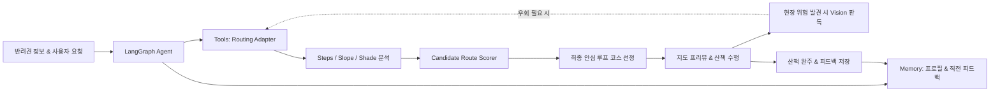

# 🐾 PawTrail 팀 빌딩 & 핵심 프로젝트 전략

> **"AI Native 관점의 선택과 집중"**  
> 5주라는 제한된 일정 내에 실제 사용 가능한 완성도 높은 제품을 구현하고 가치를 증명하기 위해 반드시 준수해야 할 팀 R&R 및 엔지니어링 실행 원칙입니다.

---

## 📌 1. 핵심 요약 (Executive Summary)

* **과정의 본질 증명**: 바닥부터 복잡한 GIS 알고리즘을 짜는 것이 아닌, **"사용자 문제를 정의하고 AI Agent가 외부 도구(Routing API, Steps, DEM, Shade, Vision)를 자율 제어해 해결하는 역량"**에 집중합니다.
* **3대 집중 전략**:
  1. **직접 A* 엔진 및 위성 CV 지양** ➔ **표준 Routing API Adapter 제어 & Steps/Slope/Shade 다요소 분석 결합**
  2. **무리한 백그라운드 GPS 종속 지양** ➔ **Next.js PWA 기반 Foreground 위치 추적 & 외부 지도(네이버/카카오 지도) 딥링크 연동**
  3. **과도한 스트리밍(SSE/WS) 인프라 지양** ➔ **안정적인 REST API + 5주 점진적 개발 및 5인 실사용자 필드 검증**
* **목표 달성성**: 도출된 **18개 사용자 스토리 (총 77 pt / 376h)**를 5인 전문 R&R과 애자일 스프린트로 5주 내 충분히 완주 가능.

---

## 🧭 2. 3대 기술 엔지니어링 전략

### 2.1 GIS 엔진 직접 코딩 ❌ ➔ Agent 도구 제어 & Routing Adapter ⭕

> **미션의 본질은 C++ 수준의 공간 지리 알고리즘을 밑바닥부터 구현하는 것이 아닙니다.**

| 구분 | 피해야 할 접근 (Bad) | 권장 전략 (Good) |
| :--- | :--- | :--- |
| **접근 방식** | Raw OSM 그래프 직접 구축 및 A* 알고리즘 자체 구현 | `OpenRouteService`/`OSRM` 표준 라우팅 API Adapter 연동 & Steps/Slope/Shade 분석 |
| **문제점 / 기대효과** | 복잡한 엣지 케이스 디버깅으로 인한 일정 지연, 바퀴의 재발명 | 검증된 도로망 위에서 계단 배제, 고도차, 그늘 분석에 집중해 0.1초 수준 라우팅 실현 |
| **에이전트 역할** | 단순 길찾기 결과 출력에 그침 | **반려견 신체 조건·산책 환경을 종합 분석**해 최적의 제약조건과 Waypoint를 자율 결정 후 API 호출 |
| **평가 관점** | 단순 알고리즘 바퀴 재발명 (저평가 위험) | **다양한 환경 공간정보 융합 및 AI Native 도구 오케스트레이션으로 완성도 극대화** |

---

### 2.2 모바일 웹 백그라운드 GPS 집착 ❌ ➔ Foreground 기록 & 상용 지도 연동 ⭕

> **모바일 브라우저의 백그라운드 위치 추적은 OS 정책상 극도로 불안정합니다. 실현 가능한 모바일 UX를 구축합니다.**

* **Foreground 위치 기록 우선**:
  - Next.js PWA 반응형 웹을 채택하여 산책 중 사용자가 화면을 열어 현재 위치, 경과 시간, 이동 거리를 확인하는 **Foreground 위치 추적**을 안정적으로 지원합니다.
* **외부 상용 지도 앱 도보 길찾기 딥링크**:
  - 도심지 복잡한 갈림길의 턴바이턴 안내가 필요할 경우, 원터치로 **네이버 지도 및 카카오맵 도보 길찾기**로 연동하여 사용자에게 친숙하고 안정적인 내비게이션 경험을 제공합니다.
* **현장 중심의 상호작용**:
  1. **구간별 속성 시각화**: 산책 전 경로의 상태(그늘/완만, 일반, 급경사 주의)를 지도 위에 색상으로 구분 표시.
  2. **현장 위험 Vision 분석**: 보행 중 마주친 높은 턱이나 계단 사진을 찍어 안전 우회 권장 획득.
  3. **완주 요약 및 피드백**: 산책 종료 후 실제 이동 거리/시간 요약 카드 및 체감 만족도(계단 회피, 경사 완만도) 저장.

---

### 2.3 복잡한 양방향 스트리밍 ❌ ➔ 예측 가능한 REST API & 5주 완결형 배포 ⭕

> **양방향 스트리밍 디버깅에 갇히면 에이전트 고도화와 실사용자 검증 일정이 무너집니다.**

* **인프라 복잡도 최소화**:
  - 복잡한 SSE나 웹소켓 대신 **명확하고 예측 가능한 REST API 기반 요청/응답 구조**를 기본 뼈대로 채택.
* **일정 로드맵의 선택과 집중**:
  - **1~2주 차**: 기본 에이전트 및 라우팅 어댑터, OSM Steps 및 경사도 분석 완성.
  - **3주 차**: 그늘 추정 모델, 현장 Vision 위험 분석, PWA 프론트엔드 통합.
  - **4~5주 차**: Foreground 위치 기록, 열 위험 안내, 최소 5인 실사용자 필드 테스트 및 피드백 기반 파라미터 튜닝.

---

## 👥 3. 5인 팀 R&R (역할과 책임) 명세

불확실한 "노면 크롤링"이나 "위성 세그멘테이션"을 배제하고, 실제 구동 가능한 서비스 구축을 위한 5인 전문 R&R을 정의합니다.

| 담당자 | 포지션 & 주요 역할 | 담당 범위 및 핵심 책임 | 관련 에픽 및 스토리 |
|:---:|---|---|---|
| **Member A** | **AI Agent / Product Logic Lead** | • LangGraph 기반 Walk Planning Agent 설계 • Pydantic V2 Strict Input Schema 및 상태 머신 수립 • Context Memory 맥락 주입 및 도구 호출 오케스트레이션 • 후보 경로 평가 코멘트 생성 및 프롬프트 가드레일 | Epic A (US-A1, US-A3) Epic B (US-B4) Epic D (US-D2) Epic E (US-E3) |
| **Member B** | **Vision / Multimodal AI Lead** | • Gemini 1.5 Flash 기반 현장 시각적 위험물(턱, 계단, 장애물) 판독 • Structured JSON 출력 스키마 고정 및 판독 지연시간 최적화 • 저조도, 모션 블러 등 현장 사진 예외 처리 및 가이드 • 공원 종합안내판 출입 제한 구역 파싱 | Epic D (US-D1) |
| **Member C** | **Backend / Routing / GIS Data Lead** | • FastAPI 백엔드 구축 및 REST API 엔드포인트 구현 • OpenRouteService / OSRM 라우팅 API Adapter 연동 • OSM Steps 데이터 필터링 및 DEM 경사도 분석 파이프라인 • SunCalc 태양각 및 건물 그림자 추정(Level 1~2) 모듈 • Candidate Route Scorer 랭킹 알고리즘 개발 | Epic B (US-B1, US-B2, US-B3, US-B4) Epic D (US-D2) Epic G (US-G1) |
| **Member D** | **Frontend / Mobile UX Lead** | • Next.js (App Router) + Tailwind CSS 반응형 PWA 구축 • MapLibre GL JS / Leaflet 기반 지도 렌더링 및 Polyline 색상 분기 • HTML5 Geolocation 기반 Foreground GPS 위치 추적 • 네이버/카카오 지도 도보 길찾기 딥링크 연동 • 산책 조건 입력 폼, 인포그래픽 요약 카드, 피드백 UI | Epic C (US-C1, US-C2) Epic E (US-E1, US-E2) Epic G (US-G2) |
| **Member E** | **Infra / Data / QA Lead** | • Supabase PostgreSQL DDL 설계, RLS 보안 및 CRUD API • Vercel / Cloud Run 배포 자동화 및 환경변수(API Key) 보안 관리 • 기상청 단기예보 연동 열 위험 모니터링 모듈 개발 • **최소 5인 실사용자 필드 테스트 운영 및 피드백 수집 리드** | Epic A (US-A2) Epic E (US-E1, US-E2, US-E3) Epic F (US-F1) Epic H (US-H1) |

---

## 🧠 4. PawTrail 핵심 AI 파이프라인

바닥부터 바퀴를 재발명하지 않고, 아래 **AI Native 파이프라인의 완성도와 상호작용**을 극대화하는 데 집중합니다.

1. **LangGraph Agent**: 전체 산책 워크플로우 오케스트레이션 및 상태 관리.
2. **Context Memory**: 반려견 체급, 연령, 관절 주의 여부, 과거 산책 피드백(경사 체감 등) 기억.
3. **Routing Adapter & Analyzers**: 전문 라우팅 엔진을 통한 후보 경로 수집 및 Steps/Slope/Shade 다요소 분석.
4. **Vision Hazard Inspector**: 현장 보행 중 마주친 높은 턱, 야외 계단, 공사 구간 시각 분석 및 안전 우회 안내.
5. **Foreground Geolocation & Feedback**: 산책 세션 위치 기록 및 완주 피드백 수집을 통한 선순환 구조.

---

## 🚀 5. 팀 운영 및 실행 원칙

1. **문서 정합성 유지**: API 명세, DTO 스키마, 데이터 출처 표기는 기획서·아키텍처·태스크 문서와 100% 일치시킵니다.
2. **Definition of Done (DoD) 준수**: 코드가 존재하는 것만으로 완료로 보지 않고, 정상 입력, 결측치/외부 API 장애 처리, 모바일 화면 검증, 단위 테스트 통과를 필수 검증합니다.
3. **실사용자 중심의 가치 검증**: 기능 개발에 매몰되지 않고 4주 차부터 실제 견주 5인 대상 필드 테스트를 수행하여 체감 만족도를 검증합니다.