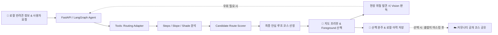

# 🐾 PawTrail 팀 빌딩 & 핵심 프로젝트 전략

> **"AI Native 관점의 선택과 집중"**  
> 5주라는 제한된 일정 내에 실제 사용 가능한 완성도 높은 제품을 구현하고 가치를 증명하기 위해 반드시 준수해야 할 팀 R&R 및 엔지니어링 실행 원칙입니다.

---

## 📌 1. 핵심 요약 (Executive Summary)

* **과정의 본질 증명**: 바닥부터 복잡한 GIS 알고리즘을 짜는 것이 아닌, **"사용자 문제를 정의하고 AI Agent가 외부 도구(Routing API, Steps, DEM, Shade, Vision)를 자율 제어해 해결하는 역량"**에 집중합니다.
* **4대 집중 전략**:
  1. **직접 A* 엔진 및 위성 CV 지양** ➔ **표준 Routing API Adapter 제어 & Steps/Slope/Shade 다요소 분석 결합**
  2. **무리한 백그라운드 GPS 종속 지양** ➔ **Next.js PWA 기반 Foreground 위치 추적 & 외부 지도(네이버/카카오 지도) 딥링크 연동**
  3. **소셜 로그인 및 복잡한 서버 개인정보 축적 배제** ➔ **간단한 이메일 회원가입 & 개인정보 로컬 저장(Privacy-First Local Storage)**
  4. **과도한 스트리밍(SSE/WS) 인프라 지양** ➔ **안정적인 REST API + 5주 점진적 개발 및 5인 실사용자 필드 검증**
* **목표 달성성**: 도출된 **18개 사용자 스토리 (총 75 pt / 366h)**를 5인 전문 R&R과 애자일 스프린트로 5주 내 충분히 완주 가능.

---

## 🧭 2. 4대 기술 엔지니어링 전략

### 2.1 GIS 엔진 직접 코딩 ❌ ➔ Agent 도구 제어 & Routing Adapter ⭕
* C++ 수준의 지리 알고리즘을 바닥부터 구현하지 않고, `OpenRouteService`/`OSRM` 표준 라우팅 API Adapter를 연동하여 도로망 경로를 연산합니다.
* AI Agent는 반려견 조건과 산책 환경을 분석해 최적의 제약조건과 Waypoint를 결정하고 다요소 스코어링을 수행합니다.

### 2.2 모바일 웹 백그라운드 GPS 집착 ❌ ➔ Foreground 기록 & 상용 지도 연동 ⭕
* 모바일 OS 정책상 배터리 절전으로 끊기기 쉬운 백그라운드 GPS 대신, 화면을 켜서 확인하는 **Foreground 위치 추적**을 채택합니다.
* 턴바이턴 안내가 필요한 복잡한 교차로는 원터치로 **네이버/카카오 지도 도보 길찾기 딥링크**로 연동합니다.

### 2.3 소셜 로그인 및 서버 개인정보 DB ❌ ➔ 간단 이메일 가입 & 로컬 저장 ⭕
* 카카오/구글 소셜 로그인은 외부 개발자 센터 등록 및 도메인 검증, OAuth 심사 등 외부 병목이 큽니다.
* **Supabase Auth 기반의 간단한 이메일/비밀번호 가입(개발/CBT 중 Auto-confirm)**으로 인증을 단순화합니다.
* 자택 위치, 보행 궤적, 반려견 프로필 등 민감 정보는 **사용자의 폰(IndexedDB/LocalStorage)에만 저장**하여 서버 해킹 시에도 개인정보 유출을 원천 차단합니다.
* 서버는 오직 '커뮤니티 공개 코스(출발지 200m 마스킹)'와 '현장 위험 제보'만 가볍게 관리합니다.

### 2.4 복잡한 양방향 스트리밍 ❌ ➔ 예측 가능한 REST API & 5주 완결형 배포 ⭕
* SSE나 웹소켓 디버깅 병목을 배제하고, 예측 가능한 표준 REST API 구조를 준수합니다.
* 1~2주 차(코어 라우팅/로컬스토리지) $\to$ 3주 차(그늘/비전/PWA) $\to$ 4~5주 차(기록/5인 CBT 및 피드백 튜닝)의 5주 완결형 로드맵을 가동합니다.

---

## 👥 3. 5인 팀 R&R (역할과 책임) 명세

| 담당자 | 포지션 & 주요 역할 | 담당 범위 및 핵심 책임 | 관련 에픽 및 스토리 |
|:---:|---|---|---|
| **Member A** | **AI Agent / Product Logic Lead** | • LangGraph 기반 Walk Planning Agent 설계 • Pydantic V2 Strict Input Schema 및 상태 머신 수립 • 클라이언트가 전달한 로컬 맥락(반려견 조건, 피드백) 기반 무상태(Stateless) 프롬프트 오케스트레이션 • 후보 경로 평가 코멘트 생성 및 가드레일 | Epic A (US-A1, US-A3) Epic B (US-B4) Epic D (US-D2) Epic E (US-E3) |
| **Member B** | **Vision / Multimodal AI Lead** | • Gemini 1.5 Flash 기반 현장 시각적 위험물(턱, 계단, 장애물) 판독 • Structured JSON 출력 스키마 고정 및 판독 지연시간 최적화 • 저조도, 모션 블러 등 현장 사진 예외 처리 및 가이드 • 공원 종합안내판 출입 제한 구역 파싱 | Epic D (US-D1) |
| **Member C** | **Backend / Routing / GIS Data Lead** | • FastAPI 백엔드 구축 및 Stateless REST API 엔드포인트 구현 • OpenRouteService / OSRM 라우팅 API Adapter 연동 • OSM Steps 데이터 필터링 및 DEM 경사도 분석 파이프라인 • SunCalc 태양각 및 건물 그림자 추정(Level 1~2) 모듈 • Candidate Route Scorer 랭킹 알고리즘 개발 | Epic B (US-B1, US-B2, US-B3, US-B4) Epic D (US-D2) Epic G (US-G1) |
| **Member D** | **Frontend / Mobile UX Lead** | • Next.js (App Router) + Tailwind CSS 반응형 PWA 구축 • **클라이언트 IndexedDB 로컬 스토리지 모듈(반려견 프로필, 개인 산책 이력, JSON 백업/복원)** • HTML5 Geolocation 기반 Foreground GPS 위치 추적 • 네이버/카카오 지도 도보 길찾기 딥링크 연동 • 간편 이메일 회원가입/로그인 폼 및 지도 뷰어 UI | Epic A (US-A2) Epic C (US-C1, US-C2) Epic E (US-E1, US-E2) Epic G (US-G2) |
| **Member E** | **Infra / Data / QA Lead** | • **Supabase Auth 기반 간단한 이메일 가입/로그인 연동 (Auto-confirm 설정)** • 커뮤니티 공개 코스(`community_courses`), 위험 제보(`hazard_reports`) 스키마 및 스토리지 관리 • Vercel / Cloud 배포 자동화 및 환경변수 보안 관리 • **최소 5인 실사용자 필드 테스트 운영 및 피드백 수집 리드** | Epic A (US-A2) Epic E (US-E2) Epic F (US-F1) Epic H (US-H1) |

---

## 🧠 4. PawTrail 핵심 AI 파이프라인

---

## 🚀 5. 팀 운영 및 실행 원칙

1. **프라이버시 기본 탑재 (Privacy by Design)**: 견주의 집 주소와 상세 궤적은 어떤 경우에도 서버 DB에 영구 저장하지 않으며 로컬에만 보관합니다.
2. **독립성과 단순성 (Zero OAuth Dependency)**: 카카오/구글 등의 외부 소셜 승인 대기 없이 Supabase 이메일 가입으로 즉시 구동합니다.
3. **Definition of Done (DoD) 준수**: 정상 입력, 결측치/외부 API 장애 처리, 모바일 화면 검증, 단위 테스트 통과를 필수 검증합니다.