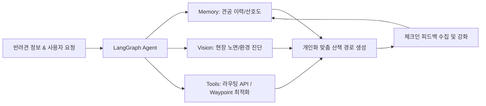

# 🐾 PawTrail 팀 빌딩 & 핵심 프로젝트 전략

> **"AI Native 관점의 선택과 집중"**  
> 팀원들의 역량이 검증되었더라도, **5주라는 제한된 시간 내에 최고의 성과와 높은 평가 점수**를 달성하기 위해 반드시 지켜야 할 프로젝트 운영 및 엔지니어링 원칙입니다.

---

## 📌 핵심 요약 (Executive Summary)

* **과정의 본질 증명**: 바닥부터 알고리즘을 짜는 것이 아닌, **"사용자 문제를 정의하고 AI Agent가 외부 도구를 자율 제어해 해결하는 역량"**에 집중합니다.
* **3대 집중 전략**:
  1. **GIS 알고리즘 자체 구현 지양** ➔ **표준 라우팅 API를 Agent의 도구(`@tool`)로 제어**
  2. **모바일 백그라운드 GPS 트래킹 지양** ➔ **노면 시각화 프리뷰 + 외부 지도 연동 + 체크인 피드백 루프**
  3. **과도한 스트리밍 인프라 지양** ➔ **안정적인 REST API + 3주차 조기 배포 및 프롬프트/가중치 튜닝**
* **목표 달성성**: 기존 도출된 **13개 사용자 스토리(55pt)**를 5인 R&R과 애자일 스프린트로 5주 내 충분히 완주 가능.

---

## 🧭 3대 기술 엔지니어링 전략

### 1. GIS 엔진 직접 코딩 ❌ ➔ Agent 도구(`@tool`) 제어 ⭕

> **미션의 본질은 C++ 수준의 공간 지리 알고리즘을 밑바닥부터 구현하는 것이 아닙니다.**

| 구분 | 피해야 할 접근 (Bad) | 권장 전략 (Good) |
| :--- | :--- | :--- |
| **접근 방식** | Raw OSM 데이터를 직접 파싱해 순환 A* 알고리즘 개발 | `OpenRouteService`, `OSRM` 등 검증된 표준 라우팅 API 연동 |
| **문제점 / 기대효과** | AI Native 역량을 보여주기 어렵고 과도한 시간 소모 | AI Agent의 도구 호출 능력 및 파라미터 제어 역량 부각 |
| **에이전트 역할** | 단순 길찾기 결과 출력에 그침 | **반려견 건강 상태·선호 노면을 종합 분석**해 최적의 경유지(Waypoint)를 자율 결정 후 API 호출 |
| **평가 관점** | 단순 알고리즘 바퀴 재발명 (저평가 위험) | **교육과정 취지에 부합하며 평가 점수 극대화** |

---

### 2. 백그라운드 실시간 GPS ❌ ➔ Agent 상호작용 & 피드백 ⭕

> **모바일 웹의 백그라운드 GPS 차단은 실력 문제가 아닌 OS(Safari, Chrome)의 정책적 제약입니다.**

* **리소스 낭비 방지**: 해결 불가능한 브라우저 백그라운드 위치 추적 권한 이슈에 시간과 체력을 소모하지 않습니다.
* **핵심 상호작용 루프 구축**:
  1. **노면별 프리뷰 시각화**: 산책 전 경로의 노면 상태(흙길, 잔디, 아스팔트 등)를 지도 위에 명확히 표시.
  2. **외부 지도 앱 연동**: 네이버 지도 / 카카오 지도 도보 길찾기 바로가기(딥링크/URL 스킴) 지원.
  3. **산책 완료 체크인 루프**: 산책 종료 후 노면 만족도 및 실제 상태 피드백을 수집하여 Agent Memory에 반영.
* **기대 효과**: 안정적인 환경에서 **5인 CBT(클로즈드 베타 테스트)**를 이슈 없이 성공적으로 완수.

---

### 3. 복잡한 스트리밍 인프라 ❌ ➔ REST API & 조기 배포 ⭕

> **양방향 스트리밍 디버깅에 갇히면 에이전트 고도화와 실사용자 검증 일정이 무너집니다.**

* **인프라 복잡도 최소화**:
  * 복잡한 SSE(Server-Sent Events)나 웹소켓 대신 **명확하고 예측 가능한 REST API 기반 요청/응답 구조**를 기본 뼈대로 채택.
* **일정 로드맵의 선택과 집중**:
  * **3주 차**: 인프라 배포 조기 완료 및 기본 E2E 플로우 정상 작동 확인.
  * **4~5주 차**: 5인 CBT 실사용자 피드백을 기반으로 **LangGraph Agent 프롬프트 엔지니어링 및 노면 추천 가중치 미세 튜닝**에 집중.

---

## 🧠 PawTrail 핵심 AI 파이프라인

알고리즘의 바퀴를 재발명하지 않고, 아래 **AI 파이프라인의 완성도**를 끌어올리는 데 집중합니다.

1. **LangGraph Agent**: 전체 산책 워크플로우 오케스트레이션 및 상태 관리
2. **Context Memory**: 반려견 견종, 연령, 관절 상태, 과거 산책 선호 이력 기억
3. **Vision Processing**: 산책로 사진 및 현장 노면 상태 진단/검증
4. **Tool Integration**: 최적 Waypoint 연산 후 라우팅 엔진을 통한 최종 코스 도출

---

## 🚀 팀 운영 및 실행 권고사항

* **역량에 대한 확신**: 팀원들이 코디세이 과정을 수료했다면 기존에 도출된 **13개 사용자 스토리(총 55 Story Point)**를 5주 내에 완주할 기본 체력은 이미 충분합니다.
* **성공의 열쇠**:
  * ❌ 복잡한 지리 알고리즘 바퀴 재발명
  * ⭕ **"AI Native 파이프라인의 완성도와 실사용자 피드백 루프"**
* **실행 액션**:
  * 계획된 **5인 R&R(역할과 책임)** 및 **애자일 스프린트 타임라인**에 맞춰 즉시 개발에 착수합니다.