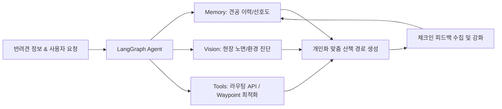

# 🐾 PawTrail 팀 빌딩 & 핵심 프로젝트 전략

> **"AI Native 관점의 선택과 집중"**  
> 팀원들의 역량이 검증되었더라도, **5주라는 제한된 시간 내에 최고의 성과와 높은 평가 점수**를 달성하기 위해 반드시 지켜야 할 프로젝트 운영 및 엔지니어링 원칙입니다.

---

## 📌 핵심 요약 (Executive Summary)

* **과정의 본질 증명**: 바닥부터 알고리즘을 짜는 것이 아닌, **"사용자 문제를 정의하고 AI Agent가 외부 도구를 자율 제어해 해결하는 역량"**에 집중합니다.
* **3대 집중 전략**:
  1. **GIS 자체 구현 및 원시 위성 CV 지양** ➔ **표준 라우팅 API 도구 제어 & 환경부 토지피복도 공간 결합(Spatial Join)**
  2. **폰 화면 주시 보행의 위험성 탈피** ➔ **React Native (Expo) 기반 시선 해방(Eyes-Free) 핸즈프리 음성 길 안내 & EAS 무중단 OTA 배포**
  3. **과도한 스트리밍 인프라 지양** ➔ **안정적인 REST API + 3주차 조기 배포 및 프롬프트/가중치 튜닝**
* **목표 달성성**: 도출된 **16개 사용자 스토리(62pt)**를 5인 R&R과 애자일 스프린트로 5주 내 충분히 완주 가능.

---

## 🧭 3대 기술 엔지니어링 전략

### 1. GIS 엔진 직접 코딩 및 위성 CV ❌ ➔ Agent 도구(`@tool`) & 토지피복 결합 ⭕

> **미션의 본질은 C++ 수준의 공간 지리 알고리즘이나 무거운 위성 영상 세그멘테이션을 밑바닥부터 구현하는 것이 아닙니다.**

| 구분 | 피해야 할 접근 (Bad) | 권장 전략 (Good) |
| :--- | :--- | :--- |
| **접근 방식** | Raw OSM 파싱 A* 개발 및 원시 위성사진 직접 CV 세그멘테이션 | `OpenRouteService`/`OSRM` 표준 라우팅 API 연동 & **환경부 토지피복지도(Land Cover Map) 세분류 Spatial Join** |
| **문제점 / 기대효과** | 수관 차폐(Tree Canopy)로 바닥 식별 불가, 과도한 시간 소모 | 복잡한 딥러닝 없이 0.1초 만에 흙/잔디 비율 100% 정밀 판정 |
| **에이전트 역할** | 단순 길찾기 결과 출력에 그침 | **반려견 건강 상태·선호 노면을 종합 분석**해 최적의 경유지(Waypoint)를 자율 결정 후 API 호출 |
| **평가 관점** | 단순 알고리즘/비전 바퀴 재발명 (저평가 위험) | **공공 공간정보 융합 및 AI Native 도구 제어로 평가 점수 극대화** |

---

### 2. 화면 주시형 보행 위험 ❌ ➔ React Native (Expo) 기반 핸즈프리 음성 안내 ⭕

> **하네스 줄을 잡고 스마트폰 화면을 보며 걷는 것은 견주와 반려견 모두에게 위험합니다. 스마트폰은 주머니에 넣고 귀로 듣는 핸즈프리 보행을 완성합니다.**

* **시선 해방(Eyes-Free) 핸즈프리 보행**: 
  - React Native (Expo SDK 51+)를 채택하여 **Android Foreground Service**로 백그라운드 GPS를 안정적으로 수신하고, `expo-speech`로 OSRM 안내 스텝(갈림길 회전, 횡단보도 주의, 흙길 진입 알림)을 폰 스피커/이어폰으로 실시간 송출합니다.
* **배포 및 유지보수 비용 최소화 (EAS Update OTA)**:
  - 복잡한 스토어 심사나 잦은 APK 재설치 피로도를 없애기 위해, **EAS Build로 테스터 APK를 1회 배포**한 후 모든 기능 수정 및 핫픽스는 **EAS Update (`expo-updates`)를 통해 무중단 OTA로 실시간 배포**합니다.
* **현장 중심 상호작용 및 Fallback 루프**:
  1. **노면별 프리뷰 시각화**: 산책 전 경로의 노면 상태(흙길, 잔디, 아스팔트 등)를 지도 위에 명확히 색상 구분 표시.
  2. **필요 시 외부 지도 딥링크**: 복잡한 교차로에서 시각적 확인이 필요할 때 네이버 지도 / 카카오맵 도보 길찾기 바로가기 지원.
  3. **백그라운드 노면 달성률 리포트**: 산책 종료 후 실제 통과한 흙/잔디길 비율과 관절 안심 걸음 수를 인포그래픽으로 요약 제공.
* **기대 효과**: 5인 CBT 견주들이 두 손과 시선이 자유로운 상태에서 안전하게 필드 테스트를 완수.

---

### 3. 복잡한 스트리밍 인프라 ❌ ➔ REST API & 조기 배포 ⭕

> **양방향 스트리밍 디버깅에 갇히면 에이전트 고도화와 실사용자 검증 일정이 무너집니다.**

* **인프라 복잡도 최소화**:
  * 복잡한 SSE(Server-Sent Events)나 웹소켓 대신 **명확하고 예측 가능한 REST API 기반 요청/응답 구조**를 기본 뼈대로 채택.
* **일정 로드맵의 선택과 집중**:
  * **3주 차**: 인프라 배포 조기 완료 및 기본 E2E 플로우 정상 작동 확인.
  * **4~5주 차**: 5인 CBT 실사용자 피드백을 기반으로 **LangGraph Agent 프롬프트 엔지니어링 및 노면 추천 가중치 미세 튜닝**에 집중.

---

## 🧠 PawTrail 핵심 AI 파이프라인

알고리즘의 바퀴를 재발명하지 않고, 아래 **AI 파이프라인의 완성도**를 끌어올리는 데 집중합니다.

1. **LangGraph Agent**: 전체 산책 워크플로우 오케스트레이션 및 상태 관리
2. **Context Memory**: 반려견 견종, 연령, 관절 안심 케어 선호도(일반/폭신한 길 위주), 과거 산책 선호 이력 및 즐겨찾기 기억
3. **Vision Processing**: 공원 입구 종합안내판 사전 판독 및 완주 후 커뮤니티 노면 제보 검증
4. **Tool Integration**: 환경부 토지피복 Spatial Join 및 라우팅 엔진을 통한 최적 순환 코스 도출

---

## 🚀 팀 운영 및 실행 권고사항

* **역량에 대한 확신**: 팀원들이 코디세이 과정을 수료했다면 도출된 **16개 사용자 스토리(총 62 Story Point)**를 5주 내에 완주할 기본 체력은 이미 충분합니다.
* **성공의 열쇠**:
  * ❌ 복잡한 지리 알고리즘 및 위성 CV 바퀴 재발명
  * ⭕ **"AI Native 파이프라인의 완성도와 실사용자 피드백 루프"**
* **실행 액션**:
  * 계획된 **5인 R&R(역할과 책임)** 및 **애자일 스프린트 타임라인**에 맞춰 즉시 개발에 착수합니다.