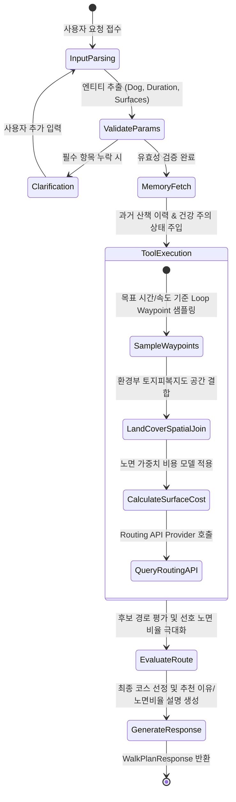
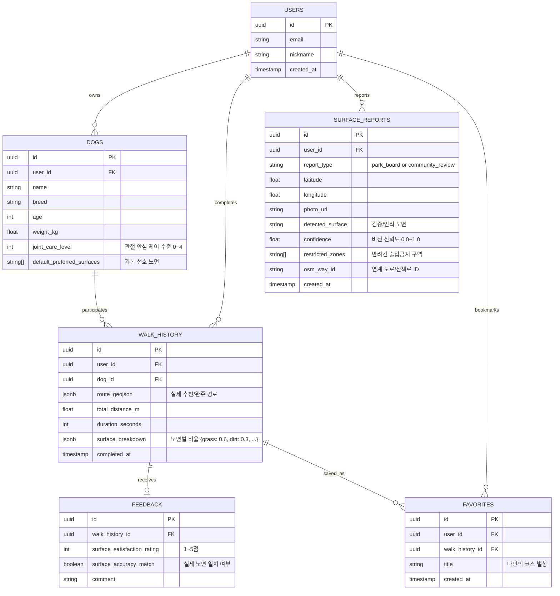
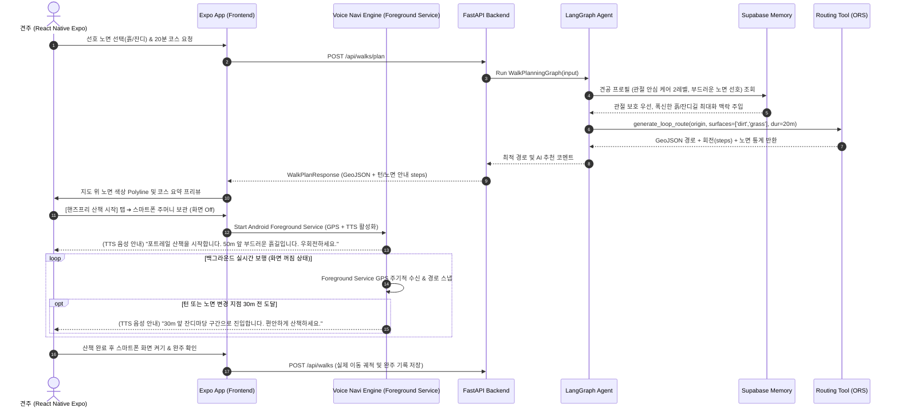
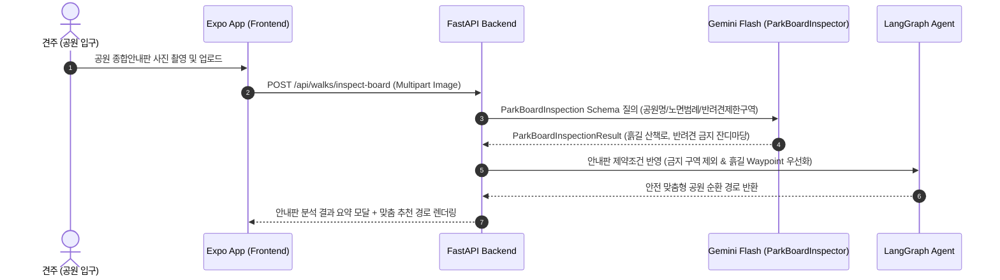
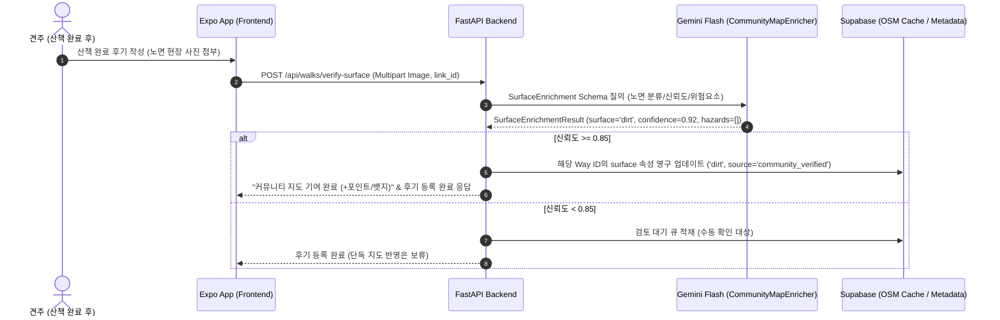

# [시스템 아키텍처 설계서] PawTrail (포트레일)

> **AI Native 반려견 맞춤형 안심 노면(Surface-aware) 산책 플래너 및 기록·공유 플랫폼**  
> 본 문서는 PawTrail의 기획서, 애자일 사용자 스토리, 구현 계획 및 AI Native 엔지니어링 원칙을 기반으로 설계된 전체 시스템 아키텍처 사양서입니다.

---

## 1. 아키텍처 개요 및 설계 원칙

### 1.1 핵심 설계 철학 (Architecture Principles)
1. **AI Native 관점의 선택과 집중 (Agent-Tool Synergy & Land Cover Spatial Join)**:
   - 원시 위성 영상의 무거운 CV 세그멘테이션(U-Net/SAM)이나 지리 알고리즘을 바닥부터 재발명하지 않고, **환경부 토지피복지도(Land Cover Map) 세분류 벡터 레이어와의 공간 결합(Spatial Join)** 및 검증된 라우팅 엔진(OpenRouteService)을 LangGraph Agent의 도구(`@tool`)로 배치하여 0.1초 만에 흙/잔디 비중이 극대화된 Waypoint를 자율 결정합니다.
2. **실용적인 비전 AI 피벗 (Pragmatic Vision AI)**:
   - 산책 중 리드줄을 잡고 발밑 1~2m를 촬영해 실시간 우회로를 찾는 비현실적 UX를 과감히 배제하고, **공원 입구 종합안내판 사전 판독(`ParkBoardInspector`)** 및 **산책 완주 후 커뮤니티 노면 제보 검증(`CommunityMapEnricher`)**을 통해 지도의 결측을 영구 보정하는 지속 가능한 데이터 선순환을 완성합니다.
3. **안정적인 계층형 분리 및 네이티브 확장 (Decoupled Layered Architecture & Native Extension)**:
   - 프론트엔드(React Native Expo 앱)와 백엔드(FastAPI)를 명확한 REST API로 분리하여 복잡한 실시간 스트리밍 디버깅 병목을 줄이고, EAS Update(OTA) 및 단 1회 Android APK 배포 체계로 3주 차 조기 배포를 지원합니다.
4. **엄격한 스키마 기반 데이터 무결성 (Schema-First Contract)**:
   - 모든 데이터 교환은 Pydantic V2 BaseModel 및 TypeScript Type Contract를 기반으로 검증하여 런타임 결함을 원천 방지합니다.
5. **시선 해방(Eyes-Free) & 두 손 자유(Hands-Free) 백그라운드 음성 길 안내 (Turn & Surface Voice Navigation)**:
   - 한 손에 리드줄을 쥐고 다른 손으로 스마트폰을 계속 보며 걷는 위험한 시각 의존 UX를 탈피합니다. Android Foreground Service 기반의 백그라운드 위치 추적(`expo-location`)과 OSRM 회전 안내 및 노면 속성을 결합한 음성 합성(`expo-speech` TTS)을 채택하여 스마트폰을 주머니나 크로스백에 넣고 화면을 끈 상태에서도 *"50m 앞 부드러운 흙길입니다. 우회전하세요"*와 같은 안내를 제공합니다.
6. **질병 용어 배제 및 긍정적 웰니스 UX 원칙 (Wellness Terminology Policy)**:
   - '슬개골 탈구', '질환 단계' 등 견주에게 불안감과 심리적 피로를 주는 임상/의학적 용어는 앱 실행 화면, 온보딩, 음성 안내 스크립트, AI 프롬프트에서 전면 배제합니다. 대신 "폭신한 길", "관절 안심 케어", "부드러운 잔디/흙길" 등 긍정적인 웰니스 케어 언어로 순화하여 일상 산책의 즐거움을 극대화합니다. (의학 통계는 투자 심사용 발표 자료에만 제한적으로 활용)

---

## 2. 전체 시스템 아키텍처 다이어그램 (End-to-End)

```mermaid
flowchart TB
    subgraph Client["[Client Tier] React Native Mobile App (Expo SDK 51+)"]
        UI[UI Components & 칩 선택 인터페이스<br/>(웰니스 노면 & 관절 안심 케어)]
        MapModule[React Native Maps & 노면 색상 Polyline]
        NaviEngine[Hands-Free Voice Navi Engine<br/>expo-location Foreground Service + expo-speech]
        CameraModule[공원 안내판 / 완주 노면 제보 카메라 (expo-camera)]
        EASModule[EAS Update OTA 클라이언트]
    end

    subgraph Gateway["[API Gateway & Backend] FastAPI"]
        Router[REST API Router & CORS]
        Auth[Supabase Auth Guard]
        Validator[Pydantic V2 Strict Validator]
    end

    subgraph AI_Core["[AI & Intelligence Tier] LangGraph + Gemini"]
        Agent[Walk Planning ReAct Agent]
        State[LangGraph State Machine]
        Vision[Gemini 1.5 Flash Vision Inspector<br/>안내판 판독 & 제보 검증]
        MemoryManager[Canine Context Memory Injector]
    end

    subgraph Tools["[Agent Tool Registry] @tool"]
        Tool_Spatial[LandCoverSpatialService<br/>토지피복 Spatial Join]
        Tool_Route[Surface Routing Tool / Waypoint Optimizer]
        Tool_Vision[Park Board & Surface Hazard Tool]
        Tool_Parking[Public Parking API Tool]
        Tool_Memory[Dog Profile & History Tool]
    end

    subgraph Data_Tier["[Data & Persistence Tier] Supabase"]
        PG[(PostgreSQL Relational DB)]
        VectorDB[(pgvector Semantic Memory)]
        Storage[(Supabase Storage - 안내판/노면 사진)]
    end

    subgraph External["[External Services & Automation]"]
        EGIS[환경부 EGIS: 토지피복지도 세분류 GeoJSON]
        ORS[Routing API Engine: ORS / OSRM]
        GovAPI[공공데이터포털: 전국공영주차장 / 기상청 단기예보]
        n8n[n8n Workflow: 지면열 연동 일일 골든타임 알림]
    end

    %% 연결 흐름
    UI --> Router
    MapModule <--> Router
    NaviEngine <--> Router
    CameraModule --> Router
    Router --> Validator --> Auth
    Auth --> Agent
    Auth --> Vision

    Agent <--> State
    Agent <--> MemoryManager
    MemoryManager <--> PG
    MemoryManager <--> VectorDB

    Agent --> Tool_Spatial
    Agent --> Tool_Route
    Agent --> Tool_Vision
    Agent --> Tool_Parking
    Agent --> Tool_Memory

    Tool_Spatial <--> EGIS
    Tool_Route <--> ORS
    Tool_Parking <--> GovAPI
    Tool_Vision <--> Vision
    CameraModule --> Storage

    n8n <--> GovAPI
    n8n --> Client
```

---

## 3. 계층별 상세 아키텍처

### 3.1 클라이언트 계층 (Frontend Tier)
* **프레임워크**: React Native (Expo SDK 51+), TypeScript, React Native Maps, expo-location, expo-speech, expo-camera
* **주요 구성요소**:
  1. **Planner Screen**:
     - 반려견 선택 드롭다운, 관절 안심 케어 수준 및 웰니스 기본 설정 표시, 목표 산책 시간 슬라이더(10~90분), 선호 노면 선택 칩(폭신한 흙길/부드러운 잔디/탄성포장/보도블록). (※ 슬개골 탈구 등 질병 용어 전면 배제)
  2. **Map Route Viewer (React Native Maps)**:
     - GeoJSON 기반 구간별 노면 속성 분기 렌더링:
       - 🌿 잔디: `#10B981` (Green-500)
       - 🍂 흙길: `#B45309` (Amber-700)
       - 🏃 탄성포장: `#F97316` (Orange-500)
       - 🏢 보도블록: `#3B82F6` (Blue-500)
       - ⚠️ 아스팔트/일반도로: `#6B7280` (Gray-500) / `#EF4444` (Red-500)
  3. **Eyes-Free & Hands-Free 백그라운드 음성 길 안내 엔진 (Voice Navigation Engine)**:
     - Android Foreground Service + `expo-location`을 통한 백그라운드 고정밀 GPS 추적 (스마트폰이 주머니나 가방에 있고 화면이 꺼진 상태에서도 연속 유지).
     - OSRM/ORS `steps[].instruction` 턴 정보 및 링크별 `surface` 속성 결합.
     - `expo-speech` TTS 기반 턴 및 노면 변경 안내 (*"50m 앞 부드러운 흙길입니다. 우회전하세요"*, *"포장 도로 구간이 시작됩니다. 보폭을 늦춰주세요"*).
     - 30m 반경 턴 도달 알림(소프트 비프음 + 음성) 및 경로 이탈(Off-route) 감지 시 재탐색 음성 알림.
  4. **Camera Module (안내판 & 노면 제보)**:
     - 공원 입구 오프라인 안내판 촬영 ➔ `POST /api/walks/inspect-board` 전송.
     - 산책 완주 후 노면 제보 사진 촬영 ➔ WebP 압축 ➔ `POST /api/walks/verify-surface` 전송.
  5. **EAS Update OTA 수신기**:
     - 앱 시작 시 원격 번들 체크 및 무선 무점검 자동 패치 적용 (1회 Android APK 설치 후 지속 업데이트).

---

### 3.2 백엔드 및 API 계층 (Backend Tier)
* **프레임워크**: Python 3.11+, FastAPI, Uvicorn, Pydantic V2, HTTPX, GeoPandas, Shapely
* **API 엔드포인트 명세 (핵심 REST Contract)**:

| Method | Endpoint | 설명 | 핵심 입출력 DTO |
|:---:|---|---|---|
| `POST` | `/api/walks/plan` | 목표 시간·선호 노면·토지피복 결합 맞춤 코스 생성 | In: `WalkPlanRequest` ➔ Out: `WalkPlanResponse(GeoJSON)` |
| `POST` | `/api/walks/inspect-board` | 공원 입구 종합안내판 비전 판독 (사전 분석) | In: `UploadFile(Image)` ➔ Out: `ParkBoardInspectionResult` |
| `POST` | `/api/walks/verify-surface` | 완주 후 견주 노면 제보 비전 검증 (지도 보정) | In: `UploadFile(Image), link_id` ➔ Out: `SurfaceEnrichmentResult` |
| `POST` | `/api/walks` | 산책 완주 기록 저장 (주머니 연속 수신 & 스냅 보정) | In: `WalkRecordCreate` ➔ Out: `WalkRecordResponse` |
| `GET` | `/api/walks/{id}` | 산책 기록 상세 조회 | Out: `WalkRecordDetail` |
| `POST` | `/api/walks/{id}/favorite` | 안심 산책로 즐겨찾기(북마크) 토글 (추가/해제) | In: `FavoriteToggleRequest` ➔ Out: `FavoriteToggleResponse` |
| `GET` | `/api/favorites` | 사용자 저장 즐겨찾기 코스 목록 조회 | Out: `List[FavoriteWalkSummary]` |
| `POST` | `/api/feedback` | 산책 후 노면 만족도 및 피드백 저장 | In: `FeedbackCreate` ➔ Out: `FeedbackResponse` |
| `GET/PUT` | `/api/dogs/{id}` | 반려견 프로필 조회 및 수정 | In/Out: `DogProfileDTO` |
| `GET` | `/api/parking/nearby` | 출발지 인근 공영주차장 P&R 조회 | In: `lat, lon, radius` ➔ Out: `List[ParkingLot]` |
| `GET` | `/api/feed` | 산책 코스 커뮤니티 피드 (마스킹 적용) | Out: `List[CourseFeedItem]` |

---

### 3.3 AI Agent 및 지능 계층 (AI Intelligence Tier)

#### 1. LangGraph State Machine 설계
에이전트는 사용자의 자연어 발화와 정형 파라미터를 통합하여 순차적으로 도구를 제어합니다.



#### 2. 멀티모달 비전 파이프라인 (Gemini 1.5 Flash)
비전 모델은 산책 중 비현실적인 실시간 촬영 우회 대신 **"사전 공원 안내판 판독"**과 **"완주 후 커뮤니티 노면 제보 검증"**의 2대 축으로 운용됩니다.

1. **공원 종합안내판 판독 (`ParkBoardInspectionResult`)**:
   ```json
   {
     "park_name": "보라매공원",
     "has_dirt_trail": true,
     "has_grass_zone": true,
     "dog_restricted_zones": ["생태연못 관찰데크", "어린이 놀이터"],
     "detected_surfaces": ["dirt", "grass", "rubber", "paved"],
     "confidence_score": 0.92,
     "summary_comment": "공원 둘레에 비포장 흙길 산책로가 조성되어 있으며 북동쪽 잔디마당 이용이 가능합니다."
   }
   ```
2. **커뮤니티 노면 제보 검증 (`SurfaceEnrichmentResult`)**:
   ```json
   {
     "verified_surface": "dirt",
     "is_safe_for_paws": true,
     "hazard_detected": false,
     "hazards": [],
     "confidence": 0.89,
     "admin_approval_suggested": true
   }
   ```

---

### 3.4 노면 가중치 순환 라우팅 엔진 및 공간 결합 서비스 (Spatial Cost Model)

#### 1. 환경부 토지피복지도 기반 공간 결합 서비스 (`LandCoverSpatialService`)
원시 위성 영상의 무거운 CV 처리를 배제하고, 환경부(EGIS) 토지피복 세분류 벡터와 도시공원 폴리곤을 공간 결합하여 0.1초 만에 링크 속성을 판정합니다.

```python
class LandCoverSpatialService:
    def resolve_link_surface(self, link_geom: LineString, osm_surface: Optional[str] = None) -> tuple[SurfaceType, SurfaceSourceType, float]:
        # 1. 시드 검증 데이터 또는 OSM 명확 태그 우선
        if osm_surface in ["dirt", "ground", "earth"]:
            return SurfaceType.DIRT, SurfaceSourceType.SEED_VERIFIED, 0.95
        # 2. 환경부 토지피복지도 공간 교차 검사 (초지=잔디, 나지=흙길, 인공포장=아스팔트)
        intersected = self.land_cover_gdf[self.land_cover_gdf.intersects(link_geom)]
        if not intersected.empty:
            dominant_cover = intersected.iloc[0].get("cover_code", "")
            if dominant_cover in ["초지", "grassland"]:
                return SurfaceType.GRASS, SurfaceSourceType.LAND_COVER_MAP, 0.90
            elif dominant_cover in ["나지", "bare_soil"]:
                return SurfaceType.DIRT, SurfaceSourceType.LAND_COVER_MAP, 0.90
        # 3. 도시공원 폴리곤 내부 Fallback (흙길 기본 추정)
        if not self.park_gdf[self.park_gdf.intersects(link_geom)].empty:
            return SurfaceType.DIRT, SurfaceSourceType.PARK_POLYGON, 0.75
        # 4. 일반 도로망 Fallback
        return SurfaceType.PAVED, SurfaceSourceType.ESTIMATED_FALLBACK, 0.50
```

#### 2. 수학적 비용 모델 공식
보행 네트워크 그래프 $G=(V, E)$에서 임의 링크 $e$의 통행 비용:
$$\text{Cost}(e) = \text{Length}(e) \times W_{\text{base}}(\text{surface}(e)) \times W_{\text{pref}}(\text{surface}(e), \text{SelectedPref})$$

#### 3. 가중치 매트릭스 (Weight Matrix)
| 노면 유형 (`surface`) | 기본 가중치 ($W_{\text{base}}$) | 선호 선택 시 할인 ($W_{\text{pref}}$) | 최종 유효 가중치 | 환경부 토지피복 매핑 |
|---|:---:|:---:|:---:|---|
| **잔디길 (Grass)** | 0.6 | **0.45** | **0.27 (최우선 탐색)** | 초지 (Grassland) |
| **흙길 (Dirt/Ground)** | 0.6 | **0.45** | **0.27 (최우선 탐색)** | 나지 (Bare Soil) |
| **탄성포장 (Rubber)** | 0.7 | **0.50** | **0.35 (적극 반영)** | 트랙 및 탄성 포장지 |
| **보도블록 (Paved)** | 1.0 | 0.80 (선택 시) / 1.0 (중립) | 0.80 ~ 1.00 (표준) | 인공포장 보행로 |
| **아스팔트 (Asphalt)** | 2.5 | 1.0 (할인 없음) | 2.50 (지면열 페널티) | 인공포장 일반도로 |
| **자갈/파쇄석 (Gravel)** | 3.5 | 1.0 (할인 없음) | 3.50 (발바닥 끼임 기피) | 미포장 거친 자갈지대 |

#### 4. 순환 경로(Loop Route) 생성 및 노면 투명성 원칙
1. **반경 산출**: $R = \frac{\text{TargetDistance}}{2\pi \times 1.2}$ (반려견 속도 기준 환산 거리 반영)
2. **다각형 경유지(Waypoint) 샘플링**: 출발점 기준 $\theta$ 각도 회전하며 2~3개 Waypoint 선정 후 토지피복 공간 가중치 적용.
3. **노면 출처 투명성**: 각 링크별로 `surface_source`(`seed_verified`, `land_cover_map`, `park_polygon`, `community_verified`, `estimated`) 및 `confidence`를 메타데이터로 함께 반환.

---

### 3.5 데이터베이스 및 영속성 계층 (Data Tier)

#### 1. 관계형 데이터 모델 (ERD)


---

## 4. 핵심 시퀀스 워크플로우 (Sequence Diagrams)

### 4.1 맞춤형 산책로 생성 및 핸즈프리 음성 길 안내 플로우


### 4.2 비전 AI 특화 플로우 (Vision AI Workflows)

#### 4.2.1 공원 종합안내판 비전 분석 및 코스 제약조건 도출 (산책 전)


#### 4.2.2 산책 후기 커뮤니티 사진 검증 및 지도 속성 보강 (산책 후)


---

## 5. 배포 및 인프라 아키텍처 (DevOps / Infrastructure)

| 영역 | 기술 스택 | 배포 대상 | 구성 세부 사항 |
|---|---|---|---|
| **Frontend** | React Native (Expo SDK 51+), TypeScript | **EAS (Expo Application Services)** | EAS Build(단 1회 Android APK 배포) + EAS Update(GitHub Actions 연동 무선 OTA 즉시 배포) |
| **Backend & AI** | FastAPI, Python 3.11 | **Render / Cloud Run** | Docker 컨테이너 기반 자동 빌드, Healthcheck(`/healthz`), CORS 도메인 격리 |
| **Database & Auth** | Supabase (PostgreSQL) | **Supabase Cloud** | pgvector 익스텐션 활성화, RLS(Row Level Security) 정책, Storage 버킷 |
| **스케줄 자동화** | n8n | **n8n Cloud / Self-hosted** | 기상청 지면열 연동 일일 크론(오전 9시) ➔ 안전 산책 골든타임 웹훅 발송 |
| **테스트 & CI** | GitHub Actions | **GitHub CI** | PR 생성 시 자동 Lint(SonarLint) + Pytest/Jest 단위 테스트 100% 통과 게이트 |

---

## 6. 비기능 요구사항(NFR) 및 보안 가드레일 설계

1. **응답 시간 최적화 (Latency)**:
   - 복합 산책로 생성 요청은 5초 이내 완료 (토지피복 Spatial Join 0.1초 + GIS 라우팅 연산 1.5초 + Agent 오케스트레이션 2초 이내).
   - 비전 판독(안내판/커뮤니티 사진)은 Gemini Flash 기반 경량화로 2.5초 이내 완료.
2. **모바일 앱 백그라운드 안정성 및 배터리 최적화**:
   - Android Foreground Service를 활용하여 산책 중 스마트폰 화면이 꺼지거나 주머니/가방에 보관되어도 백그라운드 고정밀 GPS 로깅 및 `expo-speech` 음성 합성이 누락 없이 연속 실행되도록 보장.
   - 배터리 절약을 위해 1초/5m 적응형 위치 폴링 및 TTS 재생 큐 최적화 적용.
3. **AI 안전장치 및 윤리적 고지 (Safety Guardrails)**:
   - 생성된 경로는 실시간 교통/공사 상황에 따라 달라질 수 있음을 화면 상단에 명시 (`AI 생성 경로 알림`).
   - 비전 분석 시 신뢰도 0.85 미만 데이터는 지도 속성에 자동 반영하지 않고 검토 대기 큐로 격리.
   - 안내판 판독 결과 반려견 출입 금지 구역 감지 시 해당 세그먼트를 라우팅 금지(Block) 영역으로 강제 격리.
4. **테스트 동기화 및 5인 CBT 검증 무결성**:
   - 요구사항(User Story/Task) 수정 시 연계된 테스트케이스(인수조건 검증, Fixture)를 즉각 갱신하여 5인 CBT 시나리오의 100% 정상 작동을 보장.
5. **질병 용어 전면 배제 및 긍정적 웰니스 카피라이팅 가드레일**:
   - 앱 화면 UI, 온보딩, TTS 음성 스크립트, AI 프롬프트 전역에서 '슬개골 탈구' 및 의학적 질병 단어 노출을 엄격히 금지하고 "폭신한 길", "관절 안심 케어", "부드러운 잔디/흙길" 등 긍정적 웰니스 표현으로 일원화. (※ 질병 통계는 투자 유치용 발표 자료에만 제한적으로 활용)
