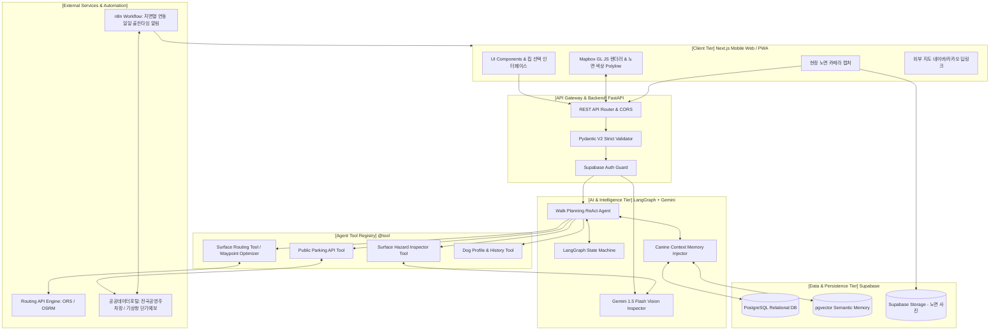
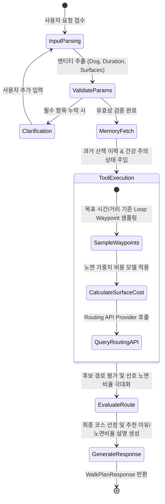
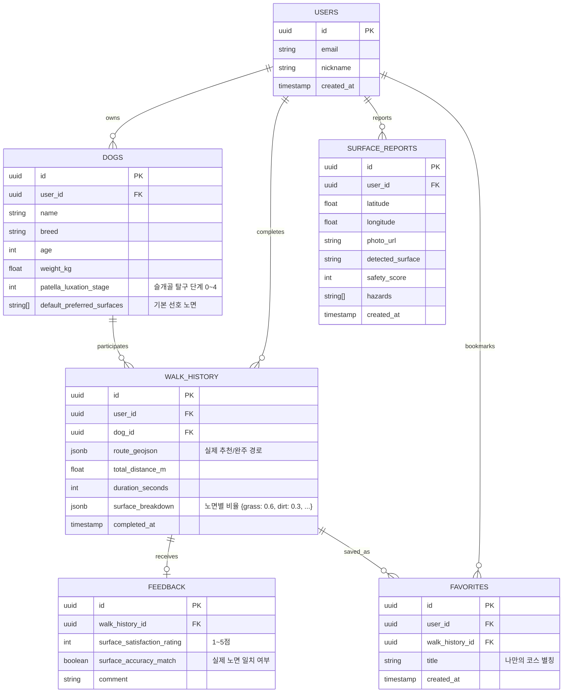
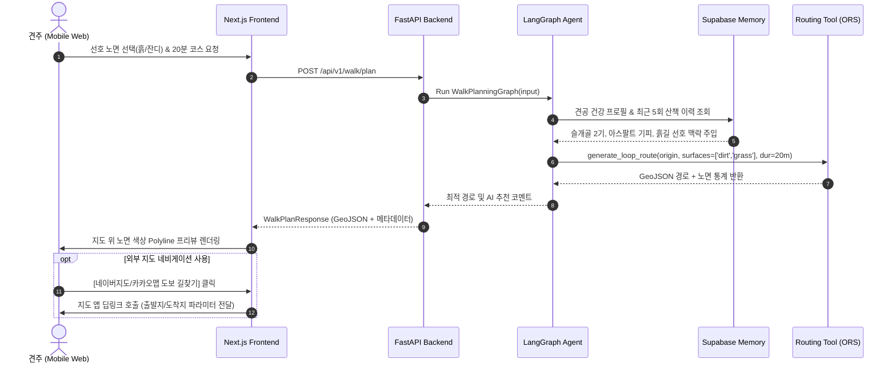
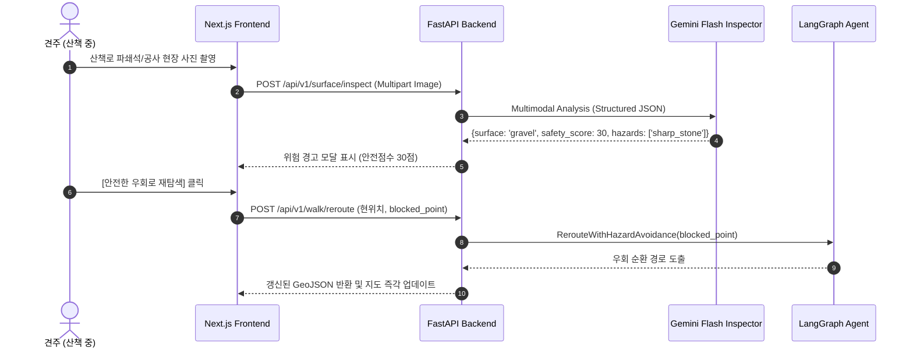

# [시스템 아키텍처 설계서] PawTrail (포트레일)

> **AI Native 반려견 맞춤형 안심 노면(Surface-aware) 산책 플래너 및 기록·공유 플랫폼**  
> 본 문서는 PawTrail의 기획서, 애자일 사용자 스토리, 구현 계획 및 AI Native 엔지니어링 원칙을 기반으로 설계된 전체 시스템 아키텍처 사양서입니다.

---

## 1. 아키텍처 개요 및 설계 원칙

### 1.1 핵심 설계 철학 (Architecture Principles)
1. **AI Native 관점의 선택과 집중 (Agent-Tool Synergy)**:
   - 지리 알고리즘을 바닥부터 재발명하지 않고, 검증된 라우팅 엔진(OpenRouteService, OSRM 등)을 LangGraph Agent의 도구(`@tool`)로 배치하여 Agent가 반려견 상태와 선호 노면을 분석해 최적 경유지(Waypoint)를 자율 결정합니다.
2. **안정적인 계층형 분리 (Decoupled Layered Architecture)**:
   - 프론트엔드(Next.js 모바일 웹)와 백엔드(FastAPI)를 명확한 REST API로 분리하여 복잡한 실시간 스트리밍 디버깅 병목을 줄이고 3주 차 조기 배포를 지원합니다.
3. **엄격한 스키마 기반 데이터 무결성 (Schema-First Contract)**:
   - 모든 데이터 교환은 Pydantic V2 BaseModel 및 TypeScript Type Contract를 기반으로 검증하여 런타임 결함을 원천 방지합니다.
4. **현장 실사용 중심의 Fallback & 딥링크 (Pragmatic Mobile UX)**:
   - 모바일 브라우저의 백그라운드 GPS 차단 정책을 수용하여, 무리한 백그라운드 추적 대신 **"노면 색상 프리뷰 + 네이버/카카오 지도 도보 길찾기 바로가기(딥링크) + 산책 완료 체크인"** 루프를 구축합니다.

---

## 2. 전체 시스템 아키텍처 다이어그램 (End-to-End)



---

## 3. 계층별 상세 아키텍처

### 3.1 클라이언트 계층 (Frontend Tier)
* **프레임워크**: Next.js 14 (App Router), React 18, TypeScript, Tailwind CSS
* **주요 구성요소**:
  1. **Planner Screen**:
     - 반려견 선택 드롭다운, 목표 산책 시간 슬라이더, 선호 노면 선택 칩(흙길/잔디/우레탄/보도블록).
  2. **Mapbox Route Viewer**:
     - GeoJSON 기반 구간별 노면 속성 분기 렌더링:
       - 🌿 잔디: `#10B981` (Green-500)
       - 🍂 흙길: `#B45309` (Amber-700)
       - 🏃 탄성포장: `#F97316` (Orange-500)
       - 🏢 보도블록: `#3B82F6` (Blue-500)
       - ⚠️ 아스팔트/위험: `#6B7280` (Gray-500) / `#EF4444` (Red-500)
  3. **Pocket Tracking & Wake Lock Controller**:
     - `navigator.wakeLock.request('screen')`을 통한 주머니 보관 중 화면 꺼짐 및 절전 방지.
     - 초절전 포켓 모드(다크 락스크린) 및 OS 절전 복귀 시 추천 경로 도로망 스냅 보정(Dead Reckoning).
  4. **Navi Launcher (Fallback)**:
     - 네이버 지도 앱(`nmap://route/walk`) 및 카카오맵(`kakaomap://route`) 도보 길찾기 URL 스킴 바로가기.
  5. **Camera & Check-in Modal**:
     - 모바일 웹 카메라 촬영 ➔ WebP 압축 ➔ 백엔드 비전 업로드 ➔ 위험도 점수 출력.
     - 산책 완주 후 노면 만족도 별점(1~5) 및 실제 노면 일치도 체크인.

---

### 3.2 백엔드 및 API 계층 (Backend Tier)
* **프레임워크**: Python 3.11+, FastAPI, Uvicorn, Pydantic V2, HTTPX
* **API 엔드포인트 명세 (핵심 REST Contract)**:

| Method | Endpoint | 설명 | 핵심 입출력 DTO |
|:---:|---|---|---|
| `POST` | `/api/walks/plan` | 반려견 맞춤형 산책 코스 생성 | In: `WalkPlanRequest` ➔ Out: `WalkPlanResponse(GeoJSON)` |
| `POST` | `/api/surface/analyze` | 현장 노면 이미지 시각적 위험 진단 | In: `UploadFile(Image)` ➔ Out: `SurfaceInspectionResult` |
| `POST` | `/api/walks` | 산책 완주 기록 저장 (주머니 보관 연속 수신 & 스냅 보정) | In: `WalkRecordCreate` ➔ Out: `WalkRecordResponse` |

| `GET` | `/api/walks/{id}` | 산책 기록 상세 조회 | Out: `WalkRecordDetail` |
| `POST` | `/api/walks/{id}/favorite` | 안심 산책로 즐겨찾기(북마크) 토글 (추가/해제) | In: `FavoriteToggleRequest` ➔ Out: `FavoriteToggleResponse` |
| `GET` | `/api/favorites` | 사용자 저장 즐겨찾기 코스 목록 조회 | Out: `List[FavoriteWalkSummary]` |
| `POST` | `/api/feedback` | 산책 후 노면 만족도 및 피드백 저장 | In: `FeedbackCreate` ➔ Out: `FeedbackResponse` |
| `GET/PUT` | `/api/dogs/{id}` | 반려견 프로필 조회 및 수정 | In/Out: `DogProfileDTO` |
| `GET` | `/api/parking/nearby` | 출발지 인근 공영주차장 P&R 조회 | In: `lat, lon, radius` ➔ Out: `List[ParkingLot]` |
| `GET` | `/api/feed` | 산책 코스 커뮤니티 피드 (마스킹 적용) | Out: `List[CourseFeedItem]` |

---

### 3.3 AI Agent 및 지능 계층 (AI Intelligence Tier)

#### 1. LangGraph State Machine 설계
에이전트는 사용자의 자연어 발화와 정형 파라미터를 통합하여 순차적으로 도구를 제어합니다.



#### 2. 노면 안전 비전 파이프라인 (Gemini 1.5 Flash)
* **입력**: 모바일 현장 촬영 노면 이미지
* **역할 제한**: **사진만으로 실제 지면 온도를 측정하지 않으며**, 시각적으로 확인 가능한 노면 종류, 물/얼음/진흙, 파손, 뾰족한 파쇄석, 유리 조각 등 물리적 위험에 집중합니다. (지면 열 위험은 기상청 단기예보 기반 별도 모델에서 계산)
* **출력 스키마 (Structured Output)**:
  ```json
  {
    "primary_surface": "asphalt | dirt | grass | rubber | paved | gravel",
    "safety_level": "SAFE | MEDIUM | DANGER",
    "safety_score": 75,
    "hazard_detected": true,
    "hazards": ["puddle", "sharp_stones"],
    "confidence": 0.88,
    "ai_comment": "노면 가장자리에 작은 파쇄석과 물 웅덩이가 관찰되어 주의가 필요합니다."
  }
  ```
* **피드백 체인**: `safety_score < 40` 또는 치명적 위험물 검출 시 해당 좌표를 차단하고 우회 경로(`/api/walks/plan` 재호출)를 트리거.


---

### 3.4 노면 가중치 순환 라우팅 엔진 (Spatial Cost Model)

#### 1. 수학적 비용 모델 공식
보행 네트워크 그래프 $G=(V, E)$에서 임의 링크 $e$의 통행 비용:
$$\text{Cost}(e) = \text{Length}(e) \times W_{\text{base}}(\text{surface}(e)) \times W_{\text{pref}}(\text{surface}(e), \text{SelectedPref})$$

#### 2. 가중치 매트릭스 (Weight Matrix)
| 노면 유형 (`surface`) | 기본 가중치 ($W_{\text{base}}$) | 선호 선택 시 할인 ($W_{\text{pref}}$) | 최종 유효 가중치 |
|---|:---:|:---:|:---:|
| **잔디길 (Grass)** | 0.6 | **0.45** | **0.27 (최우선 탐색)** |
| **흙길 (Dirt/Ground)** | 0.6 | **0.45** | **0.27 (최우선 탐색)** |
| **탄성포장 (Rubber)** | 0.7 | **0.50** | **0.35 (적극 반영)** |
| **보도블록 (Paved)** | 1.0 | 0.80 (선택 시) / 1.0 (중립) | 0.80 ~ 1.00 (표준) |
| **아스팔트 (Asphalt)** | 2.5 | 1.0 (할인 없음) | 2.50 (지면열/딱딱함 페널티) |
| **자갈/파쇄석 (Gravel)** | 3.5 | 1.0 (할인 없음) | 3.50 (발바닥 끼임 강한 기피) |

#### 3. 순환 경로(Loop Route) 생성 및 평가 원칙
1. **반경 산출**: $R = \frac{\text{TargetDistance}}{2\pi \times 1.2}$
2. **다각형 경유지(Waypoint) 샘플링**: 출발 좌표 $(lat_0, lon_0)$를 중심으로 각도 $\theta$를 $120^\circ$ 또는 $90^\circ$씩 회전하며 2~3개의 중간 경유지 선정.
3. **가중치 매핑 라우팅**: 각 경유지를 잇는 구간에 노면 비용 함수를 적용하여 표준 라우팅 API 도구를 호출한 뒤 출발점으로 귀환하는 폐곡선(Loop) 도출.
4. **선호 노면 비율 유연화 및 투명성**:
   - 도심지 등 특정 환경의 링크 한계로 인해 **"선호 노면 50% 무조건 보장"을 강제하지 않음**.
   - 가용 후보 경로 중 선호 노면 비율을 최대화하며, 목표 미달 시 사유(예: "주변 잔디/흙길 부족으로 38% 구성")를 사용자에게 제공.
   - OSM 결측치 추정 노면은 실측값처럼 확정하지 않고 `surface_source: estimated`, `surface_confidence`를 메타데이터로 함께 반환.

---

### 3.5 데이터베이스 및 영속성 계층 (Data Tier)

#### 1. 관계형 데이터 모델 (ERD)


---

## 4. 핵심 시퀀스 워크플로우 (Sequence Diagrams)

### 4.1 맞춤형 산책로 생성 및 외부 길찾기 플로우


### 4.2 현장 노면 사진 진단 및 회피 리라우팅 플로우


---

## 5. 배포 및 인프라 아키텍처 (DevOps / Infrastructure)

| 영역 | 기술 스택 | 배포 대상 | 구성 세부 사항 |
|---|---|---|---|
| **Frontend** | Next.js 14, Tailwind | **Vercel** | Edge Network, 모바일 웹 PWA 메타태그, 자동 HTTPS, PR 미리보기 배포 |
| **Backend & AI** | FastAPI, Python 3.11 | **Render / Cloud Run** | Docker 컨테이너 기반 자동 빌드, Healthcheck(`/healthz`), CORS 도메인 격리 |
| **Database & Auth** | Supabase (PostgreSQL) | **Supabase Cloud** | pgvector 익스텐션 활성화, RLS(Row Level Security) 정책, Storage 버킷 |
| **스케줄 자동화** | n8n | **n8n Cloud / Self-hosted** | 기상청 지면열 연동 일일 크론(오전 9시) ➔ 안전 산책 골든타임 웹훅 발송 |
| **테스트 & CI** | GitHub Actions | **GitHub CI** | PR 생성 시 자동 Lint(SonarLint) + Pytest/Jest 단위 테스트 100% 통과 게이트 |

---

## 6. 비기능 요구사항(NFR) 및 보안 가드레일 설계

1. **응답 시간 최적화 (Latency)**:
   - 복합 산책로 생성 요청은 5초 이내 완료 (GIS 라우팅 연산 1.5초 + Agent 오케스트레이션 2초 이내).
   - 비전 판독은 Gemini Flash 기반 경량화로 2.5초 이내 완료.
2. **모바일 웹 안정성 및 메모리 관리**:
   - 컴포넌트 언마운트 시 Mapbox 지도 인스턴스 `map.remove()` 필수 호출로 장시간 사용 시 브라우저 탭 크래시 방지.
3. **AI 안전장치 및 윤리적 고지 (Safety Guardrails)**:
   - 생성된 경로는 실시간 교통/공사 상황에 따라 달라질 수 있음을 화면 상단에 명시 (`AI 생성 경로 알림`).
   - 비전 분석 점수가 40점 미만인 경우 즉시 견주에게 "우회 권장" 시각적 뱃지 노출.
4. **테스트 동기화 및 5인 CBT 검증 무결성**:
   - 요구사항(User Story/Task) 수정 시 연계된 테스트케이스(인수조건 검증, Fixture)를 즉각 갱신하여 5인 CBT 시나리오의 100% 정상 작동을 보장.
