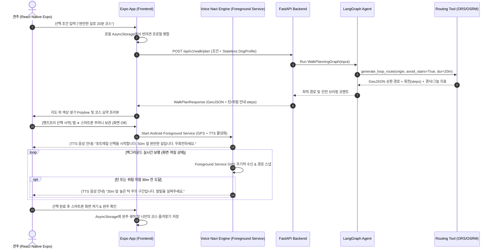
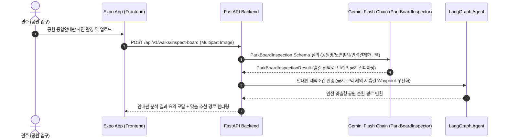
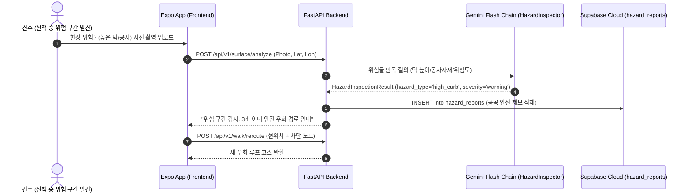

# [시스템 아키텍처 설계서] PawTrail (포트레일)

> **AI Native 반려견 안심(무계단·완만 경사·그늘 우선) 산책 플래너 및 핸즈프리 모바일 앱 플랫폼**  
> 본 문서는 PawTrail의 기획서, 애자일 사용자 스토리, 기술적 정정사항 및 AI Native 엔지니어링 원칙을 기반으로 설계된 전체 시스템 아키텍처 사양서입니다.

---

## 1. 아키텍처 개요 및 설계 원칙

### 1.1 핵심 설계 철학 (Architecture Principles)
1. **시선 해방(Eyes-Free) & 두 손 자유(Hands-Free) 백그라운드 음성 길 안내**:
   - 한 손에 리드줄을 잡고 다른 손으로 스마트폰을 계속 보며 걷는 위험한 시각 의존 UX를 탈피합니다.
   - **React Native (Expo SDK 51+) + Android Foreground Service**를 채택하여 스마트폰을 주머니나 가방에 넣고 화면을 꺼두어도 백그라운드 GPS를 수신하고, OSRM 스텝 및 경로 속성을 결합한 **`expo-speech` TTS 기반 실시간 음성 브리핑**을 제공합니다.
2. **배포 피로도 제로 (EAS Build & EAS Update OTA)**:
   - 복잡한 스토어 심사 대기나 잦은 APK 재설치 번거로움을 없애기 위해, **EAS Build로 테스터용 APK를 1회 배포**하고 이후 모든 UI/로직 수정은 **EAS Update (`expo-updates`) 무선 OTA**로 실시간 무점검 배포합니다.
3. **프라이버시 중심 로컬 저장 (Privacy-First Local Storage)**:
   - 견주의 자택 위치, 상세 보행 GPS 궤적, 반려견 프로필은 **사용자 폰 로컬(`AsyncStorage`)에만 보관**합니다.
   - 백엔드는 민감 정보를 저장하지 않는 **완전한 무상태(Stateless)** 구조로 운영됩니다.
4. **독립적이고 간결한 인증 (Simple Email Auth, No Social OAuth)**:
   - 외부 소셜 OAuth 연동 병목을 배제하고, `Supabase Auth` 기반의 **단순 이메일/비밀번호 가입 체계**로 단일화합니다. (개발/CBT 중 Auto-confirm 활성화)
   - 커뮤니티 코스 공유 시에만 **출발지/도착지 200m 마스킹 블러링(Spatial Jittering)**을 적용하여 업로드합니다.
5. **AI Agent와 전문 라우팅 도구의 분리**:
   - AI Agent는 조건 구조화와 다요소 채점에 집중하고, 도로망 지오메트리 연산은 전문 **Routing API(ORS/OSRM) Adapter**에 위임합니다.
6. **질병 용어 배제 및 긍정적 웰니스 UX 원칙 (Wellness Terminology Policy)**:
   - 앱 실행 화면, 온보딩, 음성 안내 스크립트, AI 프롬프트에서 '슬개골 탈구', '질환 단계' 등 임상적 용어를 전면 배제합니다.
   - 대신 *"폭신한 길"*, *"관절 안심 케어"*, *"부드러운 완만길"* 등 긍정적 웰니스 언어로 순화합니다. (의학 통계는 발표 자료에만 제한 활용)

---

## 2. 전체 시스템 아키텍처 다이어그램 (End-to-End)

```mermaid
flowchart TB
    subgraph Client["[Client Tier] React Native Mobile App (Expo SDK 51+)"]
        UI[UI Components & 웰니스 조건 입력]
        MapModule[React Native Maps & Polyline]
        NaviEngine[Hands-Free Voice Navi Engine<br/>expo-location Foreground Service + expo-speech]
        CameraModule[현장 위험 사진 촬영 (expo-camera)]
        EASModule[EAS Update OTA 클라이언트]
        
        subgraph LocalStore["[📱 Local Storage] AsyncStorage"]
            DogProfile[반려견 프로필<br/>(체급, 연령, 관절 안심 케어)]
            WalkTrack[개인 산책 궤적 & 자택 좌표<br/>(서버 절대 미전송)]
            FeedbackStore[최근 보행 피드백 누적]
            BackupManager[JSON 백업/가져오기]
        end
    end

    subgraph Gateway["[API Gateway & Backend] FastAPI (Render / Cloud Run)"]
        Router[Stateless REST API Router & CORS]
        Validator[Pydantic V2 Strict Validator]
    end

    subgraph AI_Core["[AI & Intelligence Tier] LangGraph Agent"]
        Agent[Walk Planning ReAct Agent]
        State[LangGraph State Machine]
    end

    subgraph Tool_Layer["[Agent Tool Layer] @tool"]
        Tool_Routing[Routing API Adapter<br/>ORS / OSRM]
        Tool_Steps[OSM Steps Detector<br/>Hard Constraint 배제]
        Tool_Slope[DEM Elevation & Slope Analyzer]
        Tool_Shade[Solar & Building Shade Estimator]
        Tool_Scorer[Candidate Route Scorer<br/>100점 만점 랭킹]
        Tool_Vision[Vision Hazard Inspector<br/>Gemini Fallback Chain<br/>(3.5 Flash-Lite / 3.1 Flash-Lite / 3.6 Flash)]
        Tool_Weather[Weather & Heat Risk Tool]
        Tool_Parking[Public Parking API Tool]
    end

    subgraph Supabase_Cloud["[Cloud Persistence Tier] Supabase Cloud (최소 관리)"]
        Users[(auth.users<br/>간편 이메일/비밀번호 계정)]
        Courses[(community_courses<br/>출발지 200m 마스킹 공개 코스)]
        Hazards[(hazard_reports<br/>현장 턱/공사 제보 좌표 및 사진)]
        Storage[(Supabase Storage - 위험 사진 버킷)]
    end

    subgraph Automation["[스케줄 자동화 Tier]"]
        n8n[n8n Workflow<br/>(기상청 지면열 골든타임 알림)]
    end

    subgraph External["[External Services & APIs]"]
        ORS_API[Routing Engine: ORS / OSRM]
        OSM_DATA[OSM Footway / Steps Data]
        DEM_DATA[DEM Elevation Data]
        BUILDING_DATA[공공 건물 공간정보]
        KMA_API[기상청 단기예보 API]
        PARKING_API[전국 공영주차장 API]
        EAS_CLOUD[Expo EAS Update CDN]
    end

    %% 클라이언트 내부 및 게이트웨이 연결
    UI --> Router
    MapModule <--> Router
    NaviEngine <--> MapModule
    CameraModule --> Router
    EASModule <--> EAS_CLOUD
    LocalStore -.->|산책 요청 시 일회성 페이로드 동봉| UI

    %% 백엔드 및 AI 에이전트 연결
    Router --> Validator --> Agent
    Agent <--> State
    Router --> Tool_Vision

    %% 에이전트 도구 오케스트레이션
    Agent --> Tool_Routing
    Agent --> Tool_Steps
    Agent --> Tool_Slope
    Agent --> Tool_Shade
    Agent --> Tool_Scorer
    Agent --> Tool_Weather
    Agent --> Tool_Parking

    %% 도구와 외부 서비스 간 연결
    Tool_Routing <--> ORS_API
    Tool_Steps <--> OSM_DATA
    Tool_Slope <--> DEM_DATA
    Tool_Shade <--> BUILDING_DATA
    Tool_Weather <--> KMA_API
    Tool_Parking <--> PARKING_API
    Tool_Vision <--> Storage

    Tool_Scorer --> Agent

    %% 클라우드 저장소 연결
    UI -.->|커뮤니티 코스 공유 시에만 (200m 마스킹)| Courses
    UI -.->|간편 이메일 가입/로그인| Users
    CameraModule -.->|위험 제보 시| Hazards
    n8n --> KMA_API
```

---

## 3. 계층별 상세 아키텍처

### 3.1 클라이언트 계층 (React Native Expo App)
* **프레임워크**: React Native (Expo SDK 51+), TypeScript, react-native-maps, expo-location, expo-speech, expo-camera, `@react-native-async-storage/async-storage`.
* **주요 구성요소**:
  1. **Planner Screen UI**:
     - 반려견 선택 드롭다운, 관절 안심 케어 수준 및 웰니스 기본 설정 표시, 목표 산책 시간 슬라이더(10~90분, 권장 15~60분), 선호 산책 조건 선택 칩(폭신한 흙길/완만한 경사/그늘 우선). (※ 슬개골 탈구 등 질병 용어 전면 배제)
  2. **Map Route Viewer (React Native Maps)**:
     - GeoJSON 기반 구간별 보행 속성 분기 렌더링:
       - 🌿 완만/그늘/잔디길: `#10B981` (Green-500)
       - 🍂 흙길: `#92400E` (Amber-800)
       - 🏃 탄성포장: `#F97316` (Orange-500)
       - 🏢 보도블록/일반길: `#3B82F6` (Blue-500)
       - ⚠️ 높은 턱/급경사/주의구간: `#EF4444` (Red-500)
  3. **Hands-Free Voice Navigation Engine**:
     - **Android Foreground Service**로 백그라운드 GPS 위치를 지속 수신 (화면 꺼짐 시에도 연속 트래킹).
     - OSRM/ORS `steps` 정보(회전각, 거리)와 경로 속성을 결합해 회전 30m 전 `expo-speech` 사전 브리핑 송출 (*"50m 앞 완만한 흙길입니다. 우회전하세요"*), 40m 이상 이탈 감지 시 재탐색 음성 경고.
  4. **AsyncStorage Local Storage Manager**:
     - `dog_profile`: 체급, 연령, 관절 안심 케어 수준 로컬 보관 (서버 절대 미전송).
     - `walk_history`: 실제 보행 GPS 궤적 및 완주 인포그래픽 데이터 영구 보관 (최근 100회 한도 FIFO).
     - `favorites`: 나만의 안심 코스 즐겨찾기 북마크 로컬 캐싱 및 즉시 재산책 연동.
  5. **EAS Update 무중단 OTA 모듈**:
     - 앱 시작 시 Expo CDN에서 최신 JS 번들 체크 및 무선 무점검 핫픽스 즉시 적용.

---

### 3.2 백엔드 및 API 계층 (FastAPI Backend)
* **무상태(Stateless) API 원칙**: 백엔드는 특정 사용자의 개인정보 세션을 저장하지 않고, 산책 요청 시 클라이언트가 보낸 일회성 페이로드로 연산 후 즉시 응답.

| Method | Endpoint | 설명 | 핵심 DTO (In / Out) |
|:---:|---|---|---|
| `POST` | `/api/v1/walk/plan` | 로컬 프로필+조건 기반 최적 코스 생성 (무상태) | In: `WalkPlanRequest` ➔ Out: `WalkPlanResponse` |
| `POST` | `/api/v1/walk/reroute` | 현장 위험 감지 시 안전 우회 동적 재산출 (3초 이내) | In: `RerouteRequest` ➔ Out: `WalkPlanResponse` |
| `POST` | `/api/v1/surface/analyze` | 현장 사진 업로드 기반 시각적 위험물 판독 | In: `UploadFile(Image)` ➔ Out: `HazardInspectionResult` |
| `POST` | `/api/v1/walks/inspect-board` | 공원 입구 오프라인 안내판 판독 및 금지구역 파싱 | In: `UploadFile(Image)` ➔ Out: `ParkBoardInspectionResult` |
| `GET` | `/api/v1/thermal/golden-time` | 기상청 예보 기반 시간대별 열 위험 지수 및 골든타임 | In: `lat, lon` ➔ Out: `HeatRiskResponse` |
| `GET` | `/api/v1/parking/nearby` | 출발 거점 반경 1.5km 이내 P&R 공영주차장 목록 조회 | In: `lat, lon, radius` ➔ Out: `List[ParkingLotDTO]` |
| `POST` | `/api/v1/community/share` | 완주 코스 공유 (출발지 200m 마스킹 블러링 필수) | In: `CourseShareRequest` ➔ Out: `CommunityCourseDTO` |
| `GET` | `/api/v1/community/feed` | 다른 견주들의 공개 공유 코스 피드 조회 | Out: `List[CommunityCourseSummary]` |
| `POST` | `/api/v1/hazards/report` | 현장 위험 제보 등록 (공공 안전용) | In: `HazardCreateRequest` ➔ Out: `HazardReportDTO` |

---

### 3.3 AI Agent & Intelligence 계층 (LangGraph & Gemini)
1. **LangGraph ReAct Agent**:
   - `AgentState`를 기반으로 사용자의 자연어 요청과 클라이언트 전달 로컬 맥락(`client_dog_context`, `client_recent_feedback`)을 주입받아 무상태로 실행.
   - Pydantic V2 Strict Input Schema를 통해 `TargetDuration`(10~90분), `AvoidStairs`, `SlopePreference`, `ShadePriority` 4대 엔티티 검증.
2. **Gemini 가용 모델 순차 선택 체인 (`GeminiModelSelector`)**:
   - **1순위 `gemini-3.5-flash-lite` ➔ 2순위 `gemini-3.1-flash-lite` ➔ 3순위 `gemini-3.6-flash`** 순차 자동 선택 체인 (Cascading Fallback).
   - 구형/단종된 `gemini-1.5` 계열 호출 전면 배제 (호출 시 즉각 예외 발생).
   - Structured JSON 강제 (`response_mime_type="application/json"`).
3. **Candidate Route Scorer (100점 만점 랭킹)**:
   - 복수의 후보 루프 코스를 다요소 가중 평가:
     - 계단 완전 배제 무결성: **30점**
     - 완만 경사 적합도: **30점**
     - 그늘 확보율: **20점**
     - 목표 시간/거리 수렴도: **20점**

---

### 3.4 핵심 데이터 모델 및 DTO 명세

#### 1. WalkPlanRequest (클라이언트 로컬 데이터 동봉)
```json
{
  "origin": {"lat": 37.492, "lon": 126.923},
  "target_duration_minutes": 25,
  "avoid_stairs": true,
  "slope_preference": "gentle",
  "shade_priority": true,
  "client_dog_context": {
    "breed": "Maltese",
    "age_years": 9,
    "speed_kmh": 2.8,
    "joint_care_level": "high"
  },
  "client_recent_feedback": [
    {"tag": "too_steep", "count": 2},
    {"tag": "cool_shade", "count": 3}
  ]
}
```

#### 2. WalkPlanResponse (생성된 경로 및 음성 스텝 응답)
```json
{
  "route_id": "route_local_123",
  "total_distance_meters": 1150,
  "estimated_duration_minutes": 24,
  "stairs_avoidance_applied": true,
  "stairs_detected_in_route": false,
  "max_slope_percent": 3.5,
  "average_shade_ratio": 0.71,
  "navigation_steps": [
    {"distance_m": 120, "instruction": "직진 후 50m 앞 우회전하세요", "voice_brief": "50m 앞 부드러운 완만길입니다. 우회전하세요"},
    {"distance_m": 350, "instruction": "그늘 산책로 진입", "voice_brief": "지금부터 300m 동안 시원한 그늘길이 이어집니다"}
  ],
  "agent_comment": "초코의 편안한 보행을 위해 계단 없이 완만한(최대 3.5%) 그늘 코스를 준비했습니다."
}
```

---

### 3.5 데이터베이스 및 영속성 계층 (Local-First + Supabase Cloud)

#### 1. 클라이언트 로컬 스토리지 계층 (`AsyncStorage`)
민감한 개인정보(자택 위치, 상세 보행 GPS 궤적)와 반려견 신체 프로필을 보호하기 위해 클라이언트 로컬에만 영속 보관한다.

```json
// AsyncStorage 키: @PawTrail:dog_profile
{
  "id": "dog_local_01",
  "name": "초코",
  "breed": "Maltese",
  "weight_kg": 3.8,
  "age_years": 9,
  "joint_care_level": 2, // 0: 일반, 1: 예방, 2: 관절 안심 케어
  "preferred_conditions": {
    "avoid_stairs": true,
    "max_slope_percent": 8,
    "shade_priority": true
  }
}

// AsyncStorage 키: @PawTrail:walk_history (최근 100회 한도 FIFO)
[
  {
    "walk_id": "walk_local_01",
    "date": "2026-09-24T02:00:00Z",
    "duration_min": 24,
    "distance_m": 1150.0,
    "gps_track": [{"lat": 37.492, "lon": 126.923}, "..."],
    "feedback": {"rating": 5, "tags": ["gentle_slope", "cool_shade"]}
  }
]

// AsyncStorage 키: @PawTrail:favorites (나만의 코스 북마크)
[
  {
    "course_id": "fav_local_01",
    "title": "우리 동네 숲길 완만 코스",
    "target_duration_min": 25,
    "total_distance_m": 1280.0,
    "geojson": { "type": "FeatureCollection", "features": [] },
    "created_at": "2026-09-21T10:00:00Z"
  }
]
```

#### 2. 중앙 클라우드 데이터베이스 스키마 (`Supabase Cloud PostgreSQL`)
커뮤니티 공개 코스(출발지 200m 마스킹) 및 현장 위험 제보를 위해 중앙 관리한다.

```sql
-- 1. 사용자 계정 (Supabase Auth 기본 연동)
-- auth.users 에 이메일/비밀번호 해시 자동 보관

-- 2. 커뮤니티 공개 코스 (자택 노출 방지: 출발지/도착지 200m 마스킹 적용)
CREATE TABLE community_courses (
    id UUID PRIMARY KEY DEFAULT gen_random_uuid(),
    author_id UUID REFERENCES auth.users(id) ON DELETE SET NULL,
    title TEXT NOT NULL,
    total_distance_m NUMERIC(7, 1) NOT NULL,
    estimated_duration_min INTEGER NOT NULL,
    stairs_count INTEGER NOT NULL DEFAULT 0,
    max_slope_percent NUMERIC(4, 1) NOT NULL,
    shade_ratio NUMERIC(3, 2) NOT NULL,
    masked_route_geojson JSONB NOT NULL, -- 출발지 200m 잘라내기/블러링 적용 좌표
    created_at TIMESTAMPTZ DEFAULT NOW()
);

-- 3. 현장 위험물 제보 (높은 턱, 야외 계단, 공사 구간)
CREATE TABLE hazard_reports (
    id UUID PRIMARY KEY DEFAULT gen_random_uuid(),
    reporter_id UUID REFERENCES auth.users(id) ON DELETE SET NULL,
    latitude DOUBLE PRECISION NOT NULL,
    longitude DOUBLE PRECISION NOT NULL,
    hazard_type VARCHAR(50) NOT NULL, -- 'high_curb', 'outdoor_stairs', 'construction'
    image_url TEXT,
    severity VARCHAR(20) DEFAULT 'warning',
    verified_by_ai BOOLEAN DEFAULT FALSE,
    created_at TIMESTAMPTZ DEFAULT NOW()
);

-- 4. RLS 보안 정책: 누구나 공개 코스 조회 가능, 작성자만 수정/삭제
ALTER TABLE community_courses ENABLE ROW LEVEL SECURITY;
CREATE POLICY "Public courses read" ON community_courses FOR SELECT USING (true);
CREATE POLICY "Users can create courses" ON community_courses FOR INSERT WITH CHECK (auth.uid() = author_id);
```

---

## 4. 핵심 시퀀스 워크플로우 (Sequence Diagrams)

### 4.1 맞춤형 산책로 생성 및 핸즈프리 음성 길 안내 플로우


### 4.2 비전 AI 특화 플로우 (Vision AI Workflows)

#### 4.2.1 공원 종합안내판 비전 분석 및 코스 제약조건 도출 (산책 전)


#### 4.2.2 현장 위험물 제보 및 우회 재탐색 (산책 중/후)


---

## 5. 배포 및 인프라 아키텍처 (DevOps / Infrastructure)

| 영역 | 기술 스택 | 배포 대상 | 구성 세부 사항 |
|---|---|---|---|
| **Frontend** | React Native (Expo SDK 51+), TypeScript | **EAS (Expo Application Services)** | EAS Build(단 1회 Android APK 배포) + EAS Update(GitHub Actions 연동 무선 OTA 즉시 배포) |
| **Backend & AI** | FastAPI, Python 3.11 | **Render / Cloud Run** | Docker 컨테이너 기반 자동 빌드, Healthcheck(`/healthz`), CORS 도메인 격리 |
| **Database & Auth** | Supabase (PostgreSQL) | **Supabase Cloud** | auth.users 간편 이메일/비밀번호, RLS(Row Level Security) 정책, Storage 버킷 |
| **스케줄 자동화** | n8n | **n8n Cloud / Self-hosted** | 기상청 지면열 연동 일일 크론(오전 9시) ➔ 안전 산책 골든타임 웹훅 발송 |
| **테스트 & CI** | GitHub Actions | **GitHub CI** | PR 생성 시 자동 Lint(SonarLint) + Pytest/Jest 단위 테스트 100% 통과 게이트 |

---

## 6. 비기능 아키텍처 및 웰니스 정책

1. **시선 해방 핸즈프리 안전성**:
   - `expo-location`과 `expo-speech`의 유기적 결합으로 스마트폰 화면 주시를 원천 차단하고 리드줄 통제력 확보.
2. **배포 효율성**:
   - EAS Update 기반으로 1회 APK 설치 후 무선 OTA 핫픽스를 실시간 적용하여 테스터 재설치 피로도 완전 해소.
3. **개인정보 제로 원칙 (Zero PII on Server)**:
   - 자택 주소 및 상세 보행 GPS 궤적은 폰에만 저장, 커뮤니티 공유 시 출발지/도착지 200m 자동 공간 마스킹.
4. **긍정적 웰니스 카피라이팅 준수**:
   - 앱 내에서 '슬개골 탈구' 등 질병 용어를 배제하고 "폭신한 길", "관절 안심 케어" 등 긍정적 웰니스 표현 사용.
