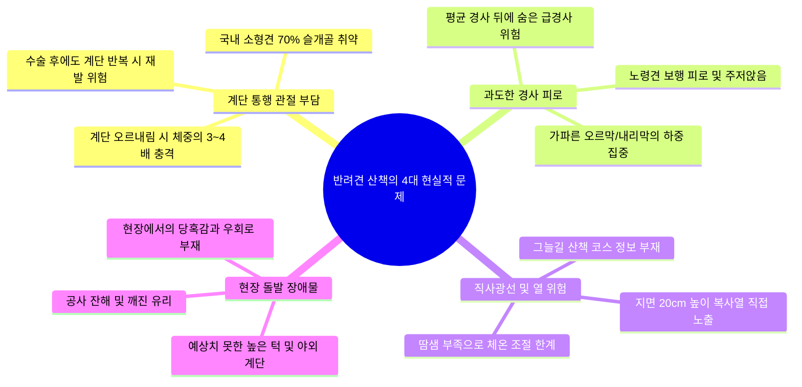
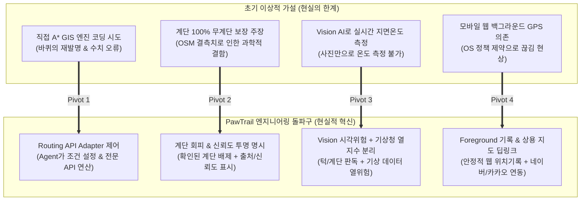
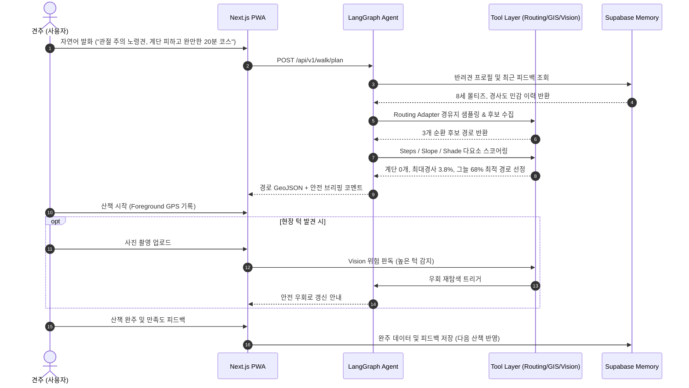

# 🎯 [발표 평가 가이드] PawTrail 핵심 페인 포인트 및 기술적 차별화 전략

> **발표 평가의 본질은 "기술의 단순 나열"이 아니라,  
> "진짜 사용자의 고통(Pain Point)을 정확히 짚어냈고, 현실적 데이터와 환경 제약 속에서 이를 어떻게 똑똑한 엔지니어링 의사결정(Engineering Decision)으로 풀어냈는가"를 증명하는 것입니다.**

본 문서는 PawTrail 최종 프로젝트 발표 시 심사위원과 평가관의 공감을 이끌어내고 최고 점수를 획득할 수 있도록 **[1] 사용자/도메인 페인 포인트**, **[2] 기존 상용 지도의 구조적 맹점**, **[3] 데이터 융합 및 AI Native 엔지니어링 돌파구**, **[4] 심사위원 예상 질문(Q&A) 방어 전략**, **[5] 슬라이드 스토리보드**를 체계적으로 정리한 발표 전용 전략 문서입니다.

---

## 📌 목차 (Table of Contents)

1. [🎙️ 30초 오프닝 훅 (Elevator Pitch)](#1-️-30초-오프닝-훅-elevator-pitch)
2. [🐾 사용자 & 도메인 페인 포인트 (Real Pain Points)](#2--사용자--도메인-페인-포인트-real-pain-points)
3. [🗺️ 기존 상용 지도 서비스의 한계 (Market Blind Spots)](#3-️-기존-상용-지도-서비스의-한계-market-blind-spots)
4. [💡 엔지니어링 의사결정과 기술적 돌파구 (Tech Pivots)](#4--엔지니어링-의사결정과-기술적-돌파구-tech-pivots)
5. [🤖 AI Native 산책 파이프라인의 완성 (How It Works)](#5--ai-native-산책-파이프라인의-완성-how-it-works)
6. [🛡️ 심사위원 킬러 질문(Q&A) 및 방어 전략 (Defense Matrix)](#6-️-심사위원-킬러-질문qa-및-방어-전략-defense-matrix)
7. [📊 발표 슬라이드 스토리보드 제안 (Slide Narrative)](#7--발표-슬라이드-스토리보드-제안-slide-narrative)

---

## 1. 🎙️ 30초 오프닝 훅 (Elevator Pitch)

> *"국내 반려견의 대다수를 차지하는 소형견과 노령견에게 **'계단'**과 **'가파른 언덕'**은 관절에 치명적이고, 한낮의 **'직사광선'**은 체열 조절이 취약한 반려견을 지치게 만듭니다.  
> 하지만 네이버 지도나 카카오맵은 사람을 위한 **'최단거리'**만 알려줄 뿐, 그 길에 **계단이 몇 개인지, 경사가 얼마나 가파른지, 그늘이 있는지** 전혀 알려주지 않습니다.  
> **PawTrail은 반려견의 관절과 상태를 이해한 AI Agent가 지도·라우팅·환경 데이터를 결합하여 계단과 과도한 경사를 피하고 그늘을 우선하는 맞춤형 순환 산책로를 찾아주는 AI Native 안심 산책 플랫폼입니다."*

---

## 2. 🐾 사용자 & 도메인 페인 포인트 (Real Pain Points)

발표 서두에서 **반려견을 키우지 않는 심사위원이라도 즉시 납득할 수 있는 구체적인 현실적 고통**을 제시합니다.

### ① 계단 통행으로 인한 관절 부담
* **도메인 현실**: 국내 소형견(말티즈, 포메라니안 등)은 유전적으로 관절 구조가 취약하며, 계단을 오르내릴 때 관절에 전달되는 충격은 평지의 3~4배에 달합니다.
* **견주의 고통**: *"동네 공원에 갔는데 갑자기 20계단이 나와서 강아지를 안고 올라가야 했습니다. 계단 없는 길만 미리 찾아갈 수는 없을까요?"*

### ② 과도한 경사로 인한 보행 피로
* **도메인 현실**: 산책로 전체의 '평균 경사도'가 낮아도, 단 한 구간의 10% 급경사는 노령견이나 관절 질환견에게 치명적인 피로와 부상을 유발합니다.
* **견주의 고통**: *"완만해 보여서 들어갔는데 막판에 가파른 언덕길이 나와 강아지가 걷기를 거부하고 멈춰 섰습니다."*

### ③ 직사광선 노출 및 열 스트레스
* **도메인 현실**: 강아지는 체고가 낮아 지면에서 올라오는 복사열을 그대로 받으며, 땀샘이 발바닥에만 있어 열 배출 능력이 사람보다 훨씬 떨어집니다.
* **견주의 고통**: *"낮 시간대에 햇빛을 피해 시원한 그늘로만 이어지는 산책길을 찾기가 너무 어렵습니다."*

### ④ 현장 돌발 장애물 및 높은 턱
* **도메인 현실**: 지도에는 평범한 보행로로 표시되어 있지만, 현장에 가보면 높은 보도 턱(20cm 이상), 파손된 도로, 공사 장애물 등이 막아서는 일이 빈번합니다.

---

## 3. 🗺️ 기존 상용 지도 서비스의 한계 (Market Blind Spots)

"네이버 지도나 카카오맵 쓰면 되는 것 아닌가요?"라는 심사위원의 질문을 선제적으로 해소합니다.

| 비교 항목 | 기존 상용 지도 (네이버 / 카카오 / 구글) | 반려견 안심 산책 플랫폼 (PawTrail) |
|---|---|---|
| **최적화 목적 함수** | **최단 거리 / 최단 시간** (도착 중심) | **계단 회피·완만 경사·그늘 우선** (과정 중심) |
| **경로 형태** | A 지점 $\to$ B 지점 편도 이동 | 출발지로 안전하게 되돌아오는 **순환형(Loop) 코스** |
| **계단 식별** | ❌ 단순 도보 통행로로 통합 표시 | ⭕ OSM `highway=steps` 기반 **확인된 계단 우선 배제** |
| **경사도 분석** | ❌ 고도차 미제공 또는 단순 참고용 | ⭕ DEM 연계 **최대 경사도 및 급경사 구간 통제** |
| **그늘 환경 연산** | ❌ 지도상 그늘 정보 부재 | ⭕ **SunCalc 태양각 + 건물 형상 결합 그늘 구간 우선** |
| **현장 위험 대응** | ❌ 현장 장애물 우회 기능 부재 | ⭕ **Vision AI 사진 분석 기반 높은 턱/위험 안전 우회** |
| **데이터 투명성** | 상용 지도 정확도 암묵적 전제 | **출처(`source`)와 신뢰도(`confidence`) 투명 표시** |

---

## 4. 💡 엔지니어링 의사결정과 기술적 돌파구 (Tech Pivots)

> **심사위원이 높게 평가하는 포인트는 "비현실적인 이상주의를 버리고, 현실의 데이터와 기술 제약 속에서 합리적인 엔지니어링 피벗(Pivot)을 단행했는가"입니다.**

### [돌파구 1] 직접 A* 알고리즘 코딩 $\to$ Agent 도구 오케스트레이션 & Routing Adapter
* **마주친 한계**: 전 세계 도로망을 직접 파싱해 C++ 수준의 A* 그래프를 구축하려는 시도는 5주라는 프로젝트 기간 내에 감당할 수 없는 바퀴의 재발명이었음.
* **혁신적 해결책**: 도로망 지오메트리 계산은 전문 **Routing API(ORS/OSRM) Adapter**에 위임하고, AI Agent는 **사용자 의도 파악, 반려견 상태 분석, 다요소(계단/경사/그늘) 스코어링 및 최적 후보 경로 선별**에 집중.

### [돌파구 2] "100% 무계단 보장" 과장 $\to$ 확인된 계단 우선 회피 및 신뢰도 체계
* **마주친 한계**: OSM의 `highway=steps`는 강력한 데이터이지만 전 세계 모든 계단을 100% 보장하지 못함. "100% 무계단 보장"은 심사위원의 신뢰를 무너뜨림.
* **혁신적 해결책**: 과장된 표현을 전면 배제하고, **"지도 데이터에서 확인된 계단 구간 우선 회피"**로 정의. 결과 객체에 데이터 출처(`osm_tag`)와 신뢰도(`confidence: 0.92`)를 투명하게 표시하고, 지형상 계단 배제가 불가능할 경우 대체 경로와 제약사항을 정직하게 안내.

### [돌파구 3] 사진으로 지면온도 측정 $\to$ 시각적 위험 분석과 열 위험 지수 분리
* **마주친 한계**: 일반 스마트폰 RGB 카메라 사진 한 장으로 실제 아스팔트 표면 온도를 정확히 측정한다는 것은 과학적으로 성립하지 않음.
* **혁신적 해결책**:
  - **Vision AI (Gemini Flash)**: 보행에 실질적 장애가 되는 **높은 턱, 야외 계단, 공사 자재, 깨진 유리** 등 시각적 위험 요소를 정밀 판독.
  - **기상 모델**: 기상청 단기예보(기온, 운량)와 일사 모델을 결합하여 **시간대별 예상 열 위험 지수**를 별도로 산출.

### [돌파구 4] 모바일 웹 백그라운드 GPS $\to$ Foreground 기록 & 상용 지도 연동
* **마주친 한계**: PWA/모바일 웹 환경에서 화면을 끈 채 백그라운드 GPS를 수신하는 것은 모바일 OS 정책상 지속성을 보장할 수 없음.
* **혁신적 해결책**: 산책 중 화면을 열어 상태를 확인하는 **Foreground 위치 기록**을 기본으로 안정화하고, 정밀 도보 길안내는 **네이버 지도 및 카카오맵 도보 길찾기 딥링크**를 원터치로 연계하여 최상의 실사용 편의성 제공.

---

## 5. 🤖 AI Native 산책 파이프라인의 완성 (How It Works)

PawTrail은 단순한 프롬프트 래퍼가 아닌, **Agent - Tools - Multi-factor Data - Memory**가 유기적으로 맞물린 AI Native 시스템입니다.

---

## 6. 🛡️ 심사위원 킬러 질문(Q&A) 및 방어 전략 (Defense Matrix)

| 예상 질문 (Question) | 핵심 방어 논리 (Defense Script) |
|---|---|
| **Q1. OSM 지도에 등록되지 않은 계단이 있으면 어떡하나요?** | *"정확한 지적이십니다. 그렇기 때문에 저희는 **'100% 무계단 보장'이라는 과장된 표현을 쓰지 않고 데이터 출처와 신뢰도를 명시**합니다. 또한 산책 중 미등록 계단이나 높은 턱을 발견했을 때 **현장 사진을 찍으면 Vision AI가 위험을 감지해 즉시 우회로를 찾아주는 상호보완적 안전망**을 구축했습니다."* |
| **Q2. 직접 A* 엔진을 안 만들고 외부 라우팅 API를 쓰면 기술적 난이도가 낮은 것 아닌가요?** | *"이미 구글이나 오픈소스 커뮤니티가 수십 년간 고도화한 도로망 지오메트리 바퀴를 5주 만에 다시 만드는 것은 비효율적입니다. PawTrail의 핵심 엔지니어링 가치는 **'기존 라우팅 API가 고려하지 못하는 계단 배제, DEM 경사도 분석, 태양각 기반 건물 그늘 추정'이라는 다요소 공간 데이터를 에이전트가 도구로 융합하고 채점(Candidate Scoring)하여 보행 약견 맞춤형 경로를 도출하는 오케스트레이션 역량**에 있습니다."* |
| **Q3. 그늘 계산이 도시 전체에서 항상 정확할 수 있나요?** | *"그늘 계산은 본 프로젝트에서 가장 높은 기술적 리스크로 정의했습니다. 따라서 수목이나 구름 같은 불확실한 요소까지 100% 계산한다고 주장하지 않고, **SunCalc 태양 위치와 공공 건물 형상 데이터를 결합한 추정 모델(Level 1~2)**로 한정했습니다. 결과에도 `shade_confidence`를 투명하게 표기하여 사용자가 참고할 수 있도록 설계했습니다."* |
| **Q4. 모바일 웹에서 백그라운드로 소리 안내를 해주는 게 더 편하지 않나요?** | *"이상적으로는 그렇지만, 모바일 OS(iOS/Android)의 엄격한 절전 정책상 브라우저 백그라운드 GPS는 5분을 넘기지 못하고 끊어집니다. 따라서 저희는 **화면을 켜서 확인하는 안정적인 Foreground 위치 기록을 채택**하고, 턴바이턴 안내가 필요한 복잡한 교차로는 **원터치로 네이버/카카오 지도 길찾기로 연결**하는 현실적이고 사용자 친화적인 방식을 선택했습니다."* |
| **Q5. 5주 안에 이 모든 기능을 실제로 동작하게 만들 수 있나요?** | *"네, 가능합니다. 저희는 바닥부터 알고리즘을 짜는 비효율을 걷어내고, **Next.js PWA, FastAPI, LangGraph, Supabase, 표준 Routing API 어댑터**라는 현대적 클라우드 스택으로 역할을 분리했습니다. 총 18개 사용자 스토리와 376시간의 세부 Task로 분할되어 있으며, 이미 핵심 라우터 및 스코어러의 단위 검증을 통과했습니다."* |

---

## 7. 📊 발표 슬라이드 스토리보드 제안 (Slide Narrative)

* **Slide 1. 타이틀**: PawTrail - 반려견의 관절과 안심을 지키는 AI Native 산책 플래너
* **Slide 2. 문제 제기**: 도심지 산책의 4대 고통 (계단, 급경사, 직사광선, 돌발 장애물)
* **Slide 3. 시장의 맹점**: 최단거리만 알려주는 기존 상용 지도의 한계
* **Slide 4. 솔루션 소개**: AI Agent가 이해하고 찾는 무계단·완만 경사·그늘 우선 순환 산책로
* **Slide 5. 기술 아키텍처**: Next.js PWA $\to$ FastAPI $\to$ LangGraph Agent $\to$ 전문 도구 계층
* **Slide 6. 엔지니어링 돌파구**: 직접 A* 배제, 신뢰도 체계 도입, 비전 위험과 열 위험의 현실적 분리
* **Slide 7. 핵심 기능 시연**: 대화형 코스 생성, 구간별 색상 시각화, 현장 턱 사진 분석 및 우회
* **Slide 8. 실사용자 검증**: 5인 실견주 필드 테스트 결과 및 피드백 반영 내역
* **Slide 9. 비전 및 로드맵**: 보행 약견을 위한 데이터 선순환 플랫폼으로의 확장
