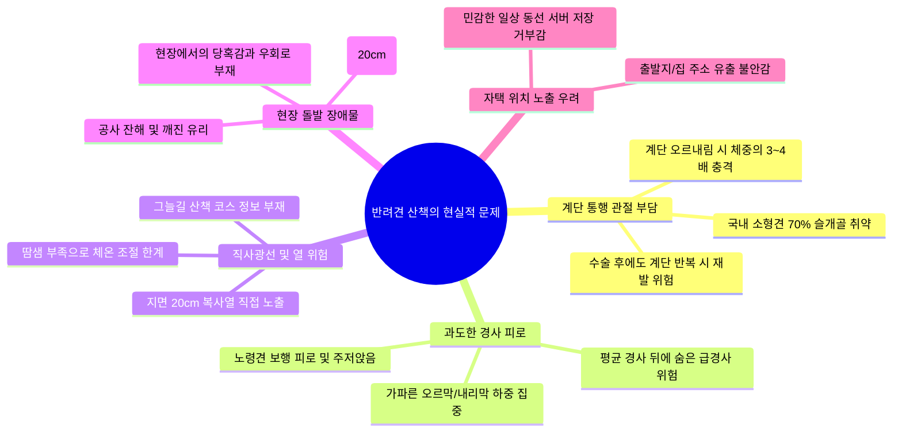
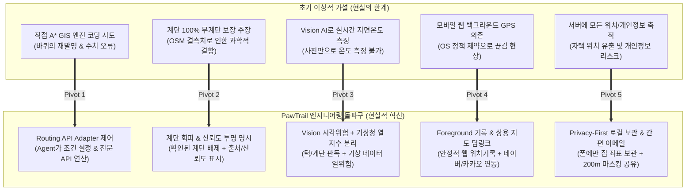
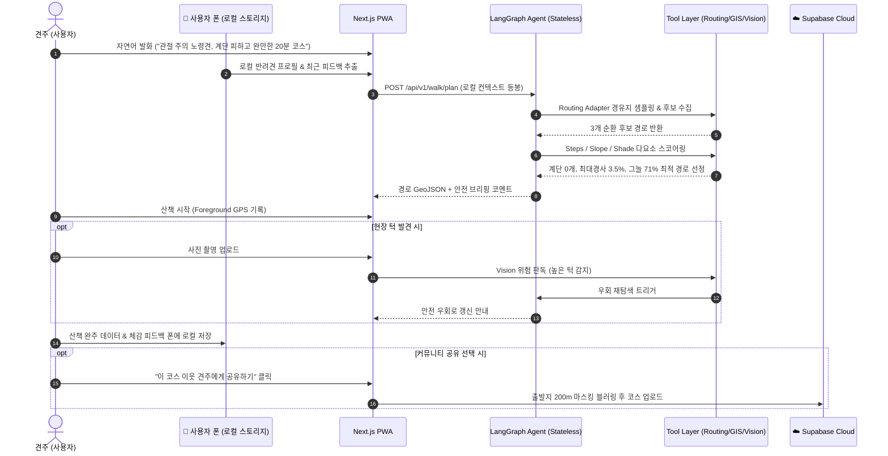

# 🎯 [발표 평가 가이드] PawTrail 핵심 페인 포인트 및 기술적 차별화 전략

> **발표 평가의 본질은 "기술의 단순 나열"이 아니라,  
> "진짜 사용자의 고통(Pain Point)을 정확히 짚어냈고, 현실적 데이터와 환경 제약 속에서 이를 어떻게 똑똑한 엔지니어링 의사결정(Engineering Decision)으로 풀어냈는가"를 증명하는 것입니다.**

본 문서는 PawTrail 최종 프로젝트 발표 시 심사위원과 평가관의 공감을 이끌어내고 최고 점수를 획득할 수 있도록 **[1] 사용자/도메인 페인 포인트**, **[2] 기존 상용 지도의 구조적 맹점**, **[3] 데이터 융합 및 AI Native 엔지니어링 돌파구**, **[4] 심사위원 예상 질문(Q&A) 방어 전략**, **[5] 슬라이드 스토리보드**를 체계적으로 정리한 발표 전용 전략 문서입니다.

---

## 📌 목차 (Table of Contents)

1. [🎙️ 30초 오프닝 훅 (Elevator Pitch)](#1-️-30초-오프닝-훅-elevator-pitch)
2. [🐾 사용자 & 도메인 페인 포인트 (Real Pain Points)](#2--사용자--도메인-페인-포인트-real-pain-points)
3. [🗺️ 기존 상용 지도 서비스의 한계 (Market Blind Spots)](#3-️-기존-상용-지도-서비스의-한계-market-blind-spots)
4. [💡 엔지니어링 의사결정과 5대 기술적 돌파구 (Tech Pivots)](#4--엔지니어링-의사결정과-5대-기술적-돌파구-tech-pivots)
5. [🤖 AI Native 산책 파이프라인의 완성 (How It Works)](#5--ai-native-산책-파이프라인의-완성-how-it-works)
6. [🛡️ 심사위원 킬러 질문(Q&A) 및 방어 전략 (Defense Matrix)](#6-️-심사위원-킬러-질문qa-및-방어-전략-defense-matrix)
7. [📊 발표 슬라이드 스토리보드 제안 (Slide Narrative)](#7--발표-슬라이드-스토리보드-제안-slide-narrative)

---

## 1. 🎙️ 30초 오프닝 훅 (Elevator Pitch)

> *"국내 반려견의 대다수를 차지하는 소형견과 노령견에게 **'계단'**과 **'가파른 언덕'**은 관절에 치명적이고, 한낮의 **'직사광선'**은 체열 조절이 취약한 반려견을 지치게 만듭니다.  
> 하지만 기존 상용 지도는 최단거리만 알려줄 뿐 계단 유무, 경사 수준, 그늘 여부를 알려주지 않으며, 견주의 자택 위치와 보행 동선이 서버에 그대로 남는 프라이버시 위험도 있습니다.  
> **PawTrail은 반려견의 관절과 상태를 이해한 AI Agent가 계단과 과도한 경사를 피하고 그늘을 우선하는 맞춤형 순환 산책로를 찾아주며, 개인정보는 폰에만 안전하게 남기는 Privacy-First AI 산책 플랫폼입니다."*

---

## 2. 🐾 사용자 & 도메인 페인 포인트 (Real Pain Points)

---

## 3. 🗺️ 기존 상용 지도 서비스의 한계 (Market Blind Spots)

| 비교 항목 | 기존 상용 지도 (네이버 / 카카오 / 구글) | 반려견 안심 산책 플랫폼 (PawTrail) |
|---|---|---|
| **최적화 목적 함수** | **최단 거리 / 최단 시간** (도착 중심) | **계단 회피·완만 경사·그늘 우선** (과정 중심) |
| **경로 형태** | A 지점 $\to$ B 지점 편도 이동 | 출발지로 안전하게 되돌아오는 **순환형(Loop) 코스** |
| **계단 식별** | ❌ 단순 도보 통행로로 통합 표시 | ⭕ OSM `highway=steps` 기반 **확인된 계단 우선 배제** |
| **경사도 분석** | ❌ 고도차 미제공 또는 단순 참고용 | ⭕ DEM 연계 **최대 경사도 및 급경사 구간 통제** |
| **그늘 환경 연산** | ❌ 지도상 그늘 정보 부재 | ⭕ **SunCalc 태양각 + 건물 형상 결합 그늘 구간 우선** |
| **현장 위험 대응** | ❌ 현장 장애물 우회 기능 부재 | ⭕ **Vision AI 사진 분석 기반 높은 턱/위험 안전 우회** |
| **프라이버시 관리** | ⚠️ 사용자 위치 서버 전면 수집 | ⭕ **자택 좌표 폰 로컬 보관 + 공유 시 200m 마스킹** |

---

## 4. 💡 엔지니어링 의사결정과 5대 기술적 돌파구 (Tech Pivots)

### [돌파구 1] 직접 A* 알고리즘 코딩 $\to$ Agent 도구 오케스트레이션 & Routing Adapter
* 전 세계 도로망을 직접 파싱하는 비효율을 걷어내고, 전문 **Routing API(ORS/OSRM) Adapter**에 도로망 연산을 위임. AI Agent는 다요소(계단/경사/그늘) 스코어링 및 최적 경로 선정에 집중.

### [돌파구 2] "100% 무계단 보장" 과장 $\to$ 확인된 계단 우선 회피 및 신뢰도 체계
* "100% 무계단 보장"이라는 비과학적 표현을 전면 배제하고, **"지도 데이터에서 확인된 계단 구간 우선 회피"**로 정의. 출처(`osm_tag`)와 신뢰도(`confidence: 0.92`)를 투명하게 표시.

### [돌파구 3] 사진으로 지면온도 측정 $\to$ 시각적 위험 분석과 열 위험 지수 분리
* 일반 사진 한 장으로 온도를 측정한다는 오류를 바로잡고, **Vision AI는 높은 턱, 야외 계단, 공사구간 판독**에 집중하며 **열 위험은 기상청 단기예보 모델**로 엄격히 분리.

### [돌파구 4] 모바일 웹 백그라운드 GPS $\to$ Foreground 기록 & 상용 지도 연동
* 브라우저 백그라운드 위치 끊김 현상을 극복하기 위해, 화면을 열어 확인하는 **Foreground 위치 기록**을 기본 채택하고 턴바이턴 안내는 **네이버/카카오 지도 딥링크**로 원터치 연동.

### [돌파구 5] 서버 개인정보 무차별 수집 $\to$ Privacy-First 로컬 보관 & 간편 이메일 가입
* 사용자의 자택 주소, 보행 궤적, 반려견 신체 정보는 **사용자의 폰(IndexedDB)에만 보관**.
* 소셜 로그인의 번거로움 없이 **간편 이메일 가입(Auto-confirm)**으로 진입장벽을 낮추고, 커뮤니티 코스 공유 시에만 **출발지/도착지 200m 자동 마스킹**을 적용해 사생활 완벽 보호.

---

## 5. 🤖 AI Native 산책 파이프라인의 완성 (How It Works)

---

## 6. 🛡️ 심사위원 킬러 질문(Q&A) 및 방어 전략 (Defense Matrix)

| 예상 질문 (Question) | 핵심 방어 논리 (Defense Script) |
|---|---|
| **Q1. 개인정보를 폰에만 저장하면 폰을 바꿨을 때 다 날아가지 않나요?** | *"정확한 지적이십니다. 그래서 저희는 **'데이터 백업/복원(JSON 파일 내보내기/가져오기)'** 기능을 기본 탑재했습니다. 사용자가 원할 때 언제든 본인의 데이터를 파일로 다운받아 다른 기기로 안전하게 옮길 수 있어, 서버 유출 위험 없이도 데이터 연속성을 확보했습니다."* |
| **Q2. 소셜 로그인을 안 쓰면 회원가입이 번거롭지 않나요?** | *"오히려 반대입니다. 카카오/구글 로그인은 웹뷰나 브라우저 리다이렉트 과정에서 튕기거나 팝업 차단 오류가 빈번합니다. 저희는 **Supabase Auth 기반의 단순 이메일/비밀번호 가입(개발 중 Auto-confirm)**을 채택하여 1초 만에 가입을 마치고 즉시 테스트할 수 있도록 진입장벽을 극소화했습니다."* |
| **Q3. 커뮤니티에 코스를 공유하면 집 주소가 노출되지 않나요?** | *"그것을 방지하기 위해 저희는 **'출발지 200m 공간 마스킹(Spatial Jittering & Truncation)'** 파이프라인을 구축했습니다. 코스를 공유하더라도 사용자의 집 앞 골목길은 자동으로 잘려 나가고 큰길부터 공개되므로 안심하고 코스를 나눌 수 있습니다."* |
| **Q4. OSM 지도에 등록되지 않은 계단이 있으면 어떡하나요?** | *"그렇기 때문에 '100% 무계단 보장'이라는 과장을 배제하고 신뢰도를 투명하게 안내합니다. 또한 현장에서 예상치 못한 계단이나 높은 턱을 마주쳤을 때 **사진을 찍으면 Vision AI가 위험을 판독해 즉시 우회로를 찾아주는 상호보완적 안전망**을 제공합니다."* |

---

## 7. 📊 발표 슬라이드 스토리보드 제안 (Slide Narrative)

* **Slide 1. 타이틀**: PawTrail - 반려견의 관절과 견주의 프라이버시를 지키는 AI 산책 플래너
* **Slide 2. 문제 제기**: 도심지 산책의 4대 고통 (계단, 급경사, 직사광선, 돌발 장애물) & 자택 노출 우려
* **Slide 3. 시장의 맹점**: 최단거리만 알려주는 기존 상용 지도와 과도한 개인정보 수집의 문제
* **Slide 4. 솔루션 소개**: 무계단·완만 경사·그늘 우선 순환 산책로 + Privacy-First Local-First 아키텍처
* **Slide 5. 기술 아키텍처**: Next.js PWA(IndexedDB) $\to$ FastAPI(Stateless) $\to$ LangGraph $\to$ Tool Layer
* **Slide 6. 엔지니어링 돌파구**: 직접 A* 배제, 신뢰도 체계, 비전/열위험 분리, Foreground 기록, 200m 마스킹 커뮤니티 공유
* **Slide 7. 핵심 기능 시연**: 대화형 코스 생성, 구간별 색상 시각화, 현장 턱 사진 분석 및 우회
* **Slide 8. 실사용자 검증**: 5인 실견주 필드 테스트 결과 및 프라이버시 만족도
* **Slide 9. 비전 및 로드맵**: 안전하고 윤리적인 반려견 보행 생태계 구축
