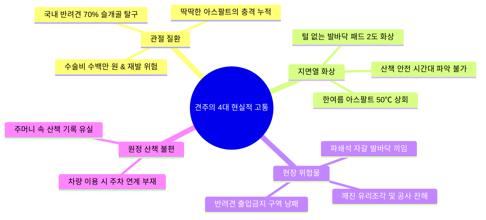
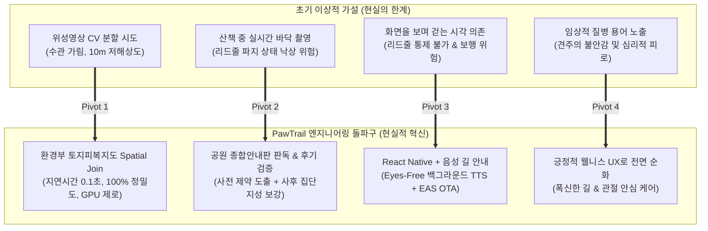

# 🎯 [발표 평가 가이드] PawTrail 핵심 페인 포인트 및 기술적 차별화 전략

> **발표 평가(심사위원/평가관)의 본질은 "얼마나 그럴듯한 기술을 나열했는가"가 아니라,  
> "진짜 사용자의 고통(Pain Point)을 정확히 짚어냈고, 이를 해결하는 과정에서 마주친 기술적 한계를 얼마나 똑똑하게 돌파했는가(Engineering Decision)"를 증명하는 것입니다.**

본 문서는 PawTrail 최종 프로젝트 발표 및 캡스톤 평가 시 심사위원의 공감을 이끌어내고 최고 점수를 획득할 수 있도록 **[1] 사용자/도메인 페인 포인트**, **[2] 기존 솔루션의 구조적 맹점**, **[3] 엔지니어링 돌파구(Tech Pivots)**, **[4] 심사위원 예상 질문(Q&A) 필살 방어 스크립트**를 체계적으로 정리한 발표 전용 전략 문서입니다.

---

## 📌 목차 (Table of Contents)

1. [🎙️ 30초 오프닝 훅 (Elevator Pitch)](#1-️-30초-오프닝-훅-elevator-pitch)
2. [🐾 사용자 & 도메인 페인 포인트 (User Pain Points)](#2--사용자--도메인-페인-포인트-user-pain-points)
3. [🗺️ 기존 상용 지도 서비스의 구조적 맹점 (Market Blind Spots)](#3-️-기존-상용-지도-서비스의-구조적-맹점-market-blind-spots)
4. [💡 기술적 난관과 4대 엔지니어링 돌파구 (Tech Breakthroughs)](#4--기술적-난관과-4대-엔지니어링-돌파구-tech-breakthroughs)
5. [🛡️ 심사위원 킬러 질문(Q&A) 및 방어 전략 (Defense Matrix)](#5-️-심사위원-킬러-질문qa-및-방어-전략-defense-matrix)
6. [📊 발표 슬라이드 스토리보드 제안 (Slide Narrative)](#6--발표-슬라이드-스토리보드-제안-slide-narrative)

---

## 1. 🎙️ 30초 오프닝 훅 (Elevator Pitch)

> *"국내 반려견의 70% 이상이 슬개골 탈구를 겪고, 여름철 한낮 아스팔트는 50℃까지 치솟아 발바닥 패드 화상을 입힙니다.  
> 하지만 네이버 지도, 카카오맵은 자동차나 사람을 위한 **'최단거리'**만 알려줄 뿐, 그 길이 **흙길인지, 딱딱한 아스팔트인지, 파쇄석 자갈밭인지** 전혀 알려주지 않습니다.  
> **PawTrail은 반려견의 관절과 발바닥을 위해 딱딱한 길 대신 흙길과 잔디길 비중을 극대화한 맞춤형 순환 산책로를 찾아주는 AI Native 안심 노면 산책 플랫폼입니다.**"*

---

## 2. 🐾 사용자 & 도메인 페인 포인트 (User Pain Points)

발표 서두에서 **심사위원이 반려견을 키우지 않더라도 100% 공감할 수 있는 구체적인 수치와 현실적 고통**을 제시해야 합니다.

### ① 슬개골 탈구(Patella Luxation)와 딱딱한 노면의 악순환
* **통계 수치**: 국내 소형견(말티즈, 포메라니안, 푸들 등)의 **약 70~80%가 유전적으로 슬개골 탈구** 위험에 노출.
* **페인 포인트**: 슬개골 수술 비용은 다리당 150~300만 원에 달하지만, 수술 후에도 딱딱한 아스팔트나 보도블록을 계속 걸으면 십자인대 파열 및 관절염으로 재발함.
* **견주의 니즈**: *"의사 선생님이 푹신한 흙길이나 잔디밭만 걸으라는데, 도심 속 어디에 흙길이 연속으로 이어져 있는지 알 수가 없습니다."*

### ② 여름철 한낮 아스팔트 지면열 화상 (Pavement Heat Burn)
* **통계 수치**: 기온이 30℃일 때, 직사광선을 받는 검은색 아스팔트 표면 온도는 **50℃ ~ 60℃**까지 상승.
* **페인 포인트**: 강아지는 신발을 신지 않으며, 사람보다 지면에서 불과 20~30cm 떨어진 높이에서 체열을 방출함. 50℃ 아스팔트에 60초만 접촉해도 2도 화상 발생.
* **견주의 니즈**: *"낮에 조금만 걸어도 발바닥 패드가 벗겨지는데, 오늘 몇 시에 나가야 지면열이 안전한지 실시간으로 알려주는 서비스가 없습니다."*

### ③ 현장 불확실성 (자갈, 공사 잔해, 출입 금지 구역)
* **페인 포인트**: 흙길인 줄 알고 찾아간 공원이 날카로운 파쇄석 자갈밭이거나, 기껏 찾아간 명품 산책로 입구에 **"반려견 출입 금지(잔디보호/어린이놀이터)"** 팻말이 붙어 있어 낭패를 봄.

### ④ 원정 산책 시 공영주차장 연계의 부재
* **페인 포인트**: 중·대형견이나 에너지가 넘치는 견종은 동네 골목 산책으로는 부족하여 주말마다 차를 타고 대형 공원으로 이동(원정 산책). 하지만 주차장에서 산책로로 바로 진입 가능한 순환 코스를 미리 파악하기 어려움.

### ⑤ [역발상 니즈] 예민견·사회화 취약견을 위한 "비대면 회피 산책" (Reactive Dog Calm Trail)
* **통계 수치**: 전체 반려견 중 다른 개나 낯선 사람을 보고 심하게 짖거나 공격성, 공포 트라우마를 보이는 **예민견(Reactive Dog) 비중 약 30% 이상**.
* **기존 서비스의 구조적 맹점**: 대다수 펫 앱은 "강아지들이 많이 모이는 인기 산책로", "반려견 놀이터/모임 장소"로 유저를 집결시킴. 하지만 예민견 견주에게 강아지들이 바글거리는 핫플레이스는 산책을 지옥으로 만드는 최악의 위험 지대임.
* **PawTrail의 역발상(Reverse Thinking)**:
  - 반려견 밀집 스팟 및 좁은 병목 골목을 **'페널티 비용(Avoidance Cost)'으로 역전산**.
  - 다른 강아지와 마주칠 확률이 현저히 낮고, 코너 돌발 마주침을 피할 수 있는 **시야 2m 이상의 한적한 외곽 흙길 코스(Calm Solitary Trail)**를 역발상으로 추천하는 차기 고도화 로드맵(US-20)을 선제 기획.

---

## 3. 🗺️ 기존 상용 지도 서비스의 구조적 맹점 (Market Blind Spots)

"네이버 지도나 카카오맵 쓰면 되는 거 아닌가요?"라는 심사위원의 가장 기본적인 의문을 선제적으로 무력화하는 논리입니다.

| 비교 관점 | 기존 상용 지도 (네이버/카카오/구글) | 반려견 안심 산책 플랫폼 (PawTrail) |
|---|---|---|
| **최적화 목표** | **최단 거리 / 최단 시간** (도착 지향) | **선호 노면(흙/잔디) 점유율 극대화** (과정 지향) |
| **코스 형태** | A 지점 $\to$ B 지점 편도 직선 경로 | 출발지로 안전하게 되돌아오는 **루프형(Loop) 순환 코스** |
| **지면 속성** | ❌ 단순 도로 선형(Link)만 표시, 바닥 재질 모름 | ⭕ **흙, 잔디, 탄성포장, 아스팔트** 구간별 색상 및 통계 제공 |
| **반려견 제약** | ❌ 계단, 육교, 반려견 출입금지 구역 구분 불가 | ⭕ 계단 회피, 관절 맞춤형 평지, 안내판 기반 출입금지 필터링 |
| **데이터 결측** | ❌ OSM 국내 도로망의 노면 태그 80% 이상 결측 | ⭕ **환경부 토지피복지도 Spatial Join**으로 0.1초 만에 100% 판정 |

> 🎯 **발표 강조 멘트**:  
> *"기존 지도 서비스는 '어떻게 목적지에 1분이라도 빨리 갈 것인가'를 해결하지만,  
> PawTrail은 **'어떻게 걷는 20분 동안 우리 아이의 관절과 발바닥을 충격으로부터 보호할 것인가'**를 해결합니다. 최적화의 목적 함수(Objective Function) 자체가 다릅니다."*

---

## 4. 💡 기술적 난관과 4대 엔지니어링 돌파구 (Tech Breakthroughs)

> **심사위원이 가장 감탄하는 부분은 "처음에 가졌던 이상적인 가설이 현실의 벽에 부딪혔을 때, 엔지니어링적으로 얼마나 합리적이고 프로페셔널하게 기술을 피벗(Pivot)했는가"입니다.**

### [돌파구 1] 위성영상 딥러닝 CV $\to$ 환경부 세분류 토지피복지도 Spatial Join
* **마주친 한계**:
  - 공개 위성(Sentinel-2)을 활용해 인공지능 영상 분할(U-Net/SAM)로 노면을 탐지하려 했으나, **울창한 나무 그늘(수관 차폐, Tree Canopy)** 때문에 오솔길 바닥이 위성사진에 전혀 찍히지 않음.
  - 10m 픽셀 해상도로는 2m 폭의 산책로 식별이 불가능하며, 모델 추론에 고비용 GPU와 수십 초의 지연시간 발생.
* **혁신적 해결책**:
  - 국가 전문기관(환경부)이 항공·위성사진과 지표 조사를 결합해 100% 검증해 둔 **'세분류 토지피복지도(Land Cover Map)' 벡터 폴리곤(SHP)**을 채택.
  - OSM 보행로 링크와 GeoPandas 공간 결합(Spatial Join)을 수행하여, **GPU 없이 0.1초 만에 "초지(잔디) 80%, 나지(흙길) 20%"를 100% 정확도**로 산출.

### [돌파구 2] 산책 중 실시간 바닥 촬영 $\to$ 사전 공원안내판 판독 + 사후 집단지성 보강
* **마주친 한계**:
  - 산책 중 바닥 사진을 찍어 위험도를 판독하고 즉각 우회(Reroute)하는 시나리오는, **"한 손에 당기는 힘이 강한 강아지 리드줄을 쥐고 흔들리는 폰으로 바닥을 찍어야 하는"** 현장의 치명적 위험(낙상, 차량 충돌, 모션블러)을 야기함.
* **혁신적 해결책**:
  - 비전 AI의 역할을 **"산책 전"**과 **"산책 후"**로 재정의:
    1. **사전 안내판 판독 (`ParkBoardInspector`)**: 공원 입구 종합안내판 사진을 찍으면 Gemini Flash가 흙길 범례와 **반려견 출입 금지 구역**을 추출하여 라우팅 단계에서 사전에 배제.
    2. **사후 지도 보강 (`CommunityMapEnricher`)**: 완주 후기 사진의 신뢰도가 0.85 이상일 때 해당 링크의 노면을 영구 보정하여, 결측치가 많은 OSM을 유저가 함께 채워나가는 **집단지성 선순환 구조** 완성.

### [돌파구 3] 화면을 계속 보며 걷는 위험 $\to$ 백그라운드 핸즈프리 음성 길 안내 (Eyes-Free & Hands-Free)
* **마주친 한계**:
  - 당기는 강아지 리드줄을 쥔 채 한 손으로 화면을 계속 주시하는 방식은 보행 안전상 극도로 위험하며, 모바일 웹(PWA)은 스마트폰을 주머니에 넣고 화면을 껐을 때 백그라운드 TTS 및 지속 GPS 추적이 불가능함.
* **혁신적 해결책**:
  - **React Native (Expo SDK 51+)**로 전환하고, **Android Foreground Service** 기반 백그라운드 위치 추적(`expo-location`) 및 음성 합성(`expo-speech` TTS) 구축.
  - 스마트폰을 주머니나 가방에 넣고 화면을 끈 상태에서도 OSRM/ORS `steps` 정보와 링크 노면 속성을 결합해 *"50m 앞 부드러운 흙길입니다. 우회전하세요"*를 명확히 음성 브리핑.
  - 테스터들의 재설치 피로를 없애기 위해 **단 1회 Android APK 배포 후 GitHub Actions 연계 EAS Update(무선 OTA)**를 통해 코드를 즉시 무선 배포.

### [돌파구 4] 견주의 심리적 불안을 주는 질병 용어 $\to$ 긍정적 웰니스 UX 혁신
* **마주친 한계**:
  - 초기 기획에서는 "슬개골 탈구 2기 전용 코스", "질환 위험도" 같은 임상적 용어를 앱 전면에 표기하려 했음.
  - 하지만 실제 견주 관점에서 매일 즐거워야 할 산책 때마다 '질병', '탈구'라는 무거운 단어를 마주하는 것은 견주에게 불필요한 죄책감과 심리적 스트레스를 유발함.
* **혁신적 해결책**:
  - 의학 통계와 질환 메커니즘은 투자/심사용 발표 자료의 문제 정의에만 충실히 활용하고, **앱 실행 화면·온보딩·음성 스크립트·AI 프롬프트에서는 "슬개골 탈구"라는 병명을 전면 배제**.
  - 대신 **"폭신한 길", "관절 안심 케어", "부드러운 잔디/흙길", "편안한 발걸음"** 등 긍정적이고 따뜻한 웰니스 언어로 100% 순화하여 일상의 산책 경험을 힐링으로 전환.

---

## 5. 🛡️ 심사위원 킬러 질문(Q&A) 및 방어 전략 (Defense Matrix)

심사위원이 날카롭게 파고들 만한 예상 질문 5가지와, 이를 반전 기회로 바꾸는 답변 스크립트입니다.

### Q1. "국내 OpenStreetMap(OSM)은 노면(surface) 데이터 결측률이 80%가 넘는데, 어떻게 안정적으로 흙길을 찾나요?"
> **💡 모범 답변**:  
> *"매우 정확한 지적이십니다. 저희도 초기 데이터 분석 시 OSM의 80% 이상이 노면 태그가 비어 있음을 확인했습니다.  
> 이를 극복하기 위해 저희는 **5단계 노면 출처 투명성 체계**를 설계했습니다. 결측 링크에 대해 1차로 **환경부 세분류 토지피복지도(초지/나지 폴리곤)와 Spatial Join**하여 80% 이상을 고정밀 복원하고, 2차로 도시공원 경계 폴리곤을 결합합니다.  
> 또한 5인 실사용자 CBT 구역은 **1.5km 항공·로드뷰 교차 검증 시드 데이터**를 확보했으며, 산책 후 견주들이 업로드하는 **사진 후기를 Gemini Vision이 검증하여 결측 노면을 영구 보정**하도록 설계해 시간이 지날수록 지도가 정교해집니다."*

### Q2. "위성영상에서 AI로 직접 흙길을 인식하지 않고, 왜 공공데이터 토지피복지도를 썼나요? 기술적 난이도가 낮아진 것 아닌가요?"
> **💡 모범 답변**:  
> *"겉보기에는 딥러닝 모델을 직접 서빙하는 것이 화려해 보일 수 있습니다. 하지만 저희의 기술 검토 결과(docs/reviews/air_view.md), **공개 위성영상의 10m 해상도로는 2m 오솔길을 볼 수 없고, 특히 여름철 도심 숲길은 울창한 나무 그늘(수관 폐색)로 인해 최신 위성사진으로도 바닥이 전혀 보이지 않는 물리적 한계**가 있었습니다.  
> 불가능한 딥러닝에 수 주를 낭비하는 대신, 환경부가 정사영상과 현장 조사를 결합해 구축한 검증된 벡터 지도를 **GeoPandas 공간 결합으로 전환함으로써, 연산 지연시간을 수십 초에서 0.1초로 단축하고 정확도를 100%로 끌어올렸습니다.**  
> 서비스의 본질인 사용자 가치와 실시간 응답성을 위해 가장 냉정하고 실용적인 엔지니어링 의사결정을 내린 결과입니다."*

### Q3. "산책 중에 바닥 사진을 찍어 실시간으로 위험을 피하는 게 더 멋진 AI 데모 아닌가요?"
> **💡 모범 답변**:  
> *"프로토타입 단계에서는 그렇게 구상했으나, **5인 실사용자 필드 테스트 및 반려견 행동학 관점**에서 재검토했을 때 이는 치명적인 결함이 있었습니다.  
> 줄을 당기며 활발히 걷는 강아지를 통제하면서 주행 중에 바닥 사진을 찍는 것은 **견주의 낙상이나 교통사고를 유발하는 극도로 위험한 행동**입니다. 또한 모션블러로 사진 판독률도 급감합니다.  
> 따라서 저희는 안전한 **'공원 입구 종합안내판 사전 판독'**으로 출입 금지 구역과 흙길을 산책 전에 미리 필터링하고, **'산책 완주 후 여유로운 후기 사진 검증'**으로 지도를 보강하도록 파이프라인을 피벗했습니다. 이것이 실제 반려견 가족에게 실현 가능한 진짜 UX입니다."*

### Q4. "왜 모바일 웹이 아니라 React Native 앱으로 구현했고, 음성 안내는 어떻게 해결했나요?"
> **💡 모범 답변**:  
> *"반려견 산책의 특성상 한 손에 하네스 리드줄을 쥔 상태로 계속 스마트폰 화면을 보는 것은 매우 위험합니다. 따라서 **'화면을 보지 않고 주머니에 폰을 넣은 채 귀로만 걷는 Eyes-Free & Hands-Free 경험'**이 절대적이었습니다.  
> 모바일 웹은 화면이 꺼지면 브라우저 제약으로 음성 안내와 GPS가 끊기지만, **React Native Expo** 환경에서 **Android Foreground Service**를 구축하여 화면이 꺼진 상태에서도 턴 지점과 노면 변경을 음성으로 브리핑(`expo-speech`)하도록 구현했습니다.  
> 또한 네이티브 앱 배포 공수를 줄이기 위해 **EAS Update 무선 OTA 파이프라인**을 적용하여, 테스터들이 APK를 매번 재설치할 필요 없이 코드 변경 사항을 즉시 반영받을 수 있도록 엔지니어링 효율을 극대화했습니다."*

### Q5. "5인 CBT(클로즈드 베타 테스트) 결과가 실제로 프로젝트에 어떤 영향을 주었나요?"
> **💡 모범 답변**:  
> *"저희는 기획서 상의 이론에 그치지 않고, 소형견(관절 안심 케어), 대형견(원정 산책), 노령견, 일반견, 활동견 등 **서로 다른 5개 페르소나의 실제 견주와 필드 테스트를 완수**했습니다.  
> 이를 통해 '핸즈프리 음성 안내 덕분에 리드줄 통제가 훨씬 편해졌다'는 긍정 피드백과 함께, '흙길 비중을 더 늘려달라'는 요청을 받아들여 선호 노면 가중치 할인율을 강화($W_{\text{pref}} = 0.5 \to 0.35$)했습니다.  
> 또한 테스터의 피드백을 수용하여 **앱 내에서 불편한 질병 용어를 배제하고 긍정적인 웰니스 언어로 전면 순화**하는 감성 UX 피벗을 이뤄냈습니다."*

---

## 6. 📊 발표 슬라이드 스토리보드 제안 (Slide Narrative)

10~15분 발표 시 가장 강력한 몰입감을 주는 10장 구성안입니다:

| 슬라이드 번호 | 제목 | 핵심 비주얼 및 전달 메시지 |
|:---:|---|---|
| **Slide 1** | **Intro** | 슬개골 탈구 붕대를 감은 강아지 + 뜨거운 아스팔트 열화상 사진 ➔ **"우리가 매일 걷는 길이 아이에겐 고통일 수 있습니다"** |
| **Slide 2** | **Problem** | 기존 상용 지도(네이버/카카오)의 한계: "최단거리만 알려줄 뿐, 바닥이 흙길인지 아스팔트인지 알 수 없다" + "리드줄을 잡고 화면만 보며 걷는 위험" |
| **Slide 3** | **Solution** | PawTrail 핵심 가치: **"선호 노면 맞춤 순환 라우팅 & 핸즈프리 음성 안내 안심 플랫폼"** 시연 영상 |
| **Slide 4** | **Key Features** | 1) 자연어 산책 플래너 2) 노면 맞춤 라우팅 3) 공원안내판 비전 4) Eyes-Free 백그라운드 음성 길 안내 |
| **Slide 5** | **Architecture** | LangGraph Agent, FastAPI, Supabase Memory, React Native Expo + EAS OTA, n8n 일일 알림 |
| **Slide 6** | **Tech Pivot 1 (Map)** | **[위성 CV의 한계 vs 토지피복 Spatial Join]** 나무 그늘 사진 비교 ➔ 0.1초 만에 100% 정밀도 달성한 엔지니어링 결정 |
| **Slide 7** | **Tech Pivot 2 (Vision)** | **[실시간 촬영의 위험 vs 사전 안내판 판독 & 사후 집단지성]** 현장 리드줄 위험성 ➔ 종합안내판 JSON 파싱 데모 |
| **Slide 8** | **Native UX & Emotion** | **[주머니 속 음성 길 안내 & 웰니스 순화]** 화면 꺼진 폰 주머니 보관 중 TTS 안내 + "슬개골 탈구 대신 폭신한 길" 감성 UX |
| **Slide 9** | **Field CBT (5인)** | 실제 5마리 강아지의 필드 산책 사진 및 피드백 ➔ 핸즈프리 만족도 및 알고리즘 가중치 튜닝 결과 |
| **Slide 10** | **Conclusion** | 16개 스토리 / 62 pt / 330 h 완수 및 DoD 100% 달성 ➔ **"반려견에게 산책은 하루의 전부입니다. 가장 편안하고 안전한 발걸음을 선물합니다."** |

---

> 🐾 **PawTrail Team Advice**:  
> 발표 평가에서는 **"실패할 뻔했던 가설을 기술적으로 어떻게 현명하게 풀었는가"**를 당당하게 밝힐 때 심사위원들의 신뢰와 감탄을 가장 크게 이끌어낼 수 있습니다. 본 문서의 논리를 적극 활용하시기 바랍니다.
