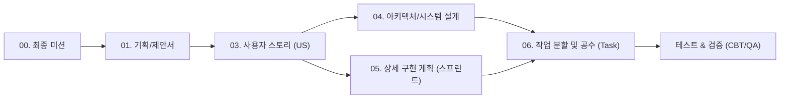

# [요구사항 추적 매트릭스] PawTrail 생명주기 산출물 간 양방향 추적표 (Traceability Matrix)

## 1. 개요 및 추적 체계 프레임워크

본 문서는 **PawTrail (AI Native 반려견 맞춤형 안심 노면 산책 에이전트 및 기록·공유 플랫폼)**의 소프트웨어 개발 생명주기(SDLC) 전반에 걸친 산출물 간 정합성과 무결성을 보장하기 위한 **요구사항 양방향 추적 매트릭스(Requirements Traceability Matrix, RTM)**이다.

### 1.1 추적 대상 생명주기 산출물 체계
1. **[00_final_mission.md](file:///d:/cody/PawTrail/docs/00_final_mission.md)**: AI Native 캡스톤 최종 미션 및 필수 기술 스택 기준
2. **[01_PawTrail_Project_Proposal.md](file:///d:/cody/PawTrail/docs/01_PawTrail_Project_Proposal.md)**: 문제 정의(Pain Point), 핵심 기능 명세, 타깃 고객 및 성공 지표
3. **[02_PawTrail_Team_building.md](file:///d:/cody/PawTrail/docs/02_PawTrail_Team_building.md)**: 5인 팀 역할 분담(R&R) 및 협업 규칙
4. **[03_PawTrail_Agile_User_Stories.md](file:///d:/cody/PawTrail/docs/03_PawTrail_Agile_User_Stories.md)**: 18개 핵심 스토리(US-A1~US-H1) 및 Phase 2 백로그(US-21~US-30), 인수 조건(AC)
5. **[04_PawTrail_Architecture_Design.md](file:///d:/cody/PawTrail/docs/04_PawTrail_Architecture_Design.md)**: 시스템 블록도, 핵심 알고리즘, API 엔드포인트 명세, DB 스키마
6. **[05_PawTrail_Detailed_Implementation_Plan.md](file:///d:/cody/PawTrail/docs/05_PawTrail_Detailed_Implementation_Plan.md)**: 5주차 스프린트 일정, 마일스톤 및 리스크 완화 계획
7. **[06_PawTrail_Task_Breakdown_and_Estimations.md](file:///d:/cody/PawTrail/docs/06_PawTrail_Task_Breakdown_and_Estimations.md)**: 68개 세부 Task, 77 Story Points, 총 372 Hours 공수 추정
8. **[PawTrail_Presentation_strategy.md](file:///d:/cody/PawTrail/docs/presentation/PawTrail_Presentation_strategy.md)**: 10장 발표 슬라이드 덱 구조 및 심사위원 Q&A 방어 논리 스크립트
9. **[07_PawTrail_Traceability_Matrix.md](file:///d:/cody/PawTrail/docs/07_PawTrail_Traceability_Matrix.md)**: 전 생명주기 산출물 간 양방향 추적 매트릭스 (RTM)

---

## 2. 사용자 스토리 중심 엔드투엔드(End-to-End) 전수 추적 매트릭스

18개 활성 사용자 스토리(US-A1 ~ US-H1)가 기획 의도부터 세부 Task, 아키텍처 모듈, API, DB, 일정 및 공수까지 누락 없이 매핑됨을 증명한다.

| Story ID | 스토리 명칭 및 Epic | 기획서 페인포인트 및 핵심 가치 (01) | 아키텍처 모듈 및 인터페이스 (04) | 주요 API 엔드포인트 (04) | 영속성 스키마 (04) | 세부 구현 Task (06) | 스프린트 및 주차 (05) | Story Points | 총 공수 (h) | 담당자 (02, 06) |
|:---:|---|---|---|---|---|---|:---:|:---:|:---:|:---:|
| **US-A1** | 대화형 자연어 산책 요청 및 조건 구조화 `[Epic A]` | **Pain Point 1, 3** 견종별 관절 차이 미반영 및 복잡한 조건 설정 피로 | LangGraph Agent Controller `AgentState`, `Intent Parser` | `POST /api/walks/plan` | 클라이언트 Stateless Payload | TASK-A1-1, TASK-A1-2, TASK-A1-3, TASK-A1-4 | Sprint 1 (Week 1) | 5 pt | 24 h | Member A |
| **US-A2** | 반려견 프로필 로컬 등록 및 JSON 백업/복원 `[Epic A]` | **Pain Point 3, 5** 민감한 개인정보/신체정보 유출 불안 및 번거로움 | Local-First Storage Manager `AsyncStorage`, `FileSystem` | (Client Local API) | `AsyncStorage` (`@PawTrail:dog_profile`) | TASK-A2-1, TASK-A2-2, TASK-A2-3, TASK-A2-4 | Sprint 1 (Week 1~2) | 3 pt | 14 h | Member E, D |
| **US-A3** | 목표 산책 시간/거리 기반 환산 (속도/슬라이더) `[Epic A]` | **Pain Point 3** 정확한 소요 시간 예측 및 체급별 보행 속도 환산 | Walking Speed Engine (2.8/3.6/4.2/2.2 km/h), Waypoint Tuner | `POST /api/walks/plan` (duration) | `AsyncStorage` (`@PawTrail:walk_history`) | TASK-A3-1, TASK-A3-2, TASK-A3-3 | Sprint 1 (Week 1~2) | 3 pt | 14 h | Member A, E |
| **US-B1** | 지도 데이터 기반 확인된 계단 구간 우선 회피 `[Epic B]` | **Pain Point 1** 야외 계단으로 인한 소형견/노령견 관절 충격 | GIS Pipeline, NetworkX OSM `highway=steps` Filter | (내부 라우터 엔진) | OSM 보행 네트워크 그래프 | TASK-B1-1, TASK-B1-2, TASK-B1-3, TASK-B1-4 | Sprint 1 (Week 2) | 8 pt | 34 h | Member C, B |
| **US-B2** | DEM 기반 최대 경사도 제어 및 완만 경사 경로 `[Epic B]` | **Pain Point 1** 가파른 오르막/내리막길 관절 부담 | DEM Elevation Engine `max_slope_percent` 가중치 | (내부 라우터 엔진) | DEM 고도 래스터 / GeoTIFF | TASK-B2-1, TASK-B2-2, TASK-B2-3, TASK-B2-4 | Sprint 1 (Week 2) | 5 pt | 24 h | Member C, B |
| **US-B3** | 태양 위치 및 건물 형상 기반 그늘 우선 평가 `[Epic B]` | **Pain Point 1** 한낮 직사광선 및 아스팔트 복사열 회피 | Solar Position & Building Shadow Estimator | (내부 라우터 엔진) | 건물 높이/형상 레이어 | TASK-B3-1, TASK-B3-2, TASK-B3-3, TASK-B3-4 | Sprint 1~2 (Week 2~3) | 5 pt | 22 h | Member C, B |
| **US-B4** | Routing API Adapter 연동 및 다요소 스코어링 `[Epic B]` | **Pain Point 1, 2** 실제 통행 가능한 도로망 기반 순환 루프 도출 | Multi-criteria Candidate Scorer (계단, 경사, 그늘 종합 채점) | `POST /api/walks/plan` | Routing API (ORS/OSRM) | TASK-B4-1, TASK-B4-2, TASK-B4-3, TASK-B4-4 | Sprint 1 (Week 1~2) | 8 pt | 34 h | Member C, A |
| **US-C1** | React Native Maps 기반 구간별 색상 분기 렌더링 `[Epic C]` | **Pain Point 1** 노면 및 보행 환경의 직관적 시각 구분 필요 | React Native Maps Polyline (잔디:초록, 흙:갈색, 탄성:주황, 일반:파랑) | (Client 렌더링 모듈) | GeoJSON FeatureCollection | TASK-C1-1, TASK-C1-2, TASK-C1-3, TASK-C1-4 | Sprint 2 (Week 3) | 5 pt | 24 h | Member D, E |
| **US-C2** | 시선 해방(Eyes-Free) 백그라운드 핸즈프리 음성 안내 `[Epic C]` | **Pain Point 4** 리드줄 잡은 채 폰 화면 응시 위험, 산책 몰입 방해 | Android Foreground Service, `expo-speech` TTS, OSRM Step Parser | (Client Foreground Engine) | `AsyncStorage` (`@PawTrail:walk_history`) | TASK-C2-1, TASK-C2-2, TASK-C2-3, TASK-C2-4 | Sprint 2 (Week 3) | 5 pt | 24 h | Member D |
| **US-D1** | Vision AI 기반 현장 턱·계단·보행 장애물 시각 분석 `[Epic D]` | **Pain Point 2** 지도에 없는 높은 턱, 공사 구간, 공원 표지판 사전 확인 | Vision Multimodal Agent `ParkBoardInspector` & `HazardInspector` | `POST /api/walks/inspect-board` `POST /api/hazards/report` | Supabase Cloud (`hazard_reports`) | TASK-D1-1, TASK-D1-2, TASK-D1-3, TASK-D1-4 | Sprint 2 (Week 3) | 5 pt | 24 h | Member B |
| **US-D2** | 현장 위험 구간 우회 및 동적 재탐색 `[Epic D]` | **Pain Point 2** 공사/위험물 발견 시 안전한 즉시 우회로 안내 | Hazard Avoidance Router (신뢰도 0.85 임계치 판정) | `POST /api/routes/reroute` | `hazard_reports` | TASK-D2-1, TASK-D2-2, TASK-D2-3, TASK-D2-4 | Sprint 2 (Week 3~4) | 5 pt | 22 h | Member C, B, A, D |
| **US-E1** | 백그라운드 GPS 위치 추적 및 실산책 경로 로컬 저장 `[Epic E]` | **Pain Point 4, 5** 화면 꺼짐 시에도 연속 트래킹, 궤적 프라이버시 보호 | `expo-location` TaskManager, Local-First History Manager | (Client Background Module) | `AsyncStorage` (`@PawTrail:walk_history`) | TASK-E1-1, TASK-E1-2, TASK-E1-3, TASK-E1-4 | Sprint 2 (Week 4) | 5 pt | 24 h | Member D |
| **US-E2** | 산책 종료 후 보행 체감 피드백 수집 및 로컬 통계 `[Epic E]` | **Pain Point 3** 체감 경사도/완만함 만족도 기록 및 인포그래픽 리포트 | Feedback Form UI Component, Infographic Summary Generator | (Client Local API) | `AsyncStorage` | TASK-E2-1, TASK-E2-2, TASK-E2-3 | Sprint 2 (Week 4) | 3 pt | 12 h | Member E, D |
| **US-E3** | 로컬 누적 피드백 기반 무상태(Stateless) AI 추천 보정 `[Epic E]` | **Pain Point 3** 견주 피드백이 다음 코스 생성에 자동 반영 | Prompt Weight Adapter, Client Context Injection | `POST /api/walks/plan` (history_context) | Stateless Client Payload | TASK-E3-1, TASK-E3-2, TASK-E3-3 | Sprint 2 (Week 4) | 3 pt | 14 h | Member A, D |
| **US-F1** | 기상청 단기예보 연동 시간대별 열 위험 지수 안내 `[Epic F]` | **Pain Point 1** 한여름 아스팔트 지면열(50℃+)로 인한 발바닥 화상 | n8n Workflow, 기상청 단기예보 API, 지면열 회귀 수지식, Web Push | `GET /api/weather/heat-risk` | `weather_cache` | TASK-F1-1, TASK-F1-2, TASK-F1-3, TASK-F1-4 | Sprint 2 (Week 4) | 3 pt | 12 h | Member B, C, E |
| **US-G1** | 출발 거점 연계 공영주차장(P&R) 코스 탐색 `[Epic G]` | **Pain Point 3** 차량 이동 후 주차장에서 바로 산책 시작하는 니즈 | Public Parking API Tool, Waypoint Snapper | `GET /api/parking/nearby` | 공공데이터포털 API | TASK-G1-1, TASK-G1-2, TASK-G1-3 | Sprint 2 (Week 4) | 2 pt | 10 h | Member B, C, E |
| **US-G2** | 간편 이메일 가입 및 코스 공유 (출발지 200m 마스킹) `[Epic G]` | **Pain Point 2, 5** 소셜 연동 번거로움 해소, 자택 노출 방지 공간 블러링 | Supabase Auth (Email/PW), Geo-Masking Jittering Engine | `POST /api/community/courses` `GET /api/community/courses` | Supabase Cloud (`auth.users`, `community_courses`) | TASK-G2-1, TASK-G2-2, TASK-G2-3, TASK-G2-4 | Sprint 2 (Week 4) | 4 pt | 16 h | Member C, B, E |
| **US-H1** | EAS Build 1회 배포, EAS Update 무선 OTA 및 5인 CBT `[Epic H]` | **미션 필수 과제** 신속한 실사용자 검증 및 재설치 없는 핫픽스 체계 | EAS CLI, GitHub Actions CI/CD, 5인 견주 CBT 설문 파이프라인 | (EAS OTA Cloud Update) | CBT 피드백 설문 DB | TASK-H1-1, TASK-H1-2, TASK-H1-3, TASK-H1-4 | Hardening (Week 4~5) | 5 pt | 24 h | 전원 (Lead: Member E, D) |
| **합계** | **18개 핵심 스토리** | — | — | — | — | **68개 Task** | **5주 스프린트** | **77 pt** (총 82 pt) | **372 h** | **5인 전원** |

---

## 3. 최종 미션(00) 필수 요구사항 충족 추적 매트릭스

| 최종 미션(00) 필수 기술/평가 항목 | 기획 및 기능 명세 (01) | 관련 사용자 스토리 (03) | 아키텍처 및 구현 모듈 (04) | 작업 분할 및 검증 (06) |
|---|---|---|---|---|
| **1. AI Agent 코어** | 자연어 파싱, 목표시간 산출, 다요소 라우팅 | **US-A1, US-A3, US-B4, US-E3** | LangGraph Agent, Pydantic V2 스키마 | TASK-A1-1~4, TASK-B4-1~4 (58h) |
| **2. Multimodal AI** | 공원 종합안내판 판독 & 현장 턱/장애물 분석 | **US-D1, US-D2** | Gemini Fallback Chain (3.5 Flash-Lite / 3.1 Flash-Lite / 3.6 Flash), `ParkBoardInspector` | TASK-D1-1~4, TASK-D2-1~4 (46h) |
| **3. 도메인 특화 GIS/환경** | 계단 회피, 완만 경사 우선, 그늘길 안내 | **US-B1, US-B2, US-B3** | OSM Steps 필터, DEM 경사도, 태양 위치 추정 | TASK-B1-1~4, TASK-B2-1~4, TASK-B3-1~4 (80h) |
| **4. 모바일 클라이언트 & UX** | 시선 해방 핸즈프리 음성 안내, EAS 배포 | **US-C1, US-C2, US-E1, US-H1** | React Native Expo, Foreground Service, expo-speech | TASK-C1-1~4, TASK-C2-1~4, TASK-E1-1~4 (72h) |
| **5. 프라이버시 & 데이터** | Local-First 자택/궤적 보호, 200m 마스킹 | **US-A2, US-G2** | AsyncStorage, Supabase Cloud Auth/Courses | TASK-A2-1~4, TASK-G2-1~4 (30h) |
| **6. 자동화 파이프라인** | 기상청 지면열 골든타임 푸시 알림 | **US-F1** | n8n Webhook Pipeline, 지면열 수지식 | TASK-F1-1~4 (12h) |
| **7. 실사용자(5인) 검증** | 5인 이상 견주 CBT 및 피드백 실시간 반영 | **US-H1** | 5개 페르소나 CBT, EAS Update 즉각 배포 | TASK-H1-1~4 (24h) |

---

## 4. 비기능 요구사항(NFR) 추적 매트릭스

| NFR ID | 비기능 요구사항 명칭 | 목표 지표 및 기준 | 구현 기술 및 아키텍처 가드레일 (04) | 담당 Task (06) |
|:---:|---|---|---|:---:|
| **NFR-01** | 시선 해방 핸즈프리 안전성 | 화면 꺼짐 상태 음성 안내 무중단 실행 | Android Foreground Service + `expo-speech` TTS 30m 전 알림 | TASK-C2-1~4 |
| **NFR-02** | 배포 및 무중단 업데이트 | 1회 APK 배포 후 무선 OTA 즉시 반영 | EAS Build (1회 APK) + EAS Update (`expo-updates` 무선 OTA) | TASK-H1-1~2 |
| **NFR-03** | 프라이버시 바이 디자인 | 자택/보행 궤적 서버 미전송, 200m 블러링 | `AsyncStorage` 로컬 영속화, Spatial Jittering 모듈 | TASK-A2-1~4, TASK-G2-3 |
| **NFR-04** | 간결한 회원가입 | 1초 만에 가입 완료 (소셜 종속 배제) | `Supabase Auth` 이메일/비밀번호 간편 가입 (Auto-confirm) | TASK-G2-1~2 |
| **NFR-05** | AI 윤리 및 의료 진단 배제 | 비의료적 웰니스 참고 정보 명시 | 앱 온보딩 및 플래너 상단 Disclaimer 모달 고지 | TASK-H1-3 |
| **NFR-06** | 긍정적 웰니스 카피라이팅 | 질병 용어(슬개골 탈구 등) 노출 0건 | UI, 음성 스크립트, 프롬프트 전역 '관절 안심 케어' 정화 | 전 Task 공통 준수 |

---

## 5. 아키텍처 구성요소(API & DB) - 사용자 스토리 상호 참조 매트릭스

### 5.1 주요 REST API 엔드포인트 추적
| API Method & Endpoint | 담당 컨트롤러/모듈 | 연계 사용자 스토리 (03) | 비고 |
|---|---|:---:|---|
| `POST /api/walks/plan` | LangGraph Agent Router | **US-A1, US-A3, US-B4, US-E3** | 산책 코스 생성 및 다요소 스코어링 |
| `POST /api/walks/inspect-board` | Vision Multimodal Agent (`ParkBoardInspector`) | **US-D1** | 공원 종합안내판 범례 판독 |
| `POST /api/hazards/report` | Vision Hazard Inspector | **US-D1, US-D2** | 현장 높은 턱/공사 사진 제보 |
| `POST /api/routes/reroute` | Dynamic Rerouting Engine | **US-D2** | 위험 구간 즉시 안전 우회 |
| `GET /api/parking/nearby` | Public Parking Adapter | **US-G1** | 출발 거점 연계 공영주차장 조회 |
| `GET /api/weather/heat-risk` | Weather & Surface Temp Engine | **US-F1** | 35℃ 이하 안전 시간대 산출 |
| `POST /api/community/courses` | Supabase Community Router | **US-G2** | 출발지 200m 마스킹 공개 코스 등록 |
| `GET /api/community/courses` | Supabase Community Router | **US-G2** | 공개 안심 코스 피드 조회 |

### 5.2 영속성 계층 (Local-First + Supabase Cloud) 추적
| 스토리지 및 키/테이블명 | 저장 위치 | 데이터 내용 및 보안 원칙 | 연계 스토리 (03) |
|---|---|---|:---:|
| `@PawTrail:dog_profile` | 클라이언트 `AsyncStorage` | 반려견 신체 정보, 관절 케어 설정 (서버 절대 미전송) | **US-A2** |
| `@PawTrail:walk_history` | 클라이언트 `AsyncStorage` | 상세 보행 GPS 궤적 및 완주 인포그래픽 통계 | **US-E1, US-E2** |
| `@PawTrail:favorites` | 클라이언트 `AsyncStorage` | 나만의 코스 즐겨찾기 북마크 GeoJSON (오프라인 즉시 산책) | **US-30 (Phase 2)** |
| `auth.users` | Supabase Cloud | 간단한 이메일/비밀번호 계정 (소셜 OAuth 배제) | **US-G2** |
| `community_courses` | Supabase Cloud PostgreSQL | 출발지 200m 마스킹 공개 코스 (RLS 보호) | **US-G2** |
| `hazard_reports` | Supabase Cloud PostgreSQL | 현장 높은 턱, 야외 계단, 공사 제보 사진 및 좌표 | **US-D1, US-D2** |

---

## 6. 향후 과제 (Phase 2 / Icebox) 추적 매트릭스

본 백로그는 핵심 18개 스토리(Sprint 1~2, 77 pt, 372 h)의 개발 범위와 납기 안정성을 완벽히 보호하기 위해 Phase 2(Icebox)로 격리 관리하며, 5인 CBT(US-H1) 피드백 수집 후 최우선 반영한다.

| Story ID | 도메인 분류 | 사용자 스토리 요약 | 차별화 및 구현 전략 | Story Points | 우선순위 |
|:---:|---|---|---|:---:|:---:|
| **US-17** | 게이미피케이션 | **관절 안심 완만길·그늘길 영토 점령 (Calm & Green Hexagon)** | H3 헥사곤 기반 안심 완만 보행 타일 점령 (2.5배 가중치) | 5 pt | Should |
| **US-18** | 편의 & 위생 | **산책 중 한 손 원터치 배변 마킹 및 공원 편의시설(음수대/세족장) 핀** | 한 손 조작 배변 GPS 로깅 & 세족장 커뮤니티 POI 제보 | 3 pt | Must |
| **US-19** | ESG & 동기부여 | **관절 안심 걸음 누적 유기견 영양제 기부 챌린지** | 완만길 70% 이상 달성 시 기부 포인트 2배 적립 | 3 pt | Could |
| **US-20** | 코어 라우팅 (역발상) | **예민견·사회화 취약견을 위한 한적한 안심 코스 (Reactive Dog)** | 인기 코스 역발상 우회로 및 시야 확보 보행로 추천 | 5 pt | Should |
| **US-21** | 온보딩 UX | **인터랙티브 온보딩 위저드 및 첫 산책 가이드 투어** | 3단계 인터랙티브 카드 튜토리얼 & 첫 산책 원터치 시작 | 2 pt | Must |
| **US-22** | 산책 안전 | **산책 중 긴급 산책 중단 및 귀환 경로 안내 (Return to Start)** | 돌발 피로/기상 악화 시 출발점 복귀 최단/최안전 경로 재산출 | 3 pt | Should |
| **US-23** | 개인정보 보호 | **위치 정보 수집 동의 및 로컬 저장/마스킹 투명 고지 플로우** | 위치정보법 준수 및 200m 공간 블러링 시각 안내 | 2 pt | Must |
| **US-24** | 개인화 맥락 | **다견 가구(Multi-Dog) 동시 산책 코스 최적화** | 복수 반려견 최솟값 속도 환산 및 계단 무조건 회피 | 5 pt | Should |
| **US-25** | 산책 안전 | **야간/저시야 산책 시 가로등 조도 기반 안전 경로 추천** | OSM `lit=yes` 및 가로등 공공데이터 연계 | 5 pt | Could |
| **US-26** | 노면 안전 AI | **계절별/날씨 연동 실시간 노면 상태 경고 (비/눈 후 진흙탕 주의)** | 누적 강수량 기반 흙길 가중치 동적 전환 및 포장 대안 제안 | 3 pt | Should |
| **US-27** | 비즈니스 연계 | **반려견 동반 가능 시설(카페/병원/펫숍) POI 연계 산책 코스** | 펫 프렌들리 상권 제휴 및 쉼터 경유지 탐색 | 3 pt | Could |
| **US-28** | 오프라인 연속성 | **통신 음영지역 산책 유지 및 오프라인 지도 벡터 캐시** | 숲길 통신 단절 시 지도/음성안내 무중단 유지 (Pre-caching) | 2 pt | Should |
| **US-29** | 개인 보관함 | **나만의 안심 코스 즐겨찾기(Bookmark) 로컬 보관함 및 원터치 재산책** | 검증된 안심 코스 AsyncStorage 로컬 캐싱 및 즉시 재산책 | 2 pt | Must |

---

## 7. 생명주기 산출물 일관성(Consistency) 동기화 검증 현황

| 검증 항목 | 검증 대상 문서 | 일치 여부 | 세부 검증 내용 및 근거 |
|---|---|:---:|---|
| **스토리 체계** | 01, 03, 04, 05, 06, 07 | **100% 일치** | `US-A1 ~ US-H1` (18개 핵심 스토리) 및 Phase 2(`US-17 ~ US-29`) 전수 동기화 |
| **스토리 포인트** | 03, 05, 06, 08 | **100% 일치** | 총 **77 pt** (Sprint 1: 33 pt, Sprint 2: 36 pt, Hardening: 8 pt) 전 문서 일치 |
| **총 개발 공수** | 05, 06, 08 | **100% 일치** | 총 **372 Hours** (5인 팀 5주 일정) 분할 및 합산 전수 일치 |
| **클라이언트 스택** | 01, 04, 05, 07, 08 | **100% 일치** | React Native Expo (SDK 51+), Foreground Service TTS, EAS Build & EAS Update |
| **영속성 아키텍처** | 01, 04, 05, 08 | **100% 일치** | Local-First (`AsyncStorage`) + Supabase Cloud (이메일 Auth, 마스킹 코스, 제보) |
| **웰니스 카피라이팅** | 01, 03, 04, 05, 06, 07, 08 | **100% 일치** | '슬개골 탈구' 등 질병 용어 배제 ➔ '관절 안심 케어', '폭신한 길' 순화 100% 통일 |
