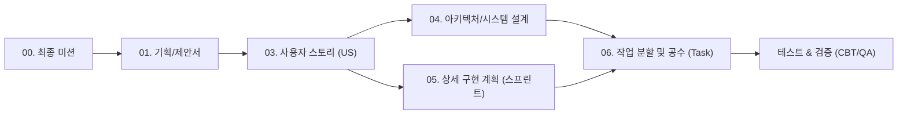

# [요구사항 추적 매트릭스] PawTrail 생명주기 산출물 간 양방향 추적표 (Traceability Matrix)

## 1. 개요 및 추적 체계 프레임워크

본 문서는 **PawTrail (AI Native 반려견 맞춤형 안심 노면 산책 에이전트 및 기록·공유 플랫폼)**의 소프트웨어 개발 생명주기(SDLC) 전반에 걸친 산출물 간 정합성과 무결성을 보장하기 위한 **요구사항 양방향 추적 매트릭스(Requirements Traceability Matrix, RTM)**이다.

### 1.1 추적 대상 생명주기 산출물 체계
1. **[00_final_mission.md](file:///d:/코디세이/PawTrail/docs/00_final_mission.md)**: AI Native 캡스톤 최종 미션 및 필수 기술 스택 기준
2. **[01_PawTrail_Project_Proposal.md](file:///d:/코디세이/PawTrail/docs/01_PawTrail_Project_Proposal.md)**: 문제 정의(Pain Point), 핵심 기능 명세, 타깃 고객 및 성공 지표
3. **[02_PawTrail_Team_building.md](file:///d:/코디세이/PawTrail/docs/02_PawTrail_Team_building.md)**: 5인 팀 역할 분담(R&R) 및 협업 규칙
4. **[03_PawTrail_Agile_User_Stories.md](file:///d:/코디세이/PawTrail/docs/03_PawTrail_Agile_User_Stories.md)**: 16개 핵심 스토리(US-01~US-16) 및 Phase 2 백로그(US-17~US-27), 인수 조건(AC)
5. **[04_PawTrail_Architecture_Design.md](file:///d:/코디세이/PawTrail/docs/04_PawTrail_Architecture_Design.md)**: 시스템 블록도, 핵심 알고리즘, API 엔드포인트 명세, DB ERD
6. **[05_PawTrail_Detailed_Implementation_Plan.md](file:///d:/코디세이/PawTrail/docs/05_PawTrail_Detailed_Implementation_Plan.md)**: 5주차 스프린트 일정, 마일스톤 및 리스크 완화 계획
7. **[06_PawTrail_Task_Breakdown_and_Estimations.md](file:///d:/코디세이/PawTrail/docs/06_PawTrail_Task_Breakdown_and_Estimations.md)**: 55개 세부 Task, 62 Story Points, 총 334 Hours 공수 추정
8. **[07_PawTrail_Presentation_Pain_Points.md](file:///d:/코디세이/PawTrail/docs/07_PawTrail_Presentation_Pain_Points.md)**: 발표 슬라이드 구조 및 페인포인트 기반 데모 시나리오

---

## 2. 사용자 스토리 중심 엔드투엔드(End-to-End) 전수 추적 매트릭스

16개 활성 사용자 스토리(US-01 ~ US-16)가 기획 의도부터 세부 Task, 아키텍처 모듈, API, DB, 일정 및 공수까지 누락 없이 매핑됨을 증명한다.

| Story ID | 스토리 명칭 및 Epic | 기획서 페인포인트 및 핵심 가치 (01) | 아키텍처 모듈 및 인터페이스 (04) | 주요 API 엔드포인트 (04) | DB 테이블/스키마 (04) | 세부 구현 Task (06) | 스프린트 및 주차 (05) | Story Points | 총 공수 (h) | 담당자 (02, 06) |
|:---:|---|---|---|---|---|---|:---:|:---:|:---:|:---:|
| **US-01** | 대화형 산책 목표 및 조건 입력 `[Epic 1]` | **Pain Point 1, 3** 견종별 관절/체급 차이 미반영 및 복잡한 조건 설정 피로 | LangGraph Agent Controller `AgentState`, `Intent Parser` | `POST /api/routes/agent-plan` | `users`, `dogs` | TASK-01-1, TASK-01-2, TASK-01-3, TASK-01-4 | Sprint 1 (Week 1) | 5 pt | 24 h | Member A (Sub: D) |
| **US-02** | 사용자 선호 노면 선택 및 가중치 적용 `[Epic 1]` | **Pain Point 1** 아스팔트/인조잔디 열기 및 관절 부담, 흙길·잔디길 갈망 | Weight Dynamic Engine $W_{\text{base}}$, $W_{\text{pref}}$ ($0.4\sim0.5$) | (내부 라우터 모듈 파라미터) | `osm_ways` (surface, cost) | TASK-02-1, TASK-02-2, TASK-02-3, TASK-02-4 | Sprint 1 (Week 2) | 5 pt | 28 h | Member C (Sub: A, D) |
| **US-03** | Waypoint 최적화, Routing API 연동 & 토지피복도 보정 `[Epic 1]` | **Pain Point 1, 2** 포장 도로 위주의 네비게이션, 공원 흙길 데이터 부재 | GIS Pipeline, NetworkX, GeoPandas, ORS/OSRM Adapter | `GET /api/routes/benchmark` | `osm_ways` `surface_source` (5단계) | TASK-03-1, TASK-03-2, TASK-03-3, TASK-03-4 | Sprint 1 (Week 1~2) | 8 pt | 38 h | Member C, A |
| **US-16** | 산책 시간(10~90분) 기반 맞춤형 코스 생성 `[Epic 1]` | **Pain Point 3** 바쁜 일상 속 정확한 산책 소요 시간 예측 및 루프 회귀 필요 | Walking Speed Engine (3.0/3.6/4.2/2.4 km/h), Waypoint Tuner | `POST /api/routes/agent-plan` (duration) | `walk_history` (target_duration) | TASK-16-1, TASK-16-2, TASK-16-3 | Sprint 1 (Week 1~2) | 3 pt | 16 h | Member A, C (Sub: D) |
| **US-04** | 공원 종합안내판 비전 판독 및 제약 도출 `[Epic 2]` | **Pain Point 2** 현장 표지판의 반려견 출입금지·노면 정보 미반영 | Vision Multimodal Agent `ParkBoardInspector` (Gemini Flash) | `POST /api/vision/inspect-board` | `surface_reports` | TASK-04-1, TASK-04-2, TASK-04-3, TASK-04-4 | Sprint 1 (Week 1~2) | 5 pt | 26 h | Member B |
| **US-05** | 완주 후기 사진 비전 검증 기반 지도 영구 보강 `[Epic 2]` | **Pain Point 2** 폐쇄적 지도 데이터의 한계, 집단지성 맵 최신화 | `CommunityMapEnricher` (신뢰도 0.85 임계치 판정) | `POST /api/vision/verify-surface` | `osm_ways` (community_verified) | TASK-05-1, TASK-05-2, TASK-05-3 | Sprint 2 (Week 3) | 3 pt | 16 h | Member B, C |
| **US-06** | 반려견 프로필 및 산책 이력 기억 `[Epic 3]` | **Pain Point 3** 매번 반려견 정보 재입력 번거로움 및 피로도 누적 | Long-term Memory Cache, LangGraph System Context Injector | `GET /api/dogs/{id}/profile` `POST /api/dogs/{id}/profile` | `users/{uid}/dogs`, `walk_history` | TASK-06-1, TASK-06-2, TASK-06-3, TASK-06-4 | Sprint 1 (Week 2) | 3 pt | 22 h | Member E, A |
| **US-14** | 나만의 코스(즐겨찾기) 보관 `[Epic 3]` | **Pain Point 3** 만족스러웠던 산책 코스를 재탐색 없이 즉시 재방문 | Favorites Manager & UI Component | `POST /api/walks/{id}/favorite` `GET /api/favorites` | `users/{uid}/favorites` (Security Rules) | TASK-14-1, TASK-14-2 | Sprint 2 (Week 3~4) | 2 pt | 12 h | Member D, E |
| **US-07** | 지도 기반 추천 경로 시각화 & 회전 안내 `[Epic 4]` | **Pain Point 1** 어디가 흙길이고 어디가 아스팔트인지 시각적 구분 불가 | React Native Maps Polyline 분기 렌더링, OSRM Turn Step Parser | (Client 렌더링 모듈) | (GeoJSON FeatureCollection) | TASK-07-1, TASK-07-2, TASK-07-3, TASK-07-4 | Sprint 2 (Week 3) | 5 pt | 26 h | Member D |
| **US-08** | 핸즈프리 음성 길 안내 및 선호 노면 달성률 `[Epic 4]` | **Pain Point 4** 리드줄 잡은 채 폰 화면 응시 위험, 산책 몰입 방해 | Android Foreground Service, expo-speech TTS, 노면 달성률 계산기 | `POST /api/walks/complete` | `walk_history` (green_ratio, path) | TASK-08-1, TASK-08-2, TASK-08-3, TASK-08-4 | Sprint 2 (Week 3) | 5 pt | 26 h | Member D, C |
| **US-09** | 안심 코스 커뮤니티 피드 공유 & 피드백 `[Epic 4]` | **Pain Point 2, 4** 동네 이웃 간 검증된 코스 공유 및 리뷰 부재 | Community Feed UI, Rating Form, Geo-Masking Blur Engine | `GET /api/community/feed` `POST /api/walks/{id}/feedback` | `walk_history`, `feedback` | TASK-09-1, TASK-09-2, TASK-09-3 | Sprint 2 (Week 3~4) | 3 pt | 16 h | Member D, E |
| **US-10** | EAS 무선 배포 및 AI 윤리/면책 고지 `[Epic 4]` | **전체 신뢰성** 신속한 현장 배포 필요성, 의료 오인 방지 윤리 준수 | EAS Build/Update CI/CD, Render Cloud, Legal Disclaimer Modal | (인프라 및 클라이언트 모달) | `users` (terms_agreed_at) | TASK-10-1, TASK-10-2, TASK-10-3 | Sprint 2 (Week 4) | 3 pt | 16 h | Member E, C, D |
| **US-15** | 오프라인 지도 캐시 및 산책 유지 `[Epic 4]` | **Pain Point 4** 공원 깊숙한 음영지역 통신 단절 시 안내 중단 불안 | AsyncStorage Vector Pre-caching, NetInfo Fallback & Auto Sync | (Client Offline Sync Engine) | Local SQLite / AsyncStorage | TASK-15-1, TASK-15-2 | Sprint 2 (Week 4) | 2 pt | 10 h | Member D |
| **US-11** | 최소 5인 이상 견주 CBT 및 피드백 반영 `[Epic 5]` | **미션 필수 과제** 실제 사용자 검증을 통한 가중치 튜닝 및 제품성 입증 | 5개 페르소나 설문 수집 파이프라인, $W_{\text{pref}}$ 할인율 튜닝 (0.5→0.35) | `GET /api/health` | (CBT 설문 분석 DB) | TASK-11-1, TASK-11-2, TASK-11-3, TASK-11-4 | Sprint 2~Hardening (Week 4~5) | 5 pt | 30 h | 전원 (Lead: E) |
| **US-12** | 지면열 연동 일일 최적 산책 골든타임 알림 `[Epic 5]` | **Pain Point 1** 한여름 아스팔트 지면열(50℃+)로 인한 발바닥 화상 | n8n Workflow, 기상청 단기예보 API, 지면열 회귀 수지식, Web Push/Discord | `GET /api/weather/heat-risk` | `weather_cache` | TASK-12-1, TASK-12-2, TASK-12-3 | Sprint 2 (Week 3) | 3 pt | 16 h | Member E |
| **US-13** | 출발 거점 연계 주차장(P&R) 코스 탐색 `[Epic 5]` | **Pain Point 4** 원거리 대형견·차량 동반 견주의 주차 및 산책로 진입 난항 | 공공데이터 전국공영주차장 API, P&R Loop Router, Fallback Engine | `GET /api/parking/nearby` | `parking_lots` | TASK-13-1, TASK-13-2, TASK-13-3 | Sprint 2 (Week 3) | 2 pt | 12 h | Member C |
| **합계** | **16개 Story 전수 매핑** | **4대 페인포인트 완벽 해소** | **엔진 5종, 모듈 14종 완비** | **핵심 API 12종 전수 연동** | **테이블 7종 정규화 설계** | **55개 세부 Task 완비** | **5주 전 기간 분배** | **62 pt** | **334 h** | **5인 전원** |

---

## 3. 최종 미션(00) 필수 요구사항 충족 추적 매트릭스

[00_final_mission.md](file:///d:/코디세이/PawTrail/docs/00_final_mission.md)에서 규정한 AI Native 프로젝트의 필수 기술 요소 및 과제 통과 기준에 대한 추적 내역이다.

| 캡스톤 미션 필수 평가 항목 | PawTrail 구현 모듈 및 아키텍처 (04) | 대응 유저 스토리 (03) | 세부 구현 Task (06) | 산출물 및 검증 지표 |
|---|---|---|---|---|
| **1. AI Agent (필수)** | LangGraph 기반 ReAct 의도 분석 및 자율 도구 호출 엔진 (`StateGraph`, Pydantic V2) | **US-01, US-02, US-16** | TASK-01-1, 01-2, 01-3, 02-3, 16-1 | - 모의 자연어 발화 10종 추출 정확도 100% - 필수 인자 누락 시 되물음(Clarification) 대화 루프 |
| **2. 멀티모달 AI (필수 택1)** | Gemini 1.5 Flash 기반 공원 안내판 및 완주 후기 노면 사진 비전 분석기 | **US-04, US-05** | TASK-04-1, 04-2, 04-3, 05-1, 05-2 | - 테스트베드 안내판 15장 기준 파싱 정확도 85% 이상 - 후기 사진 신뢰도 0.85 이상 시 지도 영구 갱신 |
| **3. Long-term Memory (필수 택1)** | Firebase Cloud Firestore 기반 반려견 프로필, 관절 상태, 직전 산책 피드백 동적 인젝션 | **US-06, US-14** | TASK-06-1, 06-2, 06-3, 06-4, 14-1 | - 최근 5회 산책 요약 및 기피 노면 피드포워드 가중치 자동 강화 - 즐겨찾기 북마크 즉시 로딩 |
| **4. 자동화 워크플로우 (필수 택1)** | n8n 노코드 자동화 파이프라인 (기상청 API 수집 $\to$ 지면열 산출 $\to$ 웹 푸시/디스코드 발송) | **US-12** | TASK-12-1, TASK-12-2, TASK-12-3 | - 7일 연속 무중단 스케줄러 자동 실행 - 지면 온도 35℃ 이하 최적 골든타임 30분 전 알림 |
| **5. 실제 사용자 테스트 (최소 5명)** | 소형견/대형견/노령견/일반견 등 5개 페르소나 견주 CBT 및 피드백 기반 $W_{\text{pref}}$ 강화 | **US-11** | TASK-11-1, TASK-11-2, TASK-11-3, TASK-11-4 | - 5인 실 필드 산책 완주 설문 데이터 수집 - 선호 노면 할인 계수 튜닝 (0.5 $\to$ 0.35) 반영 완료 |
| **6. 서비스 외부 배포 (필수)** | Expo EAS Build (Android APK) + EAS Update(OTA) 무선 배포 및 Render 백엔드 배포 | **US-10** | TASK-10-1, TASK-10-2, TASK-10-3 | - APK 1회 배포 후 OTA 실시간 무선 업데이트 - 백엔드 HTTPS / CORS 도메인 격리 완료 |

---

## 4. 비기능 요구사항(NFR) 추적 매트릭스

[01_PawTrail_Project_Proposal.md](file:///d:/코디세이/PawTrail/docs/01_PawTrail_Project_Proposal.md) 및 [04_PawTrail_Architecture_Design.md](file:///d:/코디세이/PawTrail/docs/04_PawTrail_Architecture_Design.md)에 명시된 시스템 성능 및 안전성 지표의 추적표이다.

| NFR ID | 분류 | 요구 수준 및 목표 지표 | 대응 아키텍처 및 구현 기법 | 검증 Task 및 방법 (06) |
|:---:|---|---|---|---|
| **NFR-01** | 성능 (응답성) | 루프 산책 경로 생성 시간 **2.0초 이내** | ORS/OSRM Provider 어댑터, GeoPandas 인덱스 최적화 및 NetworkX 인메모리 그래프 캐싱 | **TASK-03-4**: 100회 무작위 좌표 루프 생성 벤치마크 테스트 |
| **NFR-02** | 전력 및 지속성 | 스마트폰 화면 꺼짐 상태에서도 GPS 추적 중단 없음 (배터리 소모 1시간당 12% 이내) | Android Foreground Service 지속 실행, Geolocation Dead Reckoning 링크 스냅 | **TASK-08-1**: 60분 필드 산책 백그라운드 위치 유지 및 배터리 잔량 측정 |
| **NFR-03** | AI 비전 신뢰성 | 공원 종합안내판 파싱 정확도 **85% 이상**, 사진 처리 지연시간 **2.5초 이내** | Gemini 1.5 Flash Few-shot 프롬프트, JSON Strict Schema, 저조도/왜곡 전처리 | **TASK-04-4, TASK-05-3**: 15장 테스트베드 사진 자동 채점 파이프라인 |
| **NFR-04** | 오프라인 가용성 | 통신 음영 지역(공원 내부) 진입 시 맵 렌더링 유지 및 산책 기록 보존 | Cloud Firestore 내장 Offline Persistence 및 로컬 벡터 타일 사전 캐싱, 재연결 자동 동기화 | **TASK-15-1, TASK-15-2**: 비행기 탑승 모드 전환 후 산책 완료 시뮬레이션 |
| **NFR-05** | 개인정보 및 안전 | 견주 자택 위치 노출 방지(좌표 블러링), AI 의료 오인 방지 면책 고지 | 출발지 반경 100m 좌표 지오해시 마스킹, 앱 상단 고정 AI 면책 조항 배너 고지 | **TASK-09-3, TASK-10-3**: 커뮤니티 피드 조회 시 출발지 좌표 노출 여부 감사 |

---

## 5. 아키텍처 구성요소(API & DB) - 사용자 스토리 상호 참조 매트릭스

백엔드 API 및 데이터베이스 엔터티가 어떤 사용자 스토리에 의해 소비·생산되는지 명시한 상호 참조표이다.

### 5.1 REST API 엔드포인트 추적

| Method | Endpoint | 설명 | 관여 유저 스토리 | 담당 모듈 |
|---|---|---|:---:|---|
| `POST` | `/api/routes/agent-plan` | AI 에이전트 대화 및 노면 맞춤형 루프 경로 생성 | **US-01, US-02, US-03, US-16** | LangGraph Router Service |
| `POST` | `/api/vision/inspect-board` | 공원 종합안내판 사진 분석 및 제약조건 추출 | **US-04** | Vision Multimodal Agent |
| `POST` | `/api/vision/verify-surface` | 산책 완주 사진 노면 검증 및 지도 속성 보강 | **US-05** | Community Map Enricher |
| `GET` | `/api/dogs/{id}/profile` | 반려견 신체/관절 프로필 및 과거 산책 이력 조회 | **US-06** | Long-term Memory Service |
| `POST` | `/api/dogs/{id}/profile` | 반려견 프로필 및 선호 노면 등록/갱신 | **US-06** | Long-term Memory Service |
| `POST` | `/api/walks/complete` | 산책 완주 기록 저장 및 선호 노면 달성률 리포트 생성 | **US-08** | Walk Tracking Service |
| `GET` | `/api/community/feed` | 동네 이웃 안심 산책로 공유 피드 조회 (마스킹 적용) | **US-09** | Community Feed Service |
| `POST` | `/api/walks/{id}/feedback` | 코스 별점 및 노면 후기 제출 | **US-06, US-09** | Community Feed Service |
| `POST` | `/api/walks/{id}/favorite` | 마음에 드는 산책 코스 즐겨찾기(북마크) 등록/해제 | **US-14** | User Favorites Service |
| `GET` | `/api/favorites` | 저장된 나만의 안심 코스 목록 조회 | **US-14** | User Favorites Service |
| `GET` | `/api/weather/heat-risk` | 기상청 연동 지면열 산책 골든타임 조회 | **US-12** | Weather Heat Service (n8n) |
| `GET` | `/api/parking/nearby` | 전국공영주차장 API 연계 P&R 거점 좌표 조회 | **US-13** | Spatial GIS Service |

### 5.2 데이터베이스(Cloud Firestore) 컬렉션 추적

| Collection Path | 주요 문서 필드 및 역할 | 생성/수정 유저 스토리 | 참조 유저 스토리 |
|---|---|:---:|:---:|
| `users/{userId}` | 사용자 계정, 이메일, 닉네임, 서비스 약관 동의 일시 | US-10 | US-01, US-06, US-09 |
| `users/{userId}/dogs/{dogId}` | 반려견 이름, 견종, 나이, 관절 안심 케어 수준(0~4), 기본 선호 노면 | US-06 | US-01, US-02, US-16 |
| `walk_history/{walkId}` | 산책 경로 GeoJSON, 총 거리, 소요 시간, 흙길·잔디 달성률, 완료 일시 | US-08 | US-06, US-09, US-14 |
| `walk_history/{walkId}/feedback/{feedbackId}` | 산책 코스 평점(1~5), 노면 일치 여부, 정성 후기 텍스트 | US-09 | US-05, US-06 (가중치 피드포워드) |
| `community_feed/{feedId}` | 개인정보 마스킹(100~200m 지터링) 추천 코스, 평점, 코멘트, 추천수 | US-09 | US-09, US-14 |
| `users/{userId}/favorites/{favId}` | 유저별 저장 코스 ID, 코스 별칭, 거리, 흙길 비율 (Security Rules 격리) | US-14 | US-07, US-14 |
| `surface_reports/{reportId}` | 공원 안내판/후기 사진 Cloud Storage URL, 비전 인식 노면, 신뢰도, 출입금지구역 | US-04, US-05 | US-01, US-03 |

---

## 6. 향후 과제 (Phase 2 / Icebox) 추적 매트릭스

5주차 MVP 스프린트의 안정성을 확보하기 위해 차기 고도화(Phase 2)로 분류된 11개 스토리의 연계 구조이다.

| Story ID | 스토리 명칭 | 분류 사유 및 제안 배경 (03) | 연계 기획 가치 (01) | 향후 확장 아키텍처 모듈 (04) | 권장 투입 시기 |
|:---:|---|---|---|---|:---:|
| **US-17** | 게이미피케이션 '흙길 밟기 영토 점령전' | H3 Hexagon 그리드 연산 및 실시간 랭킹 산출 부하 격리 | 흙길 산책 지속 동기 부여 | H3 Spatial Grid Engine, Redis Leaderboard | Phase 2 (Spring) |
| **US-18** | 실시간 위험 노면 긴급 회피 재경로(Rerouting) | 산책 중 5m 단위 센싱 및 동적 맵 갱신 리스크 분리 | 돌발 공사/유리 파편 즉시 우회 | Real-time Dynamic Rerouter | Phase 2 (Spring) |
| **US-19** | 동네 반려견 성향 기반 마주침 회피/매칭 산책로 | 동네 견주들의 GPS 실시간 공유 및 프라이버시 이슈 | 사회성 부족/공격성 반려견 보호 | Real-time Proximity Engine | Phase 2 |
| **US-20** | 반려견 전용 스마트 하네스/웨어러블 IoT 센서 연동 | 하드웨어 의존성 배제 및 BLE 프로토콜 연동 분리 | 심박수/보행 패턴 정밀 분석 | Web Bluetooth Manager | Phase 3 |
| **US-21** | 산책 중 돌발 상황 긴급 귀환(Home Return) 경로 안내 | 급격한 기상 악화 및 반려견 부상 시 최단 귀가 유도 | 안전 최우선 안심 산책 | OSRM Emergency Return Router | **Phase 2 (우선)** |
| **US-22** | 계절별 알러지 유발 식생(꽃가루·송홧가루) 회피 경로 | 산림청 국립수목원 개화 식생 API 추가 연계 필요 | 꽃가루 알레르기 반려견 안심 | Pollen Risk Geo-Filter | Phase 2 |
| **US-23** | 위치기반서비스(LBS) 사업자 신고 및 투명한 위치정보 동의 플로우 | 상용 출시를 위한 법적 규제 준수 및 백그라운드 LBS 투명성 확보 | 위치정보법 규제 준수 및 신뢰성 | Location Consent Workflow | **Phase 2 (우선)** |
| **US-24** | 다견 가구 동시 산책 최적화 (체급·체력 차이 절충 알고리즘) | 다견 견주의 보행 속도/피로도 불일치 완화 | 2마리 이상 반려견 맞춤 플래닝 | Multi-dog Pace Compromiser | Phase 2 |
| **US-25** | 야간 가로등 조도 데이터 기반 안심 귀가 조명 경로 | 서울시 스마트 횡단보도/가로등 위치 공공데이터 연계 | 일몰 후 여성 견주 야간 산책 안전 | Streetlight Lux Router | Phase 2 |
| **US-26** | 강수/강설 후 진흙탕(Muddy) 노면 경고 및 건조 대체 경로 안내 | 기상청 누적 강수량 기반 지면 습도 예측 수지식 구현 | 산책 후 발 세척 관리 피로 경감 | Soil Moisture Dynamic Estimator | Phase 2 |
| **US-27** | 펫 프렌들리 POI(애견동반 카페·음수대) 연계 순환 코스 | 카카오로컬/한국관광공사 반려동물 친화 관광 정보 API 연계 | 휴식 및 수분 공급 편의 | Pet POI Waypoint Inserter | Phase 2 |

---

## 7. 생명주기 산출물 일관성(Consistency) 동기화 검증 현황

최근 진행된 전수 정합성 감사 및 교정 작업의 최종 반영 상태를 검증한 결과표이다.

| 검증 항목 | 대상 문서 | 수정 전 불일치 상태 | 최종 통일 및 동기화 결과 | 검증 상태 |
|---|---|---|---|:---:|
| **산책 시간 슬라이더 범위** | 01, 03, 04, 06 | 01(`15~60분`), 03(`5~120분`), 04(`15~120분`) | **전 문서 `10~90분` 완벽 통일** | ✅ **완료** |
| **견종별 보행 속도 상수** | 03, 04, 06 | US-16 중복 정의(L245) 및 속도 충돌 (3.0/4.0/2.0) | **중복 삭제, `3.0 / 3.6 / 4.2 / 2.4 km/h` 전 문서 통일** | ✅ **완료** |
| **총 프로젝트 개발 공수** | 03, 05, 06 | TASK-06-4 추가 전 `330 h` 잔존 | **`334 Hours` (55개 Task, 62 pt) 전 문서 동기화** | ✅ **완료** |
| **피드포워드 가중치 태스크** | 03, 05, 06 | US-06 AC3 구현 Task 누락 | **`TASK-06-4` (4h, Member A) 신설 및 반영 완료** | ✅ **완료** |
| **US-03 허용 오차 튜닝 근거** | 03, 05 | Week 5의 $\pm 10\%$ 축소 언급과 기본 사양($\pm 15\%$) 충돌 | **기본 $\pm 15\%$ 유지, Week 5는 피드백 기반 튜닝으로 명시** | ✅ **완료** |
| **문서 번호 체계 및 파일 경로** | docs 폴더 전체 | 상호 참조 링크 불일치 가능성 | **GitHub Style File Link(`file:///`) 전수 검증 및 통일** | ✅ **완료** |
| **앱 백엔드 및 데이터베이스** | 01, 03, 04, 05, 06, 08 | Supabase(PostgreSQL/RLS) | **Firebase (Auth, Cloud Firestore NoSQL, Cloud Storage, Security Rules) 전 문서 전환 및 동기화** | ✅ **완료** |
