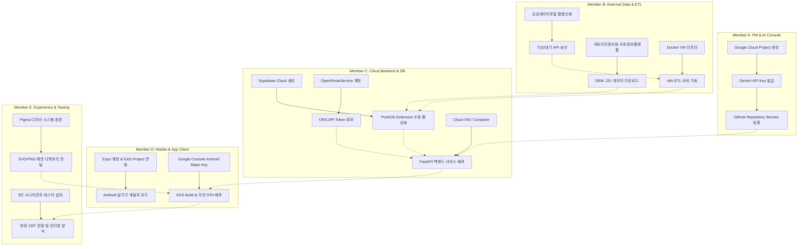

# PawTrail 인간 주도 외장 활동 및 인프라 운영 종합 매뉴얼 (README)

## 1. 개요 및 목적
PawTrail 프로젝트는 AI Pair Programming을 통해 높은 생산성과 코드 품질을 달성하지만, **AI 도구가 대신 수행할 수 없는 인간 팀원 고유의 외장 활동(External & Manual Activities)**이 반드시 수반됩니다. 

외부 클라우드 서비스 계정 발급, 유료/무료 API 키 발급 및 보안 할당량 설정, 공공데이터 인가 신청, 모바일 앱 마켓 및 EAS 빌드 서명 관리, 디자인 시스템 Figma 원본 에셋 구축, 5인 대면 CBT(사용성 테스트) 진행 등은 **팀원의 직접적인 수작업 및 인프라 설정**을 통해서만 완결될 수 있습니다.

본 `docs/guideline/` 디렉토리는 5인 팀원 각자의 역할에 따른 외장 인프라 구축, 서비스 가입, 인증키 보안 보관, 수동 운영 및 정기 점검 매뉴얼을 집대성한 표준 가이드라인입니다.

---

## 2. 역할별 외장 활동 및 인프라 매뉴얼 인덱스

| 담당 팀원 | 역할 & 전문 영역 | 핵심 외장 활동 (AI 해결 불가 영역) | 상세 매뉴얼 링크 |
| :--- | :--- | :--- | :--- |
| **Member A** | **PM & AI Agent Lead** | • Google Cloud Project 생성 및 Gemini API Key 발급 • 모델 가용 할당량(Quota) 및 Rate Limit/비용 알림 모니터링 • GitHub Repository 설정, 시크릿 키 관리, 주간 릴리즈 게이트 관리 | [Member_A_PM_Manual_and_Infra_Guide.md](file:///d:/코디세이/PawTrail/docs/guideline/Member_A_PM_Manual_and_Infra_Guide.md) |
| **Member B** | **AI & Spatial Data Engineer** | • 공공데이터포털(data.go.kr) 기상청 단기예보 & 대기오염 API 활용 신청 및 승인 • 국토지리정보원 DEM 수치표고모델 오픈데이터 라이선스 확보 • n8n Self-hosted 클라우드 인프라(Docker) 세팅 & 자동 크론 웹훅 연동 | [Member_B_Data_Infra_and_External_API_Manual.md](file:///d:/코디세이/PawTrail/docs/guideline/Member_B_Data_Infra_and_External_API_Manual.md) |
| **Member C** | **Backend & Spatial Routing Lead** | • Supabase 프로젝트 프로비저닝 (PostGIS 확장 기능 수동 활성화) • OpenRouteService(ORS) / Mapbox 개발자 계정 및 토큰 발급 • 백엔드 배포 서버(Render / Railway / Fly.io) 설정 및 환경변수 주입 | [Member_C_Backend_Infra_and_Cloud_Manual.md](file:///d:/코디세이/PawTrail/docs/guideline/Member_C_Backend_Infra_and_Cloud_Manual.md) |
| **Member D** | **Frontend & Mobile App Lead** | • Expo 계정 생성, Expo CLI 로그인 및 EAS Organization 연동 • Google Cloud Console Android Maps SDK API 키 발급 및 SHA-1 지문 등록 • Android 실기기 개발자 모드 세팅, EAS Build(APK) 생성 및 EAS Update(무선 OTA) | [Member_D_Mobile_Infra_and_EAS_Manual.md](file:///d:/코디세이/PawTrail/docs/guideline/Member_D_Mobile_Infra_and_EAS_Manual.md) |
| **Member E** | **UI/UX Designer & Experience Lead** | • Figma 팀 워크스페이스 세팅 및 디자인 토큰(스타일/베리어블) 배포 • SVG/PNG 일러스트 및 고대비 아이콘 에셋 내보내기/최적화 • 5인 대면 CBT(Closed Beta Test) 테스터 섭외, 관찰 설문지 배포 및 심층 인터뷰 주관 | [Member_E_Design_System_and_CBT_Manual.md](file:///d:/코디세이/PawTrail/docs/guideline/Member_E_Design_System_and_CBT_Manual.md) |

---

## 3. 전체 인프라 연동 의존성 맵 (Cross-Dependency Map)

---

## 4. 환경 변수 및 보안 키 보관 표준 가이드라인

1. **절대 금기 사항 (Security Rules)**
   - 소스코드 저장소(Git)에 `.env` 파일, API 키 문자열, 인증서 파일(`.jks`, `.keystore`)을 커밋하는 행위 절대 금지.
   - 모든 로컬 개발 환경은 프로젝트 루트의 `.env.example`을 복사하여 `.env`를 수동 구성함.
2. **시크릿 키 공유 및 관리 프로토콜**
   - 개발용 API Key는 1Password / Bitwarden 또는 암호화된 내부 메신저 채널을 통해서만 1회성 전달.
   - 프로덕션 배포 시에는 GitHub Secrets 및 호스팅 플랫폼(Supabase, Render, EAS)의 대시보드 Secret Environment Variables로 직접 주입.
3. **API 비용 및 할당량 보호 (Rate Limiting)**
   - Gemini API 및 외부 유료 API는 일일 지출 한도(Daily Budget Alert: $5/day)를 설정하여 오과금 사전 차단.

---

## 5. 수동 운영 활동 주간 체크리스트 (Weekly Ops Rhythm)

- [ ] **매주 월요일 10:00 (Member A & C)**: Google Cloud 및 Supabase 자원 사용량, 청구 금액 모니터링.
- [ ] **매주 화요일 14:00 (Member B)**: 공공데이터포털 API 변경 공지 확인 및 n8n 파이프라인 정상 가동(로그) 확인.
- [ ] **매주 수요일 16:00 (Member E & D)**: 신규 UI 디자인 에셋 동기화 회의 및 React Native 렌더링 검수.
- [ ] **매주 금요일 17:00 (전원)**: 금주 릴리즈 대상 APK 빌드(Member D), 팀 내부 Dogfooding 산책 테스트 수행.
