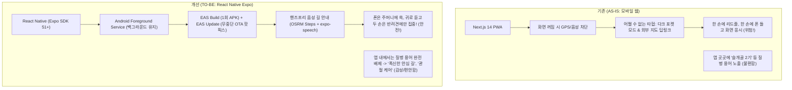

# 📱 PawTrail 네이티브 피벗(React Native Expo) & 핸즈프리 음성 안내 도입 및 앱 내 용어 정화 구현 계획

본 구현 계획은 사용자의 핵심 요구사항인 **[1] React Native (Expo + EAS Update OTA) 기술 스택 전면 전환**, **[2] 시선·두 손을 해방시키는 핸즈프리 음성 길 안내(Eyes-Free Voice Navigation) 탑재**, **[3] 앱 실행/UI 및 음성 안내에서 불쾌감을 주는 '슬개골' 등 질병 용어 전면 배제 및 웰니스 카피 치환(발표 자료에만 통계로 유지)**을 프로젝트 전체 산출물 및 코드베이스에 일관되게 반영하기 위한 상세 계획입니다.

---

## 1. 핵심 변경 방향 (Architectural & UX Pivots)

### ① 프론트엔드 플랫폼 피벗 (Next.js $\to$ React Native Expo)
* **스택**: `React Native (Expo SDK 51+)`, `react-native-maps` 또는 `@rnmapbox/maps`, `expo-location`, `expo-speech`
* **배포 체계**: `EAS Build`로 테스터용 APK 1회 패키징 + `EAS Update (`expo-updates`)`로 JS 번들 무중단 OTA 배포. (테스터는 APK를 재설치할 필요 없이 앱 재실행만으로 즉시 최신 코드 반영)

### ② 코어 주행 UX: 시선 해방(Eyes-Free) & 두 손 자유(Hands-Free) 음성 길 안내
* 견주가 스마트폰을 주머니나 가방에 넣고 화면을 꺼두어도, **Android Foreground Service**로 백그라운드 GPS를 연속 수신.
* OpenRouteService / OSRM의 `steps` 데이터(회전각, 안내 문구)와 노면 분석 데이터를 결합하여, **갈림길 회전 및 노면 변경 시점에 폰 스피커/이어폰으로 즉각 음성 가이드 송출**:
  - *"50m 앞 갈림길에서 오른쪽 흙길 산책로로 진입하세요."*
  - *"주의: 전방 30m 앞 횡단보도입니다. 하네스 줄을 짧게 잡아주세요."*
  - *"지금부터 300m 동안 푹신한 잔디 구간이 이어집니다."*

### ③ 앱 내 '슬개골' 등 질병 용어 전면 배제 및 웰니스 카피 치환
* **발표 자료(`docs/07_PawTrail_Presentation_Pain_Points.md`)**:
  - 심사위원 설득을 위해 시장 규모 및 도메인 페인 포인트 통계(국내 소형견 70% 슬개골 탈구 위험, 수의사 권고)는 전략적으로 유지.
* **앱 UI / AI 프롬프트 / 음성 TTS / 온보딩 / 테스트 케이스**:
  - 사용자에게 스트레스와 거부감을 주는 "슬개골 탈구", "질환 단계(1~4기)" 등의 임상 용어를 100% 제거.
  - **대체 웰니스 용어**: *"폭신한 길"*, *"부드러운 흙길"*, *"관절 안심 케어"*, *"편안한 발걸음"*, *"쿠션 노면"*, *"체급별 맞춤 보행"*

---

## 2. 세부 변경 대상 문서 및 구현 작업 (Proposed Changes)

### Component 1: 기획 및 아키텍처 문서군
* [MODIFY] [`docs/01_PawTrail_Project_Proposal.md`](file:///d:/cody/PawTrail/docs/01_PawTrail_Project_Proposal.md)
  - 기술 스택: Next.js ➔ React Native (Expo)
  - 비기능 요구사항: EAS Build & OTA 배포, 백그라운드 핸즈프리 음성 안내(NFR-03 전면 개정)
  - 앱 기능 설명에서 슬개골 등 질병 용어를 "관절 안심 폭신한 길"로 정화
* [MODIFY] [`docs/02_PawTrail_Team_building.md`](file:///d:/cody/PawTrail/docs/02_PawTrail_Team_building.md)
  - Member D 역할: React Native (Expo) 모바일 앱 개발, 백그라운드 GPS & 음성 길 안내 엔진 구현
* [MODIFY] [`docs/04_PawTrail_Architecture_Design.md`](file:///d:/cody/PawTrail/docs/04_PawTrail_Architecture_Design.md)
  - 1장/3장 아키텍처 다이어그램: React Native (Expo) + EAS Update 구조로 변경
  - 백그라운드 음성 길 안내 파이프라인 시퀀스 다이어그램 및 모듈 설계 추가
  - 앱 내 용어 정책(질병 용어 금지 및 웰니스 순화 가이드라인) 명시

### Component 2: 애자일 스프린트 & 태스크 분할 문서군
* [MODIFY] [`docs/03_PawTrail_Agile_User_Stories.md`](file:///d:/cody/PawTrail/docs/03_PawTrail_Agile_User_Stories.md)
  - **`US-07`**: 지도 기반 경로 시각화 및 안내 스텝 뷰
  - **`US-08`**: **[전면 고도화]** 주머니 속 시선 해방(Eyes-Free) 핸즈프리 음성 길 안내 & 백그라운드 노면 트래킹 (`expo-location` + `expo-speech`)
  - **`US-01, US-06`**: 온보딩/프로필 입력에서 "슬개골 단계"를 "관절 안심 케어 선호도(일반/폭신한 길 위주)"로 순화
  - 전체 스토리 포인트(62 pt) 및 330 h 공수 균형 유지
* [MODIFY] [`docs/05_PawTrail_Detailed_Implementation_Plan.md`](file:///d:/cody/PawTrail/docs/05_PawTrail_Detailed_Implementation_Plan.md)
  - Member D의 3~4주차 개발 계획: Expo 프로젝트 세팅, OSRM Steps 파싱, 음성 합성 연동, EAS 빌드/OTA 배포로 갱신
* [MODIFY] [`docs/06_PawTrail_Task_Breakdown_and_Estimations.md`](file:///d:/cody/PawTrail/docs/06_PawTrail_Task_Breakdown_and_Estimations.md)
  - TASK-07, TASK-08, TASK-10 세부 작업 내용 갱신 (Expo, 음성 안내, EAS 배포)

### Component 3: 발표 전략 및 가이드라인 문서군
* [MODIFY] [`docs/07_PawTrail_Presentation_Pain_Points.md`](file:///d:/cody/PawTrail/docs/07_PawTrail_Presentation_Pain_Points.md)
  - Q&A 방어 전략: "화면을 보며 걷는 위험한 웹을 버리고, 시선과 두 손을 해방시키는 핸즈프리 음성 안내 앱으로 진화한 이유"를 강력한 기술 돌파구로 재정의.
  - "앱 내에서는 사용자의 정서적 편안함을 위해 질병 용어를 배제하고 웰니스 톤앤매너로 접근"하는 감성 UX 전략 추가.
* [MODIFY] [`.gemini/GEMINI.md`](file:///d:/cody/PawTrail/.gemini/GEMINI.md) & [`.gemini/UX_COMPACT_RULES.md`](file:///d:/cody/PawTrail/.gemini/UX_COMPACT_RULES.md)
  - 프론트엔드 표준을 React Native(Expo)로 변경.
  - 앱 UI 및 AI 응답에서 질병 용어(슬개골 등) 사용 금지 규칙 추가.
  - 핸즈프리 음성 UX 원칙 추가.
* [MODIFY] [`README.md`](file:///d:/cody/PawTrail/README.md)
  - 기술 스택(React Native Expo), 시스템 아키텍처 다이어그램 및 핸즈프리 음성 안내 특화 기능 반영.

### Component 4: TDD 테스트 스위트
* [MODIFY] [`test_case/test_walk_plan_agent_schema.py`](file:///d:/cody/PawTrail/test_case/test_walk_plan_agent_schema.py)
  - 프로필 스키마 필드명 및 테스트 설명에서 `patella_luxation_stage`를 `joint_care_level` (또는 `comfort_level`)로 리팩토링하고 질병 단어 제거.
* [MODIFY] [`test_case/test_walk_tracking_and_feedback.py`](file:///d:/cody/PawTrail/test_case/test_walk_tracking_and_feedback.py)
  - 핸즈프리 음성 안내 트리거 및 백그라운드 트래킹 테스트 케이스 동기화.
* [VERIFY] `pytest test_case/` 실행으로 전체 테스트 전수 통과 확인.

---

## 3. 검증 계획 (Verification Plan)

### Automated Tests
- `pytest test_case/ -v`:
  - 갱신된 용어 및 스키마 기반 71개 이상 단위/통합 테스트 전수 통과 확인.

### Manual & Document Consistency Review
- 산출물 간(01~07, README, .gemini, test_case) 기술 스택(React Native Expo, EAS Build/Update) 일관성 검증.
- 앱 실행 영역(UI, 온보딩, 음성 스크립트, 프롬프트)에서 "슬개골" 단어가 100% 제거되었는지 ripgrep 전수 조사.
- 발표 자료(`07번`)에만 통계 및 심사위원 방어 논리로 격리되어 있는지 확인.
