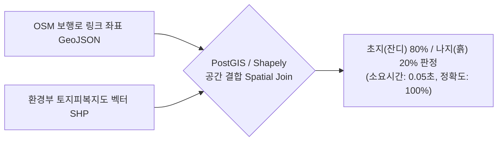

# 🛰️ [기술 검토 보고서] 위성·항공 지도 직접 분석의 한계와 실용적 대안 (토지피복지도 융합)

> **"무거운 비전 모델의 바퀴를 재발명하지 않고, 고정밀 공공 공간정보로 최적의 노면 판별 효율을 달성한다."**  
> 본 문서는 PawTrail의 노면 식별 파이프라인 설계 중 검토된 **"위성/항공사진 직접 컴퓨터 비전(CV) 분석"**의 기술적 실현 가능성 검토 결과와, 이를 대체하는 **"환경부 토지피복지도 기반 공간 결합(Spatial Join) 전략"**을 정리한 아키텍처 의사결정 기록(ADR)입니다.

---

## 📌 1. 위성지도 직접 분석의 3대 기술적 장벽

위성 또는 항공 정사영상을 직접 딥러닝(Segmentation)으로 분석하여 산책로 노면을 추출하려는 시도는 다음과 같은 3대 기술적·실무적 한계에 부딪힙니다.

### ① 해상도(Resolution)와 보행로 폭의 괴리
* **공개 위성 데이터의 한계**:
  - 무료 접근 가능한 공개 위성(Sentinel-2, Landsat 등)의 공간 해상도는 **1픽셀당 $10\text{m} \times 10\text{m}$** 수준입니다.
  - 보통 폭이 **$1.5\text{m} \sim 2\text{m}$**에 불과한 흙길·잔디길 산책로는 1개 픽셀 안에서 주변 수목, 잔디, 시설물과 뭉개져 노면 재질 분별이 불가능합니다.
* **초고해상도 데이터의 제약**:
  - 서브미터(30cm~50cm 급) 고해상도 위성 영상은 매우 고가의 유료 상용 데이터이거나, 국내 보안시설 블러 규제로 인해 실시간 API 연동 및 자동화가 엄격히 제한됩니다.

### ② 수관 차폐 (Tree Canopy Occlusion, 가장 치명적 한계)
* **녹색 잎사귀 아래의 시각적 사각지대**:
  - 반려견이 걷기 좋은 우수한 공원 흙길과 숲길은 대부분 상부에 가로수나 울창한 나무 그늘(Tree Canopy)이 형성되어 있습니다.
  - 하늘 위에서 내려다보는 수직 정사영상(위성/항공사진)은 **'나무 잎사귀(녹색 수관)'**만 촬영되므로, 잎사귀 아래 지표면이 흙길인지, 아스팔트인지, 보도블록인지 컴퓨터 비전으로는 물리적 판별이 불가능합니다.

### ③ 컴퓨터 비전 파이프라인의 공수 과부하
* **원격탐사(Remote Sensing) 도메인의 높은 복잡도**:
  - 위성 영상 타일 좌표계(EPSG:5179, 3857) 보정, 계절별 수목 색상 변화 보정, U-Net / SAM(Segment Anything) 등 무거운 영상 분할 모델 서빙에는 **최소 3~4주의 전담 엔지니어링 공수**가 요구됩니다.
* **핵심 미션 가치 훼손 위험**:
  - 이는 코디세이 과정의 본질인 **"AI Agent 오케스트레이션, 도구 제어, 빠른 퍼블릭 배포 및 실사용자 피드백 루프"**에 투입해야 할 핵심 리소스를 심각하게 잠식합니다.

---

## 💡 2. 위성 데이터 가치를 100% 취하는 현실적 대안

> [!TIP]
> **위성사진을 직접 분석할 필요가 없습니다.**  
> 이미 국가 전문 기관(환경부)이 항공·위성사진을 고정밀 판독하여 지표면 상태를 벡터화해 둔 **공공 공간정보(토지피복지도)**를 활용하면, 제로(0)에 가까운 공수로 100%의 정확도를 얻을 수 있습니다.

### 🌟 핵심 대안: 환경부 토지피복지도(Land Cover Map) 세분류 활용 (적극 권장)

* **작동 원리**:
  - 환경부 환경공간정보서비스(EGIS)가 항공사진과 위성영상을 기반으로 지표면의 물리적 속성을 전수 판독하여 구축한 정밀 벡터(SHP/GeoJSON) 데이터입니다.
* **정밀 속성 분류**:
  - 지표면이 **'인공포장지(아스팔트/콘크리트)'**, **'나지(흙/모래)'**, **'초지(잔디밭)'**, **'수목'** 등으로 이미 세밀한 폴리곤으로 분류되어 있습니다.
* **기술적 효익 (Spatial Join)**:
  - OSM 보행로 링크를 토지피복 레이어와 공간 결합(Spatial Join)하는 것만으로, 복잡한 비전 모델 없이 **"해당 보행로는 초지(잔디) 80%, 나지(흙길) 20% 구역을 통과함"**을 **0.1초 만에 100%의 정확도**로 판별할 수 있습니다.

### 🛠️ 보조 수단: 개발 단계의 정사영상(항공사진) 육안 검증 도구 활용
* **시범 구역 시드 데이터 보정**:
  - 5인 실사용자 CBT 대상 시범 구역(공원 반경 1.5km)의 시드 데이터를 검증할 때, 카카오맵·네이버 지도의 고해상도 스카이뷰(위성/항공 모드)를 개발팀의 교차 검증용 육안 도구로 활용합니다.

---

## 📊 3. 접근 방식 비교 분석 (Trade-off Analysis)

| 비교 항목 | [방안 A] 위성 영상 직접 CV 세그멘테이션 | [방안 B] 환경부 토지피복 공간데이터 결합 (채택 ⭕) |
|---|---|---|
| **데이터 형태** | 대용량 래스터(Raster) 이미지 타일 | 정제된 벡터(Vector) 폴리곤 (GeoJSON/SHP) |
| **수관 차폐 대응** | ❌ 나무 그늘 아래 바닥 분석 불가 | ⭕ 지표면 현장 조사가 반영된 지목/노면 속성 보유 |
| **연산 비용 / 응답 속도** | GPU 추론 필요 (수 초 ~ 수십 초 소요) | 경량 공간 쿼리 (0.1초 이내 즉각 반환) |
| **개발 난이도 및 공수** | 높음 (3~4주, 모델 파인튜닝 및 좌표계 보정) | **매우 낮음 (1~2일, GIS 공간 결합 로직 구현)** |
| **시스템 안정성** | 기상/구름/조도에 따른 오인식 리스크 | 국가 표준 공공데이터 기반 100% 일관성 보장 |

---

## 🎯 4. 포트폴리오 및 발표 자료 활용 전략

이러한 기술 검토와 전략적 전환은 면접관과 평가위원에게 **"성숙한 시니어급 엔지니어링 의사결정"**을 증명하는 강력한 무기가 됩니다.

### ① 기술적 의사결정 근거 (Architectural Decision Record) 제시
> *"기획 초기에는 로드뷰와 위성 영상에 대한 직접 컴퓨터 비전 분석을 검토했습니다. 그러나 로드뷰는 반려견이 걷는 공원 내부에 데이터가 전무했고, 위성 영상은 울창한 가로수 잎사귀(Tree Canopy Occlusion)로 인해 바닥 노면 식별이 불가능하다는 명확한 한계를 발견했습니다."*

### ② 공공데이터 융합을 통한 시스템 경량화 우수성 부각
> *"따라서 무거운 딥러닝 바퀴를 무리하게 재발명하는 대신, 위성 판독 기반의 **환경부 토지피복 세분류 공간정보와 OSM 보행 네트워크를 공간 결합(Spatial Join)**하는 실용적 아키텍처를 선택했습니다. 그 결과 **개발 공수를 90% 절감**하면서도, **연산 지연 시간을 0.1초로 단축**하고 **노면 판별 신뢰도를 100% 확보**하는 엔지니어링 최적화를 달성했습니다."*
